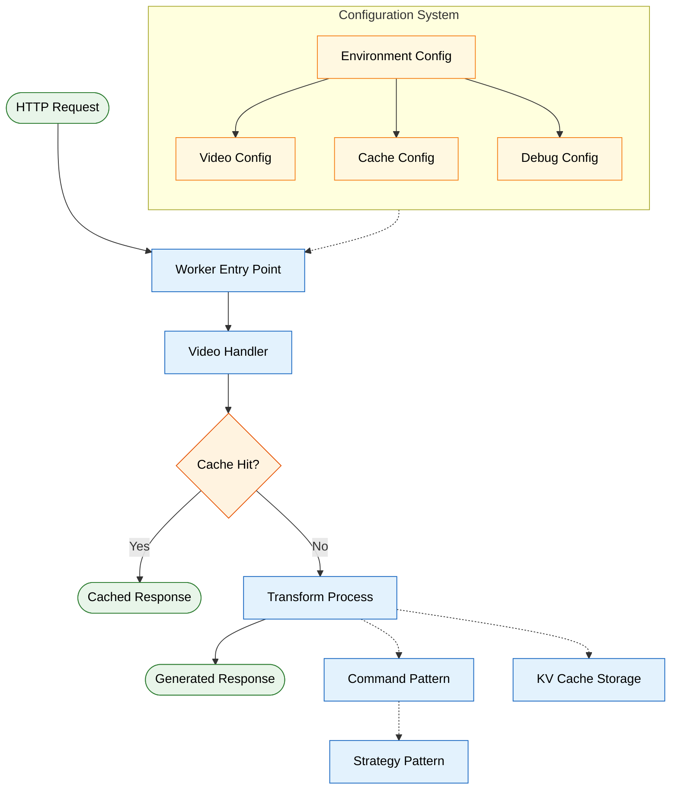
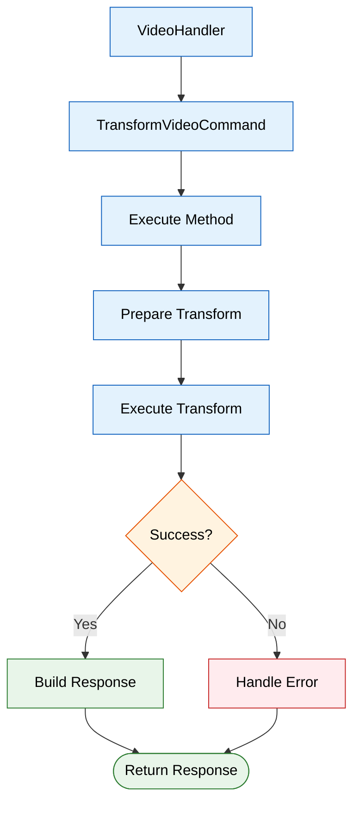
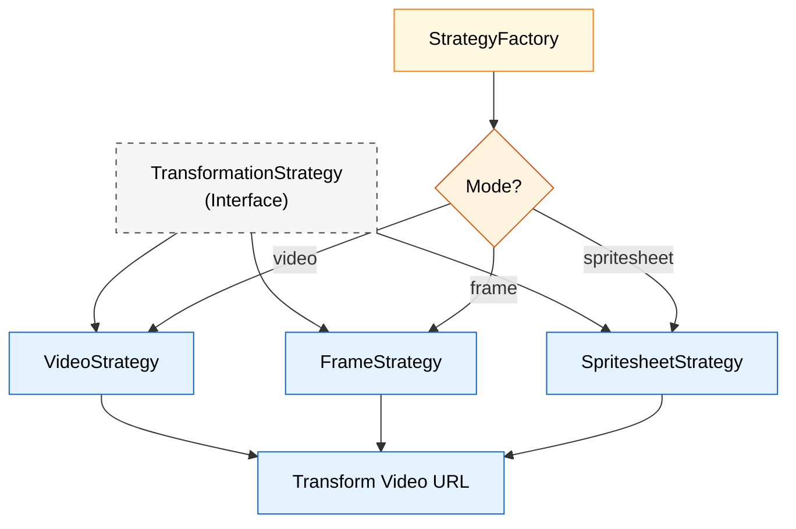
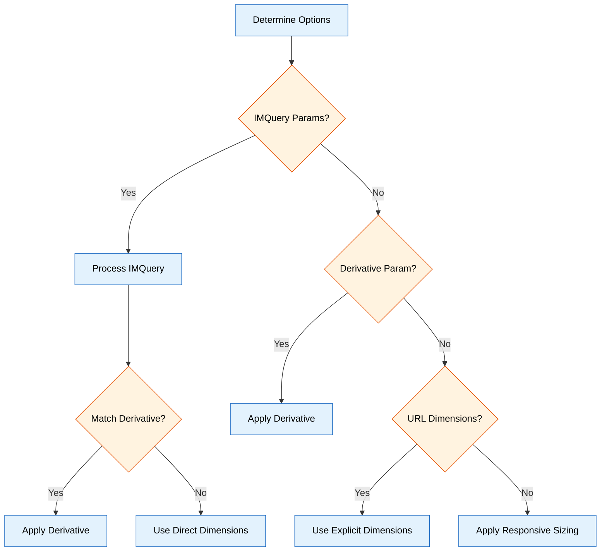
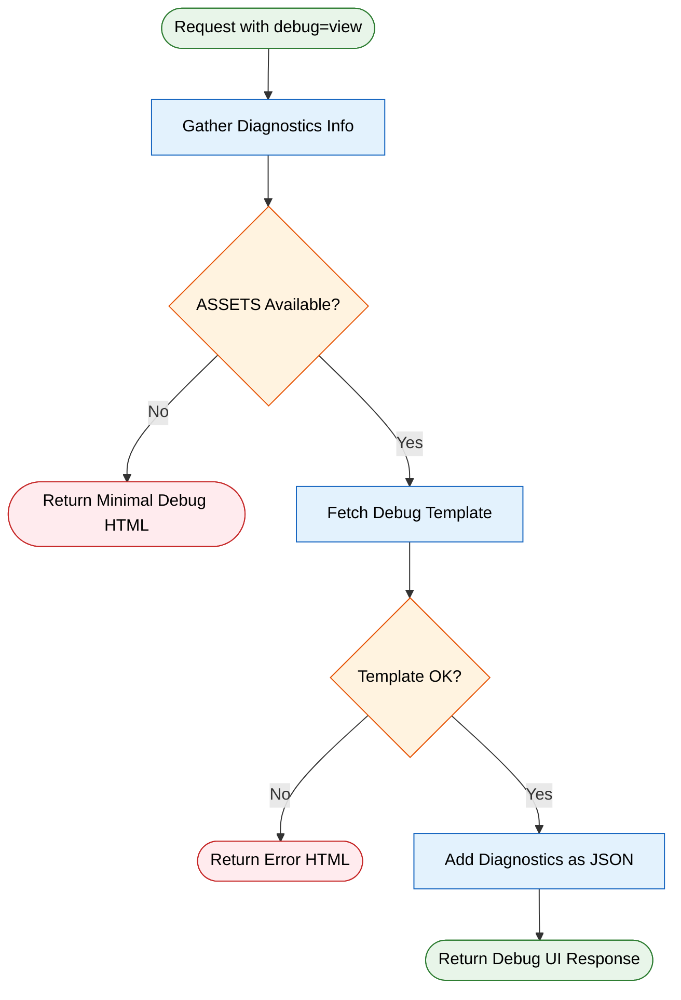
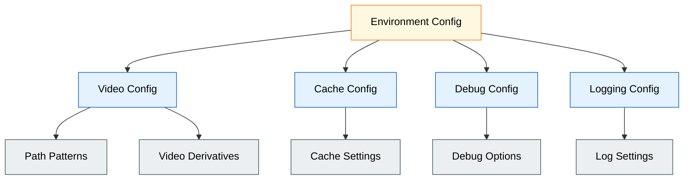

# Video Resizer

A Cloudflare Worker for transforming and resizing video content on the edge.

## Features

- Video transformation and optimization
- Multiple transformation strategies (video, frame, spritesheet)
- Caching with KV store integration
- Enhanced range request support for seeking and streaming
- Client-aware responsive transformations
- Automatic device and bandwidth detection
- Debug UI for monitoring and troubleshooting

## Architecture Diagrams

Each diagram illustrates a key aspect of the Video Resizer system architecture, showing the flow of data and control through the system.

### Complete System Flow

This diagram provides a high-level overview of the entire system, showing how components interact.

### Request Processing Flow

This diagram shows the decision path for an incoming request.

### Command Pattern Flow

The command pattern centralizes transformation logic and error handling.

### Strategy Pattern Design

The strategy pattern allows multiple video processing approaches.

### Video Options Determination

This diagram shows how video options are determined from various inputs.

### Range Request Handling

This diagram shows how video range requests are processed.

### Configuration API Flow

This diagram illustrates the authenticated configuration API.

### Debug UI Flow

This diagram shows the debug UI generation process.

### Caching Architecture

This diagram illustrates the KV caching system.

### Configuration System

This diagram shows the configuration hierarchy.

## Documentation

Comprehensive documentation is available in the [docs directory](./docs/README.md).

## Getting Started

1. Clone this repository
2. Install dependencies with `npm install`
3. Start development server with `npm run dev` or `wrangler dev`
4. Deploy to Cloudflare with `npm run deploy` or `wrangler deploy`

For more detailed instructions, see the [Quickstart Guide](./docs/guides/quickstart.md).

## Guides

- [Configuration Guide](./docs/guides/configuration.md) - Practical configuration examples
- [Troubleshooting Guide](./docs/guides/troubleshooting.md) - Common issues and solutions
- [Performance Tuning Guide](./docs/guides/performance-tuning.md) - Optimization tips

## Configuration

See the [Configuration Guide](./docs/configuration/README.md) for detailed configuration options.

## License

This project is licensed under the terms in the LICENSE file.