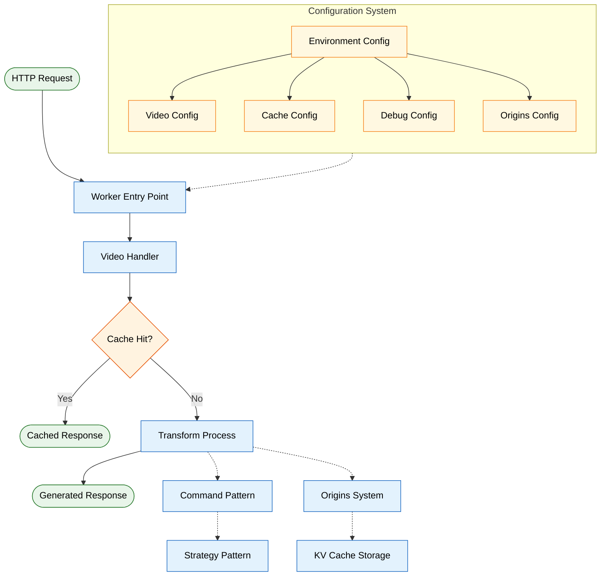

# Video Resizer

A Cloudflare Worker for transforming and resizing video content on the edge.

## Features

- Video transformation and optimization
- Multiple transformation strategies (video, frame, spritesheet, audio)
- Caching with KV store integration and efficient TTL refresh
- KV chunking for large videos with concurrency-safe chunk locking
- Background fallback caching with streaming for large videos
- Cache versioning for invalidation without purging
- Consolidated 404 failover using Origins system
- Multi-origin retry with source exclusion
- Memory-efficient video streaming with zero-copy buffer handling
- Optimized timeout management to prevent quota exceeded errors
- Enhanced range request support for seeking and streaming
- Client-aware responsive transformations
- Automatic device and bandwidth detection
- Debug UI for monitoring and troubleshooting
- High-concurrency chunk size validation and tolerance
- Flexible KV namespace bindings for multi-tenant deployments

## Quick Start

1. Clone this repository
2. Install dependencies with `npm install`
3. Start development server with `npm run dev` or `wrangler dev`
4. Deploy to Cloudflare with `npm run deploy` or `wrangler deploy`

For more detailed instructions, see the [Quickstart Guide](./docs/guides/quickstart.md).

## Documentation

Comprehensive documentation is available in the [docs directory](./docs/README.md).

### Guides

- [Configuration Guide](./docs/guides/configuration.md) - Practical configuration examples
- [Troubleshooting Guide](./docs/guides/troubleshooting.md) - Common issues and solutions
- [Performance Tuning Guide](./docs/guides/performance-tuning.md) - Optimization tips
- [API Reference](./docs/reference/api-reference.md) - Complete API details

### Key Features Documentation

- [Cache Versioning](./docs/caching/versioning.md) - Cache key versioning system
- [404 Retry Mechanism](./docs/features/404-retry-mechanism.md) - Automatic failover to alternative sources
- [Request Coalescing](./docs/features/request-coalescing.md) - Prevents duplicate origin fetches
- [Range Request Support](./docs/features/range-request-support.md) - Efficient video streaming

## System Architecture

This section provides visual diagrams of the system architecture and key components. For your convenience, diagrams are organized by functional area.

### Core System Flow

<details>
<summary><strong>Complete System Flow</strong> - High-level overview of the entire system</summary>



</details>

<details>
<summary><strong>Comprehensive E2E System Diagram</strong> - Complete end-to-end flow of all components</summary>


</details>

<details>
<summary><strong>Request Processing Flow</strong> - Decision path for request handling</summary>


</details>

<details>
<summary><strong>Configuration System</strong> - Configuration hierarchy</summary>


</details>

### Video Transformation

<details>
<summary><strong>Command Pattern Flow</strong> - Transformation logic and error handling</summary>


</details>

<details>
<summary><strong>Strategy Pattern Design</strong> - Multiple video processing approaches</summary>


</details>

<details>
<summary><strong>Origins System Architecture</strong> - Multi-source video storage with failover</summary>


</details>

<details>
<summary><strong>Video Options Determination</strong> - Parameter processing flow</summary>


</details>

### Caching System

<details>
<summary><strong>Caching Architecture</strong> - KV caching system overview</summary>


</details>

<details>
<summary><strong>Cache TTL Refresh Flow</strong> - Efficient TTL refresh with metadata-only updates</summary>


</details>

<details>
<summary><strong>Cache Versioning Flow</strong> - Invalidation without purging</summary>


</details>

<details>
<summary><strong>KV Chunking Architecture</strong> - Large video storage with concurrency control</summary>


</details>

### Additional Features

<details>
<summary><strong>Range Request Handling</strong> - Video seeking and streaming support</summary>


</details>

<details>
<summary><strong>Request Coalescing</strong> - Preventing duplicate transformation requests</summary>


</details>

<details>
<summary><strong>Configuration API Flow</strong> - Authenticated configuration management</summary>


</details>

<details>
<summary><strong>Debug UI Flow</strong> - Monitoring and troubleshooting interface</summary>


</details>

## Logging

The video-resizer uses a centralized, high-performance logging system built on [Pino](https://github.com/pinojs/pino).

### Key Features

- 🚀 **High Performance** - Minimal overhead with Pino's efficient serialization
- 🎯 **Component Filtering** - Control which components log using wildcard patterns
- 📊 **Performance Monitoring** - Automatic tracking of slow operations
- 🔍 **Log Enrichment** - Add memory, timing, and request context to logs
- 📈 **Production Ready** - Sampling, batching, and graceful configuration updates

### Quick Example

```typescript
import { createCategoryLogger } from '@/utils/logger';

const logger = createCategoryLogger('MyService');

// Use throughout your component
logger.debug('Processing request', { id: '123' });
logger.info('Request completed', { duration: 150 });
logger.warn('Using fallback origin');
logger.error('Request failed', { error: 'timeout' });

// Track performance
const stop = startPerformanceMeasurement('fetchVideo', 'MyService');
// ... do work ...
stop(); // Logs if operation exceeds threshold
```

### Configuration

```json
{
  "logging": {
    "level": "info",
    "enabledComponents": ["Video*", "Cache*"],
    "disabledComponents": ["*Test"],
    "performanceThresholdMs": 1000
  }
}
```

For complete logging documentation, see the [Logging Guide](./docs/features/logging.md).

## License

This project is licensed under the terms in the [LICENSE](./LICENSE) file.
