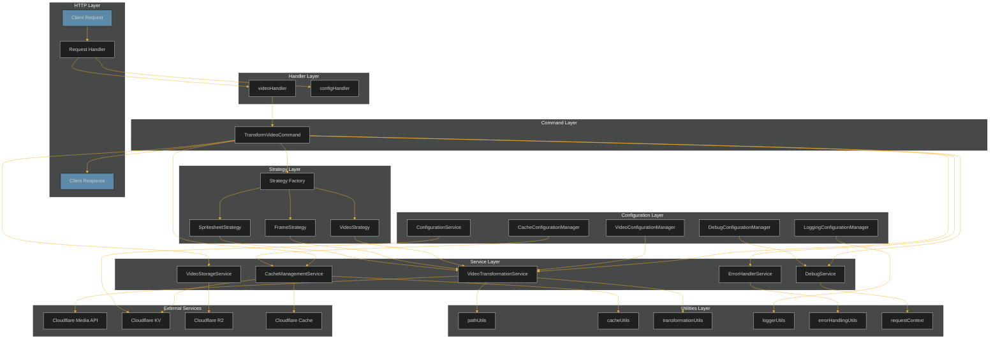
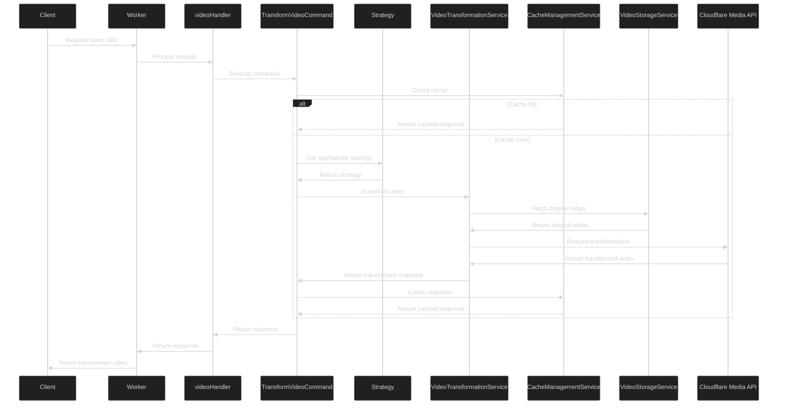
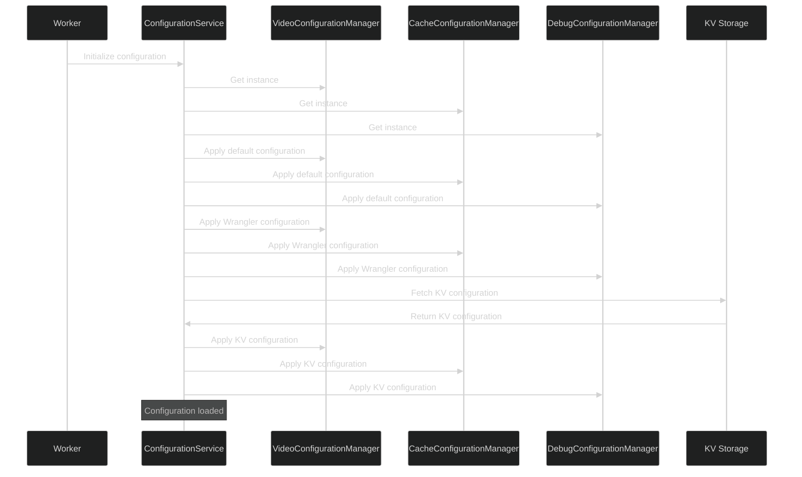
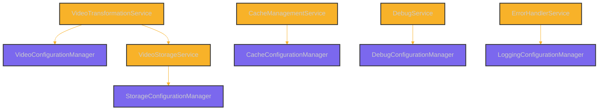
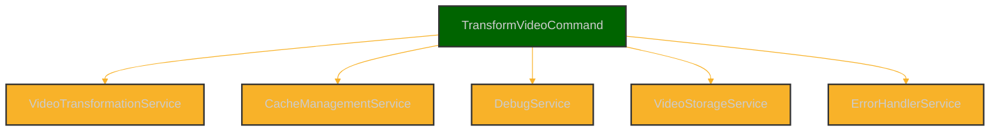
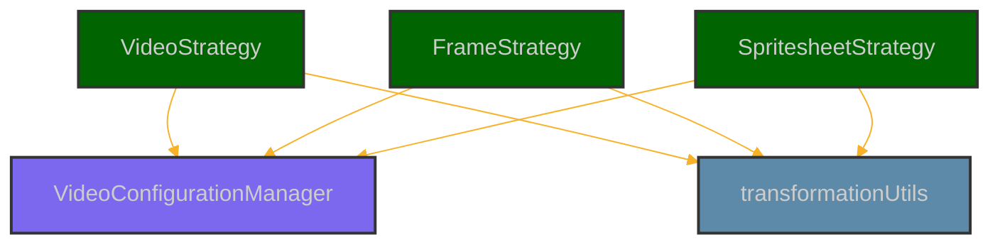
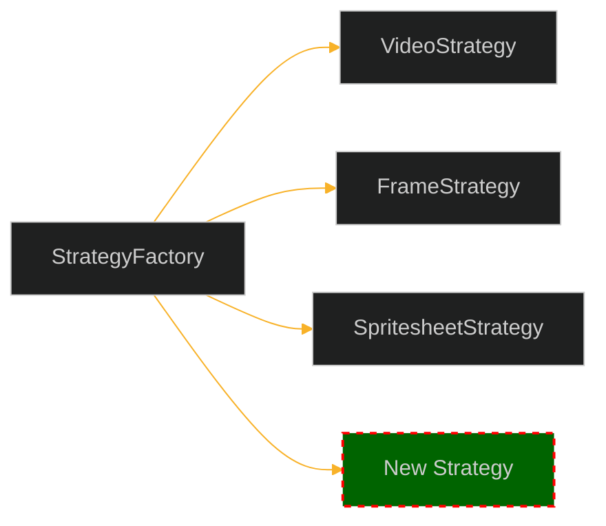
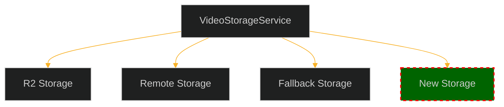
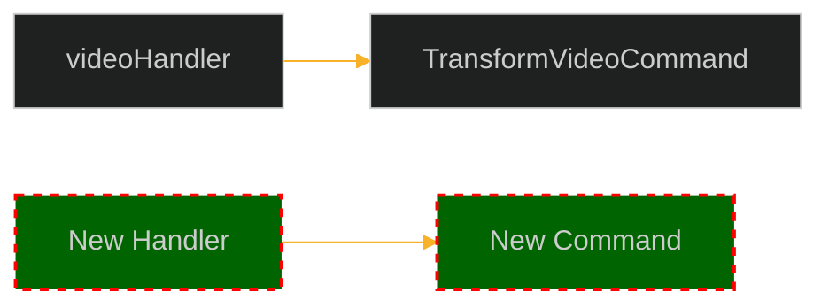
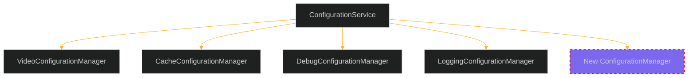

# Video Resizer Component Diagram

This document provides visual and descriptive representations of the key components in the Video Resizer architecture and their interactions.

## System Overview

The following diagram shows the high-level architecture of the Video Resizer system:



## Component Interactions

### Request Flow

The following sequence diagram illustrates a typical request flow through the system:



### Configuration Initialization

The following sequence diagram shows how configuration is initialized:



## Component Descriptions

### HTTP Layer

The HTTP Layer handles incoming requests and returns responses:

| Component | Type | Description |
|-----------|------|-------------|
| Request Handler | Entry Point | Main worker entry point that receives requests and routes them to the appropriate handler |

### Handler Layer

The Handler Layer contains specialized request handlers:

| Component | Type | Description |
|-----------|------|-------------|
| videoHandler | Function | Handles video transformation requests |
| configHandler | Function | Handles configuration management requests |

### Command Layer

The Command Layer implements the command pattern:

| Component | Type | Description |
|-----------|------|-------------|
| TransformVideoCommand | Class | Implements the command pattern for video transformations |

### Strategy Layer

The Strategy Layer implements the strategy pattern:

| Component | Type | Description |
|-----------|------|-------------|
| StrategyFactory | Class | Creates appropriate transformation strategies |
| VideoStrategy | Class | Handles regular video transformations |
| FrameStrategy | Class | Handles frame extraction |
| SpritesheetStrategy | Class | Handles spritesheet generation |

### Service Layer

The Service Layer provides reusable functionality:

| Component | Type | Description |
|-----------|------|-------------|
| VideoTransformationService | Class | Handles video transformation operations |
| CacheManagementService | Class | Manages caching operations |
| DebugService | Class | Provides debugging functionality |
| VideoStorageService | Class | Handles video storage and retrieval |
| ErrorHandlerService | Class | Centralizes error handling |

### Configuration Layer

The Configuration Layer manages system configuration:

| Component | Type | Description |
|-----------|------|-------------|
| VideoConfigurationManager | Class | Manages video-specific configuration |
| CacheConfigurationManager | Class | Manages cache-specific configuration |
| DebugConfigurationManager | Class | Manages debug-specific configuration |
| LoggingConfigurationManager | Class | Manages logging-specific configuration |
| ConfigurationService | Class | Coordinates configuration loading and distribution |

### Utilities Layer

The Utilities Layer provides reusable utility functions:

| Component | Type | Description |
|-----------|------|-------------|
| pathUtils | Module | URL and path manipulation utilities |
| cacheUtils | Module | Caching utilities |
| transformationUtils | Module | Transformation utilities |
| loggerUtils | Module | Logging utilities |
| errorHandlingUtils | Module | Error handling utilities |
| requestContext | Module | Request context management |

### External Services

External services that the system interacts with:

| Component | Type | Description |
|-----------|------|-------------|
| Cloudflare Media API | External API | Provides video transformation capabilities |
| Cloudflare KV | External Storage | Provides key-value storage for configuration and caching |
| Cloudflare R2 | External Storage | Provides object storage for videos |
| Cloudflare Cache | External Cache | Provides HTTP caching |

## Component Dependencies

### Service Dependencies

Services depend on configuration and sometimes on each other:



### Command Dependencies

Commands depend on services:



### Strategy Dependencies

Strategies depend on configuration and utilities:



## Package Structure

The codebase is organized into the following directory structure:

```
src/
├── config/              # Configuration managers and schemas
│   ├── index.ts
│   ├── videoConfig.ts
│   ├── cacheConfig.ts
│   ├── debugConfig.ts
│   └── loggingConfig.ts
│
├── domain/              # Domain logic and business rules
│   ├── commands/
│   │   └── TransformVideoCommand.ts
│   ├── strategies/
│   │   ├── index.ts
│   │   ├── StrategyFactory.ts
│   │   ├── TransformationStrategy.ts
│   │   ├── VideoStrategy.ts
│   │   ├── FrameStrategy.ts
│   │   └── SpritesheetStrategy.ts
│
├── errors/              # Error classes and handling
│   ├── index.ts
│   ├── VideoTransformError.ts
│   ├── ValidationError.ts
│   ├── ProcessingError.ts
│   ├── ConfigurationError.ts
│   └── NotFoundError.ts
│
├── handlers/            # Request handlers
│   ├── videoHandler.ts
│   ├── configHandler.ts
│   └── videoOptionsService.ts
│
├── services/            # Service implementations
│   ├── TransformationService.ts
│   ├── CacheManagementService.ts
│   ├── ConfigurationService.ts
│   ├── DebugService.ts
│   ├── VideoStorageService.ts
│   └── ErrorHandlerService.ts
│
├── utils/               # Utility functions
│   ├── cacheUtils.ts
│   ├── pathUtils.ts
│   ├── transformationUtils.ts
│   ├── loggerUtils.ts
│   ├── errorHandlingUtils.ts
│   ├── requestContext.ts
│   └── responseBuilder.ts
│
├── types/               # TypeScript type definitions
│   ├── cloudflare.ts
│   └── diagnostics.ts
│
└── index.ts            # Application entry point
```

## Extensibility Points

The architecture provides several key extensibility points:

### 1. New Transformation Modes

To add a new transformation mode:

1. Create a new strategy implementing `TransformationStrategy`
2. Add the strategy to `StrategyFactory`
3. Update configuration and validation



### 2. New Storage Backends

To add a new storage backend:

1. Update the `VideoStorageService` with the new backend
2. Add configuration options for the new backend
3. Implement authentication and connection logic



### 3. New Commands

To add a new command:

1. Create a new command class
2. Inject required services
3. Add a new handler to use the command



### 4. New Configuration Managers

To add a new configuration area:

1. Create a new configuration manager class
2. Define Zod schema for validation
3. Add initialization in the configuration service



## Conclusion

The Video Resizer architecture follows a clear component structure with separation of concerns and well-defined interfaces between layers. The architecture is designed to be extensible, maintainable, and testable through the use of established patterns like command, strategy, and dependency injection.

Key architectural principles:

1. **Separation of Concerns**: Each component has a specific responsibility
2. **Pattern-Based Design**: Leveraging established patterns for common problems
3. **Centralized Configuration**: Type-safe, validated configuration
4. **Comprehensive Error Handling**: Structured error hierarchy
5. **Extensibility**: Clear extension points for new features

This component diagram provides a reference for understanding the system structure and for planning future enhancements.