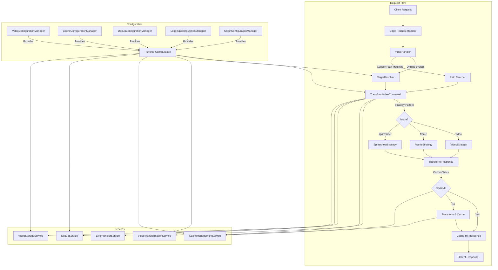
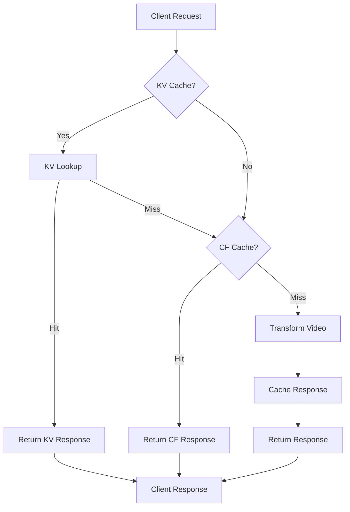
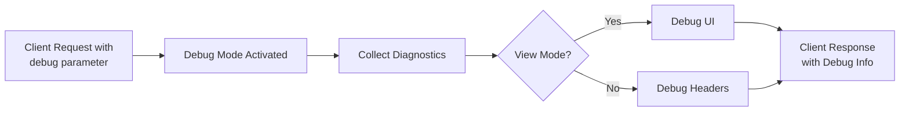
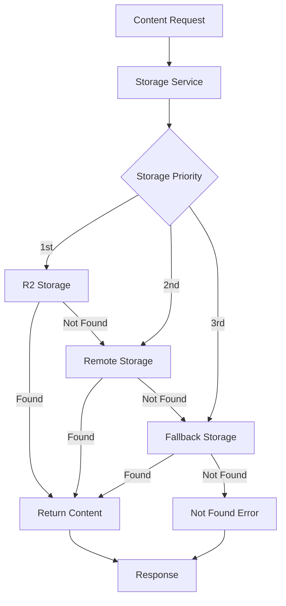

# Video Resizer Architecture Overview

*Last Updated: May 15, 2025*

## Table of Contents

- [Introduction](#introduction)
- [System Architecture](#system-architecture)
- [Core Components](#core-components)
  - [Configuration Layer](#1-configuration-layer)
  - [Domain Layer](#2-domain-layer)
  - [Service Layer](#3-service-layer)
  - [Utilities Layer](#4-utilities-layer)
  - [Handler Layer](#5-handler-layer)
- [Design Patterns](#design-patterns)
  - [Strategy Pattern](#strategy-pattern)
  - [Command Pattern](#command-pattern)
  - [Factory Pattern](#factory-pattern)
  - [Singleton Pattern](#singleton-pattern)
- [Request Flow](#request-flow)
- [Caching Architecture](#caching-architecture)
- [Debugging Architecture](#debugging-architecture)
- [Storage Integration](#storage-integration)
- [Development Patterns](#development-patterns)
- [Design Evolution](#design-evolution)
- [Conclusion](#conclusion)

## Introduction

The Video Resizer is a Cloudflare Worker application that transforms video URLs to use Cloudflare's Media Transformation API. It implements a modern, service-oriented architecture with clearly defined layers and separation of concerns, following best practices for maintainability, testability, and extensibility.

## System Architecture

The system architecture uses a layered approach with specialized components:



## Core Components

### 1. Configuration Layer

The configuration system provides strongly-typed, validated access to all settings using Zod schemas.

#### Configuration Managers

Each manager is a singleton class that handles a specific area of configuration:

```typescript
// Example configuration manager
export class VideoConfigurationManager {
  private static instance: VideoConfigurationManager | null = null;
  private config: VideoConfig;
  
  public static getInstance(): VideoConfigurationManager {
    if (!VideoConfigurationManager.instance) {
      VideoConfigurationManager.instance = new VideoConfigurationManager();
    }
    return VideoConfigurationManager.instance;
  }
  
  // Configuration access methods
  public getDerivative(name: string): VideoDerivative | null {
    return this.config.derivatives[name] || null;
  }
  
  public isValidOption(param: string, value: string): boolean {
    // Validation implementation
  }
  
  // Configuration update methods
  public updateConfigFromKV(kvConfig: Partial<VideoConfig>): void {
    // Validation and update logic
  }
}
```

#### Multi-Layer Configuration

Configuration is loaded from multiple sources with clear precedence:

1. **Default Values**: Hardcoded in manager classes
2. **Wrangler Config**: From `wrangler.jsonc` 
3. **Environment Variables**: Override during runtime
4. **KV Storage**: Dynamic updates without redeployment

### 2. Domain Layer

The domain layer implements core business logic through the command and strategy patterns.

#### Command Pattern

The `TransformVideoCommand` implements the command pattern to encapsulate video transformation logic:

```typescript
export class TransformVideoCommand {
  private transformationService: VideoTransformationService;
  private cacheService: CacheManagementService;
  private debugService: DebugService;
  
  constructor(services: ServiceDependencies) {
    // Initialize services
  }
  
  public async execute(request: Request): Promise<Response> {
    // Command execution logic:
    // 1. Parse request
    // 2. Validate parameters
    // 3. Select appropriate strategy
    // 4. Execute transformation
    // 5. Handle caching
    // 6. Return response
  }
}
```

#### Strategy Pattern

The strategy pattern handles different transformation modes (video, frame, spritesheet) in a maintainable and extensible way. Each mode has its own strategy implementation that encapsulates the mode-specific logic and validation.

```typescript
// Strategy interface
interface TransformationStrategy {
  prepareTransformParams(context: TransformationContext): TransformParams;
  validateOptions(options: VideoTransformOptions): void | Promise<void>;
  updateDiagnostics(context: TransformationContext): void;
}

// Concrete strategies
class VideoStrategy implements TransformationStrategy { /* implementation */ }
class FrameStrategy implements TransformationStrategy { /* implementation */ }
class SpritesheetStrategy implements TransformationStrategy { /* implementation */ }

// Strategy factory
class StrategyFactory {
  static createStrategy(mode: string): TransformationStrategy {
    switch (mode) {
      case 'frame': return new FrameStrategy();
      case 'spritesheet': return new SpritesheetStrategy();
      default: return new VideoStrategy();
    }
  }
}
```

### 3. Service Layer

The service layer provides reusable, specialized functionality for the domain layer.

#### Core Services

```typescript
// Video transformation service
export class VideoTransformationService {
  public buildTransformUrl(params: TransformParams): string {
    // Create Cloudflare Media Transformation URL
  }
  
  public async transformVideo(
    request: Request, 
    options: VideoTransformOptions
  ): Promise<Response> {
    // Transformation implementation
  }
}

// Cache management service
export class CacheManagementService {
  public async getCachedResponse(request: Request): Promise<Response | null> {
    // Cache retrieval implementation
  }
  
  public async cacheResponse(
    request: Request, 
    response: Response
  ): Promise<Response> {
    // Cache storage implementation
  }
}
```

#### Error Handling

Centralized error handling through specialized error classes:

```typescript
// Base error class
export class VideoTransformError extends Error {
  public readonly statusCode: number;
  public readonly errorType: string;
  public readonly details: Record<string, any>;
  
  constructor(message: string, options: ErrorOptions) {
    super(message);
    // Initialize error properties
  }
}

// Specialized error classes
export class ValidationError extends VideoTransformError { /* ... */ }
export class ProcessingError extends VideoTransformError { /* ... */ }
export class ConfigurationError extends VideoTransformError { /* ... */ }
export class NotFoundError extends VideoTransformError { /* ... */ }
```

### 4. Utilities Layer

Reusable utility functions organized by domain:

- **pathUtils.ts**: URL and path handling
- **cacheUtils.ts**: Caching utilities
- **transformationUtils.ts**: Shared transformation functions
- **loggerUtils.ts**: Structured logging utilities
- **errorHandlingUtils.ts**: Error processing and formatting

### 5. Handler Layer

Handles HTTP requests and orchestrates the execution of commands:

```typescript
// Video handler
export async function videoHandler(
  request: Request,
  env: Env,
  ctx: ExecutionContext
): Promise<Response> {
  try {
    // Initialize services
    const services = await initializeServices(env);
    
    // Create and execute command
    const command = new TransformVideoCommand(services);
    return await command.execute(request);
  } catch (error) {
    // Error handling
    return createErrorResponse(error);
  }
}
```

## Design Patterns

### Strategy Pattern

The strategy pattern provides several key benefits in this architecture:

1. **Separation of Concerns**: Each strategy handles only its specific mode
2. **Encapsulation**: Mode-specific logic is contained within its strategy
3. **Extensibility**: New modes can be added by creating new strategies
4. **Maintainability**: Changes to one mode don't affect others
5. **Testability**: Each strategy can be tested in isolation

#### Adding a New Transformation Mode

To add a new transformation mode:

1. Create a new strategy class implementing `TransformationStrategy`
2. Implement the required methods for the new mode
3. Add the new mode to the `StrategyFactory`
4. Update configuration to include the new mode
5. Add validation for new parameters

```typescript
export class GifStrategy implements TransformationStrategy {
  prepareTransformParams(context: TransformationContext): TransformParams {
    // Prepare GIF-specific parameters
  }
  
  validateOptions(options: VideoTransformOptions): void {
    // Validate GIF-specific options
  }
  
  updateDiagnostics(context: TransformationContext): void {
    // Update diagnostics with GIF-specific information
  }
}

// Update factory
export class StrategyFactory {
  static createStrategy(mode: string): TransformationStrategy {
    switch (mode) {
      case 'gif':
        return new GifStrategy();
      // ... other cases ...
    }
  }
}
```

### Command Pattern

The command pattern is used to encapsulate transformation operations as discrete commands:

1. **Encapsulation**: Wraps transformation logic in a single unit
2. **Dependency Injection**: Takes services as constructor parameters
3. **Single Responsibility**: Focuses solely on transformation execution
4. **Error Handling**: Centralizes error management
5. **Testing**: Allows easy mocking of services for testing

### Factory Pattern

The factory pattern is used for creating appropriate strategy instances:

1. **Centralized Creation**: Single place for strategy instantiation
2. **Decoupling**: Clients don't need to know concrete strategy classes
3. **Extensibility**: Easy to add new strategies without modifying client code
4. **Configuration**: Can be extended to use configuration for strategy selection

### Singleton Pattern

The singleton pattern is used for configuration managers:

1. **Shared State**: Ensures a single instance of configuration
2. **Centralized Access**: Provides global access point
3. **Lazy Initialization**: Created only when needed
4. **Configuration Consistency**: Guarantees all components use the same configuration

## Request Flow

The request flow through the system follows these steps:

1. **Request Entry**: Cloudflare Worker receives the request
2. **Origin Resolution**: URL is matched against configured Origins using OriginResolver (when enabled)
   - Pattern matching with regex capture groups
   - Source selection based on priority
   - Path transformation using capture groups
3. **Legacy Path Matching**: As a fallback, URL is matched against configured path patterns
4. **Parameter Extraction**: URL parameters and path captures are processed
5. **Strategy Selection**: Based on mode (video, frame, spritesheet)
6. **Cache Check**: Check if transformed response is already cached
7. **Transformation**: If needed, transform video using Cloudflare Media API
8. **Caching**: Cache the response for future requests
9. **Response**: Return the transformed video to the client

## Caching Architecture

The caching system has a multi-layer design:



### Cache Layers

1. **KV Cache**: Cloudflare KV storage for transformed video variants
   - Configurable TTL for different status codes
   - Global namespace with key structure: `url:options:hash`
   - Best for high-reuse transformations
   
2. **Cloudflare Cache**: Built-in HTTP caching
   - Configured through Cache-Control headers
   - Content-based caching using ETag and If-None-Match
   - Automatic edge distribution
   
3. **Browser Cache**: Client-side caching
   - Controlled through Cache-Control headers
   - Suitable for static transformations

For detailed documentation on the caching system, see the [Caching Architecture](../caching/caching-architecture.md) document.

## Debugging Architecture

The debug system provides comprehensive insights into request processing:



### Debug Features

1. **Debug UI**: Interactive dashboard for detailed request analysis
2. **Debug Headers**: Debug information in response headers
3. **Breadcrumb Trail**: Sequential tracking of request flow
4. **Performance Metrics**: Timing for key operations
5. **Configuration Dump**: Current applied configuration

## Storage Integration

The system supports multiple storage backends for video content:



### Storage Options

1. **Cloudflare R2**: Primary storage for video content
2. **Remote URL**: Secondary HTTP-based storage
3. **Fallback URL**: Last-resort storage location
4. **AWS S3**: Compatible with S3-compatible storage via SigV4 signing

## Development Patterns

### Dependency Management

Services are initialized centrally and injected into the command:

```typescript
async function initializeServices(env: Env): Promise<ServiceDependencies> {
  return {
    transformationService: new VideoTransformationService(env),
    cacheService: new CacheManagementService(env),
    debugService: new DebugService(env),
    videoStorageService: new VideoStorageService(env),
    errorHandlerService: new ErrorHandlerService(env)
  };
}
```

### Testing Approach

- **Unit Tests**: For individual components
- **Integration Tests**: For service interactions
- **End-to-end Tests**: For request flow
- **Parameterized Tests**: For transformation options
- **Mock Services**: For isolation

## Design Evolution

The architecture has evolved through several phases:

### Phase 1: Initial Implementation

- Basic functionality with minimal structure
- Simple transform options
- Limited error handling

### Phase 2: Service Architecture

- Introduced command pattern
- Added service layer
- Improved configuration system

### Phase 3: Current Architecture

- Full strategy pattern implementation
- Advanced configuration with Zod
- Comprehensive error handling
- Cache optimization
- Storage abstraction
- Debug UI integration

### Phase 4: Current Evolution

- Origins system implementation
  - Priority-based source selection
  - Pattern matching with capture groups
  - Flexible path template transformations
  - Compatibility with legacy path patterns
- Enhanced error handling for source resolution
- Improved diagnostic information

### Phase 5: Future Direction

- Further dependency inversion
- Expanded transform options
- Enhanced metrics and observability
- Complete migration from path patterns to Origins

## Conclusion

The Video Resizer architecture follows modern software design principles:

- **Separation of Concerns**: Clear layer boundaries
- **Single Responsibility**: Focused components
- **Open/Closed Principle**: Extensible through strategies
- **Dependency Inversion**: Service injection
- **Command Pattern**: Encapsulation of business logic
- **Strategy Pattern**: Polymorphic transformation behavior

This architecture provides a solid foundation for future enhancements while maintaining maintainability and testability.