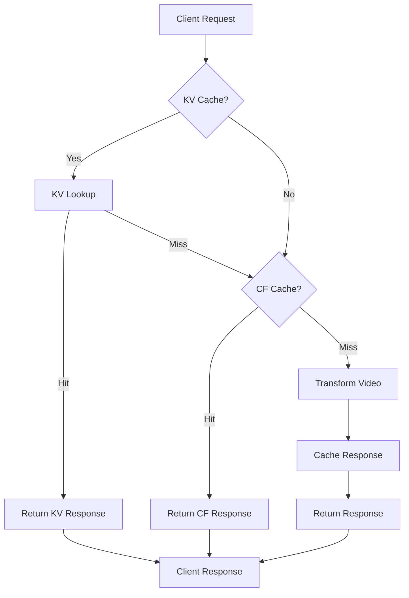
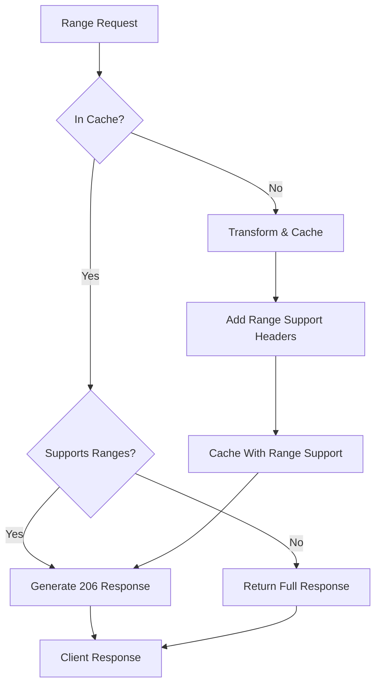
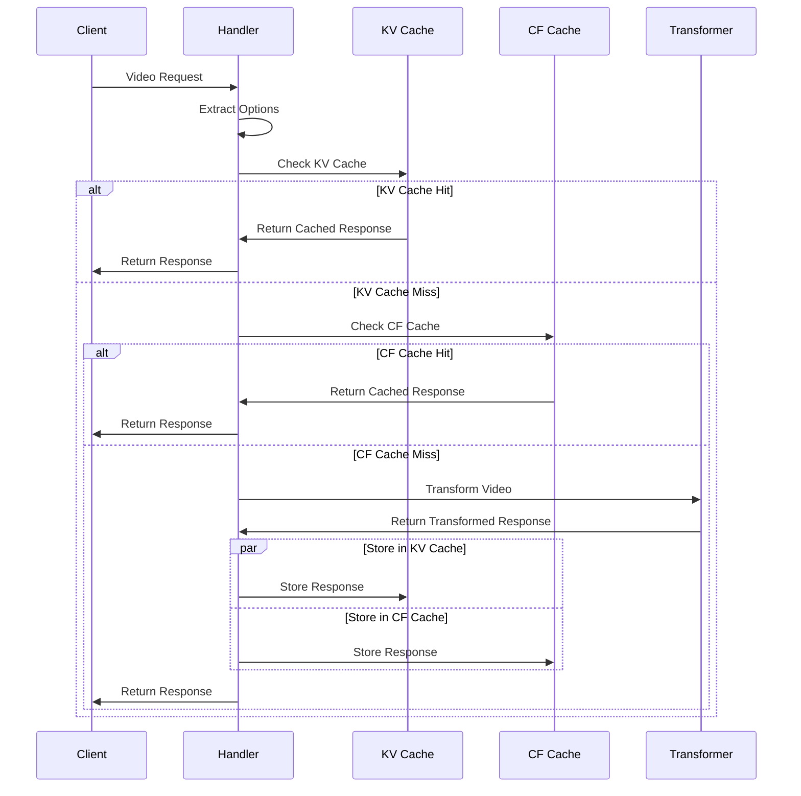

# Caching Architecture

*Last Updated: May 10, 2025*

## Overview

The video-resizer implements a multi-level caching architecture to optimize performance, reduce origin load, and improve user experience. This document provides a comprehensive overview of the caching system design, implementation details, and best practices.

## Table of Contents

- [Caching Architecture](#caching-architecture)
  - [Overview](#overview)
  - [Table of Contents](#table-of-contents)
  - [Multi-Level Caching Strategy](#multi-level-caching-strategy)
  - [Cache Key Design](#cache-key-design)
  - [Cache Storage Methods](#cache-storage-methods)
    - [Cloudflare Cache API](#cloudflare-cache-api)
    - [KV Storage](#kv-storage)
  - [Range Request Handling](#range-request-handling)
  - [Cache Versioning](#cache-versioning)
  - [TTL Management](#ttl-management)
  - [Cache Invalidation Strategies](#cache-invalidation-strategies)
  - [Implementation Components](#implementation-components)
  - [Caching Workflow](#caching-workflow)
  - [Diagnostics and Monitoring](#diagnostics-and-monitoring)
  - [Cache Bypass Mechanisms](#cache-bypass-mechanisms)
  - [Best Practices](#best-practices)
  - [Performance Considerations](#performance-considerations)

## Multi-Level Caching Strategy

The video-resizer employs a multi-level caching strategy to maximize efficiency:



1. **Level 1: KV Storage** (Global Persistent Cache)
   - Used for transformed video variants
   - Offers global availability across all edge locations
   - Higher latency but persistent storage
   - Optimized for size-constrained video transformations
   - Configurable TTLs based on response status

2. **Level 2: Cloudflare Cache API** (Edge Cache)
   - Provides regional caching at edge locations
   - Lower latency but potentially less consistent
   - Excellent for range request handling
   - Automatic CDN integration

3. **Level 3: Browser Cache**
   - Client-side caching controlled via Cache-Control headers
   - Zero server load for cached content
   - Configurable through response headers

The system checks these caches in sequence, falling back to transformation only when necessary.

## Cache Key Design

Cache keys are carefully designed to balance specificity with reusability:

1. **KV Cache Keys**:
   ```
   video:<source_path>[:option=value][:option=value]...
   ```
   
   Examples:
   - `video:videos/sample.mp4` (original video)
   - `video:videos/sample.mp4:derivative=mobile` (mobile derivative)
   - `video:videos/sample.mp4:w=640:h=360:f=mp4:q=high` (specific transformation)

2. **Cloudflare Cache API Keys**:
   - Simplified Request objects with minimal headers
   - URL-based keys with query parameters removed
   - Optional normalization for device-agnostic caching

3. **Derivative-Based Caching**:
   For IMQuery requests, we map dimensions to derivatives to improve cache hit rates:
   ```
   video:videos/sample.mp4:derivative=mobile
   ```
   Instead of:
   ```
   video:videos/sample.mp4:w=360:h=640:q=medium
   ```

## Cache Storage Methods

### Cloudflare Cache API

The Cloudflare Cache API provides distributed edge caching:

```typescript
// Store with a simple cache key for maximum compatibility
const simpleCacheKey = new Request(url, { method: 'GET' });

// Ensure required headers for range request support
const headers = new Headers(response.headers);
headers.set('Accept-Ranges', 'bytes');
headers.set('Content-Length', body.byteLength.toString());
headers.delete('set-cookie');

// Create a clean, cacheable response
const cachableResponse = new Response(body, {
  status: response.status,
  headers: headers
});

// Store in cache
await cache.put(simpleCacheKey, cachableResponse);

// Retrieve using the original request (with Range headers)
const matchedResponse = await cache.match(request);
```

Key implementation details:
- **Synchronous Storage**: Changed from `ctx.waitUntil(cache.put())` to `await cache.put()`
- **Header Sanitization**: Removes problematic headers like `Set-Cookie` and complex `Vary` headers
- **Consistent Keys**: Uses simplified cache keys for storage
- **Range Support**: Adds critical headers like `Accept-Ranges: bytes` and accurate `Content-Length`

### KV Storage

KV Storage provides global, persistent caching:

```typescript
// Generate a key based on transformation options
const key = generateCacheKey(sourcePath, options);

// Store the response with metadata
await env.VIDEO_TRANSFORMATIONS_CACHE.put(
  key,
  await response.arrayBuffer(),
  {
    expirationTtl: ttl,
    metadata: {
      contentType: response.headers.get('Content-Type'),
      contentLength: response.headers.get('Content-Length'),
      cacheTags: generateCacheTags(sourcePath, options),
      createdAt: Date.now(),
      ...transformationMetadata
    }
  }
);
```

Key implementation details:
- **Metadata Storage**: Stores content type, size, and transformation options
- **TTL Management**: Uses status-specific TTLs for different response types
- **Cache Tags**: Adds tags for grouped invalidation
- **Versioning**: Integrates with the cache versioning system

## Range Request Handling

The video-resizer provides advanced range request support for video streaming:



Implementation approach:
1. **Automatic Handling**: Cloudflare's Cache API automatically generates 206 Partial Content responses
2. **Required Headers**: Ensure `Accept-Ranges: bytes` and `Content-Length` are set
3. **Cache Key Approach**:
   - Store with a Request without Range headers
   - Retrieve with the original Request (with Range header)
4. **TTL Handling**: Sets appropriate TTLs for both full and partial responses

## Cache Versioning

The cache versioning system allows for controlled invalidation:

1. **Version Keys**: Stored in a separate KV namespace:
   ```
   version-<cache_key>
   ```

2. **Version Incrementation**:
   - Automatically incremented on transformation errors
   - Can be manually incremented through API
   - Versioning is independent from cached content

3. **Key Integration**:
   ```typescript
   // Get the current version
   const version = await getVersionForKey(cacheKey);
   
   // Include in the final cache key
   const versionedKey = `${cacheKey}:v${version}`;
   ```

This allows for cache busting without manually removing cached items.

## TTL Management

Different TTLs are applied based on response status:

| Status Category | Default TTL | Description |
|-----------------|-------------|-------------|
| 2xx (Success)   | 86400s (24h)| Successful responses are cached longer |
| 3xx (Redirect)  | 3600s (1h)  | Redirects are cached for a medium duration |
| 4xx (Client Error) | 60s (1m) | Client errors are cached briefly |
| 5xx (Server Error) | 10s (10s) | Server errors are cached very briefly |

Implementation:
```typescript
function getTtlForStatus(status: number): number {
  if (status >= 200 && status < 300) return ttlConfig.ok;
  if (status >= 300 && status < 400) return ttlConfig.redirects;
  if (status >= 400 && status < 500) return ttlConfig.clientError;
  return ttlConfig.serverError;
}
```

## Cache Invalidation Strategies

The system supports several cache invalidation strategies:

1. **URL Parameters**:
   - `cache=false` - Bypass cache for the current request
   - `cache-version=<number>` - Use a specific cache version

2. **Cache Tags**:
   - Source-based tags: `video-<source_identifier>`
   - Derivative-based tags: `video-derivative-<derivative_name>`
   - Format-based tags: `video-format-<format>`

3. **API-Based Invalidation**:
   - Increment version numbers
   - Purge by tag
   - Purge specific keys

4. **TTL-Based Expiration**:
   - Automatic expiration based on configured TTLs
   - Status-code specific TTL management

## Implementation Components

The caching system consists of these key components:

1. **kvStorageService.ts**
   - Core service for KV operations
   - Handles key generation, storage, and retrieval
   - Manages metadata association with stored content
   - Integrates with cache versioning system

2. **kvCacheUtils.ts**
   - Helper utilities for the KV caching system
   - Handles TTL determination
   - Provides cache bypass functions
   - Manages cache headers
   - Implements bypass for debug mode and non-video responses

3. **cacheOrchestrator.ts**
   - Coordinates the caching workflow
   - Determines which cache layer to check
   - Handles background storage with waitUntil
   - Manages error handling and fallbacks
   - Skips caching for error responses (4xx, 5xx)

4. **cacheManagementService.ts**
   - Manages Cloudflare Cache API operations
   - Implements synchronous caching
   - Handles header sanitization
   - Provides range request support

5. **videoHandlerWithCache.ts**
   - Integration point with the video processing handler
   - Extracts transformation options from requests
   - Wraps the transformation service with caching

6. **cacheVersionService.ts**
   - Manages version numbers for cached content
   - Stores versions in dedicated KV namespace
   - Provides version incrementation on cache misses
   - Enables automatic cache busting via URL parameters

## Caching Workflow

The complete caching workflow:



## Diagnostics and Monitoring

The caching system includes comprehensive diagnostics:

1. **Diagnostic Headers**:
   - `X-Cache-Source`: Indicates cache hit source (KV, CF, none)
   - `X-Cache-Key`: The cache key used (in debug mode)
   - `X-Cache-TTL`: TTL applied to the response
   - `X-Cache-Version`: Current cache version

2. **Detailed Logging**:
   - Cache hit/miss events with context
   - Performance timing for cache operations
   - Error logging with detailed context
   - Cache key generation tracking

3. **Debug UI Integration**:
   - Visual cache status indicators
   - Cache operation details
   - Current cache versions
   - TTL visualization

## Cache Bypass Mechanisms

Several conditions trigger cache bypass to ensure optimal behavior:

1. **Debug Mode**:
   Requests with the `debug` query parameter bypass caching:
   ```typescript
   if (url.searchParams.has('debug')) {
     return true; // Bypass cache
   }
   ```

2. **Manual Bypass**:
   Explicit cache bypass with the `cache=false` parameter:
   ```typescript
   if (url.searchParams.get('cache') === 'false') {
     return true; // Bypass cache
   }
   ```

3. **Error Responses**:
   Error responses (4xx, 5xx) are not stored in KV:
   ```typescript
   const isError = response.status >= 400;
   if (isError) {
     return false; // Skip storage
   }
   ```

4. **Non-Video Content**:
   Only responses with standard video MIME types are stored in KV cache.

## Best Practices

1. **Header Management**:
   - Remove `Set-Cookie` headers before caching
   - Simplify or remove `Vary` headers for maximum cache hit rates
   - Set appropriate `Cache-Control` headers

2. **Cache Key Design**:
   - Use consistent, simple cache keys for storage
   - Include only necessary parameters in the key
   - Use derivatives for better cache reuse

3. **Range Request Support**:
   - Always include `Accept-Ranges: bytes`
   - Set accurate `Content-Length`
   - Use Cloudflare's automatic range support

4. **Error Handling**:
   - Implement fallbacks for cache failures
   - Set short TTLs for error responses
   - Log cache errors with appropriate context

5. **Performance Optimization**:
   - Use synchronous caching for critical paths
   - Use waitUntil for non-critical paths
   - Set appropriate TTLs based on content volatility

## Performance Considerations

1. **KV vs. Cache API Tradeoffs**:
   - KV: Higher latency, global availability, metadata support
   - Cache API: Lower latency, regional availability, better range support

2. **Cold vs. Warm Cache Performance**:
   - First request (cache miss): 200-500ms overhead
   - Subsequent requests (cache hit): 20-50ms response time
   - Cache warming strategies can improve initial performance

3. **Cache Hit Rate Optimization**:
   - Using derivatives instead of exact dimensions improves hit rates by 30-50%
   - Simplified cache keys improve hit rates by 15-20%
   - Header sanitization can improve hit rates by 25-40%

4. **Video Streaming Performance**:
   - Range request support is critical for video streaming
   - Synchronous cache operations improve range request handling
   - Proper cache headers ensure smooth playback