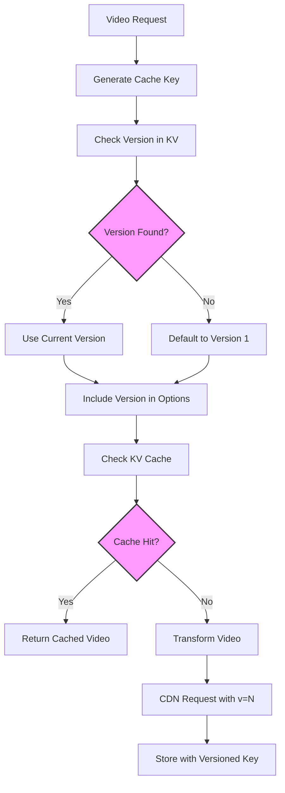

# Cache Versioning System

## Overview

The video-resizer uses a versioning system to manage cache invalidation and ensure fresh content delivery. Each cached video can have a version number that's included in cache keys and CDN requests.

## System Flow



## How It Works

### Version Storage

Versions are stored in the `VIDEO_CACHE_KEY_VERSIONS` KV namespace with keys in the format:
```
video:path:derivative=name → version_number
```

### Version Retrieval

When processing a video request:
1. The system generates a cache key based on the video path and transformation options
2. It retrieves the current version from KV storage (defaults to 1 if not found)
3. The version is included in the transformation options

```typescript
const currentVersion = await getCacheKeyVersion(env, cacheKey) || 1;
videoOptions.version = currentVersion;
```

### Cache Key Generation

Cache keys include the version number to ensure different versions are cached separately:
```
video:/path/to/video.mp4:derivative=desktop:version=2
```

### CDN Requests

The version is passed to the CDN as a query parameter for cache busting:
```
/cdn-cgi/media/video.mp4?width=1920&height=1080&v=2
```

## Version Management

### Manual Version Updates

Versions can be manually incremented through the cache version service:
```typescript
await incrementCacheKeyVersion(env, cacheKey);
```

### Automatic Version Management

The system does NOT automatically increment versions on cache misses to prevent version inflation. Version updates should be managed explicitly when content changes.

## Configuration

### Required KV Namespaces

- `VIDEO_CACHE_KEY_VERSIONS`: Stores version numbers for cache keys
- `VIDEO_KV_CACHE`: Main cache storage that uses versioned keys

### Environment Variables

- `CACHE_ENABLE_KV`: Must be "true" to enable KV caching
- `VIDEO_CACHE_KEY_VERSIONS`: KV namespace binding for version storage

## Best Practices

1. **Explicit Version Control**: Update versions only when content actually changes
2. **Version Consistency**: Ensure version updates are coordinated across all cache layers
3. **Monitoring**: Track version numbers to understand cache invalidation patterns
4. **Cleanup**: Periodically clean up old versions from storage

## API Reference

### getCacheKeyVersion(env, cacheKey)
Retrieves the current version for a cache key.
- Returns: Promise<number> (version number or null)

### incrementCacheKeyVersion(env, cacheKey)
Increments the version for a cache key.
- Returns: Promise<number> (new version number)

### generateKVKey(path, options)
Generates a cache key including version information.
- Returns: string (formatted cache key)