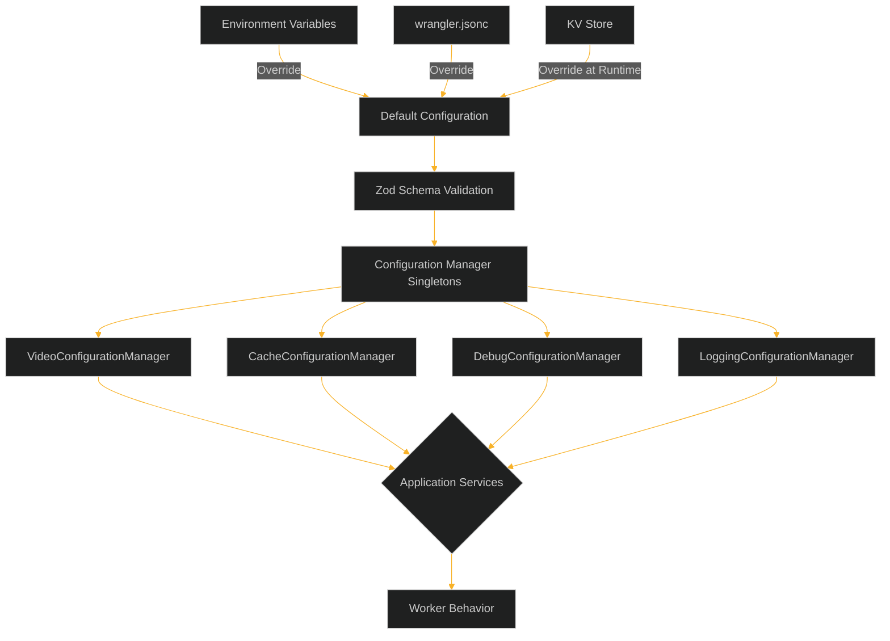
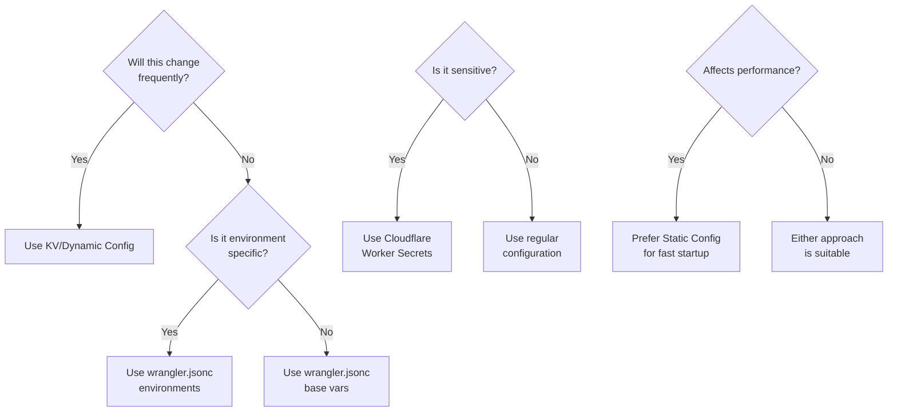

# Video Resizer Configuration Guide

This guide provides a comprehensive walkthrough of the video-resizer configuration system, explaining how to configure the service for different environments and use cases.

## Table of Contents

- [Configuration System Overview](#configuration-system-overview)
- [Getting Started](#getting-started)
- [Static vs. Dynamic Configuration](#static-vs-dynamic-configuration)
- [Configuration Managers](#configuration-managers)
- [Environment Variables](#environment-variables)
- [Path Pattern Matching System](#path-pattern-matching-system)
- [Storage Configuration](#storage-configuration)
- [Caching Configuration](#caching-configuration)
- [Debug Configuration](#debug-configuration)
- [Common Configuration Tasks](#common-configuration-tasks)
- [Troubleshooting](#troubleshooting)

## Configuration System Overview

The video-resizer uses a centralized configuration management system based on TypeScript and Zod schema validation. This provides type safety, runtime validation, and a clean interface for accessing configuration values.



### Configuration Loading Flow

1. **Default Configuration**: Initial values defined in each manager (e.g., `videoConfig.ts`)
2. **Static Configuration**: Values from wrangler.jsonc apply as the first level of overrides
3. **Environment Variables**: Override both wrangler.jsonc and defaults
4. **KV Configuration**: On first request, configuration is loaded from KV storage (if available)
5. **Validation**: All configuration validated against Zod schemas to ensure type safety
6. **Configuration Application**: Valid configuration applied to appropriate managers
7. **Runtime Access**: Manager singletons provide typed access to validated configuration

This approach allows progressive configuration refinement from hardcoded defaults to dynamic runtime updates.

## Getting Started

### Basic Configuration

To start using the video-resizer, you need at minimum:

1. A `wrangler.jsonc` file with your basic configuration
2. Configuration for at least one path pattern to match video URLs

Here's a minimal example:

```jsonc
// wrangler.jsonc
{
  "name": "video-resizer",
  "main": "src/index.ts",
  "compatibility_date": "2023-09-01",
  
  "vars": {
    "ENVIRONMENT": "development",
    "video": {
      "pathPatterns": [
        {
          "name": "standard",
          "matcher": "^/(.*\\.(mp4|webm|mov))",
          "priority": 10,
          "processPath": true
        }
      ]
    }
  }
}
```

### Development Workflow

For local development, use:

```bash
npm run dev
# or
wrangler dev
```

This starts a local development server with your configuration. You can then test video transformation by sending requests to your local worker.

## Static vs. Dynamic Configuration

The video-resizer supports both static and dynamic configuration approaches:

### Static Configuration (wrangler.jsonc)

Static configuration is defined in `wrangler.jsonc` and deployed with your worker. This is recommended for:

- Base configuration that rarely changes
- Path patterns and URL matching rules
- Default video transformation options
- Environment-specific settings (dev/staging/prod)

**Advantages**:
- Available immediately on worker startup
- No external dependencies
- Version controlled with your code
- Validated at build time

**Example**:
```jsonc
"vars": {
  "video": {
    "defaults": {
      "quality": "auto",
      "fit": "contain"
    },
    "pathPatterns": [
      {
        "name": "main-videos",
        "matcher": "^/videos/(.*\\.(mp4|webm))",
        "priority": 10
      }
    ]
  }
}
```

### Dynamic Configuration (KV Storage)

Dynamic configuration is stored in Cloudflare KV and can be updated without redeploying your worker. This is recommended for:

- Configuration that changes frequently
- A/B testing parameters
- Feature flags
- Temporary overrides

**Advantages**:
- Can be updated without redeployment
- Different teams can manage configuration
- Supports complex multi-environment setups
- Can be updated via API or dashboard

**KV Setup**:
```jsonc
"kv_namespaces": [
  {
    "binding": "VIDEO_CONFIGURATION_STORE",
    "id": "your-kv-namespace-id"
  }
]
```

**Updating Dynamic Configuration**:
```bash
# Using provided tool
npm run config-upload -- --env production --config path/to/config.json

# Or directly via Wrangler
wrangler kv:key put --binding=VIDEO_CONFIGURATION_STORE "config:video" "$(cat path/to/video-config.json)" --env production
```

### Configuration Decision Flowchart

Use this flowchart to determine where to place different configuration items:



## Configuration Managers

The configuration system uses specialized manager classes to handle different aspects of the system:

### VideoConfigurationManager

Controls all video transformation settings:

```typescript
import { VideoConfigurationManager } from './config';

const videoConfig = VideoConfigurationManager.getInstance();
const quality = videoConfig.getDefaultOption('quality');
const isValidFit = videoConfig.isValidOption('fit', 'cover');
```

Key configuration areas:
- Path patterns for URL matching
- Default transformation options
- Video derivative presets
- Parameter validation settings

### CacheConfigurationManager

Manages caching behavior for transformed videos:

```typescript
import { CacheConfigurationManager } from './config';

const cacheConfig = CacheConfigurationManager.getInstance();
const cacheMethod = cacheConfig.getCacheMethod();
const ttl = cacheConfig.getProfileForPath('/videos/sample.mp4').ttl.ok;
```

Key configuration areas:
- Cache method (CF vs. Cache API)
- TTL settings for different response types
- Cache profiles for different content types
- KV cache settings

### DebugConfigurationManager

Controls debug capabilities and settings:

```typescript
import { DebugConfigurationManager } from './config';

const debugConfig = DebugConfigurationManager.getInstance();
const isDebugEnabled = debugConfig.isEnabled();
const shouldDebugRequest = debugConfig.shouldEnableForRequest(request);
```

Key configuration areas:
- Debug mode toggles
- Verbose output settings
- Debug view configuration
- IP-based access control

### LoggingConfigurationManager

Handles logging levels, formats, and behavior:

```typescript
import { LoggingConfigurationManager } from './config';

const loggingConfig = LoggingConfigurationManager.getInstance();
const logLevel = loggingConfig.getLogLevel();
const shouldLogComponent = loggingConfig.shouldLogComponent('cache');
```

Key configuration areas:
- Log level settings
- Component-specific logging
- Performance logging thresholds
- Log format configuration

## Environment Variables

Environment variables provide a way to override configuration at runtime without changing configuration files. These can be set through the Cloudflare dashboard or `wrangler.jsonc` environments.

### Common Environment Variables

```
# Debug settings
DEBUG_ENABLED=true
DEBUG_VERBOSE=true

# Cache settings
CACHE_METHOD=cf
CACHE_ENABLE_KV=true

# Logging settings
LOG_LEVEL=info
LOG_PERFORMANCE=true

# General settings
ENVIRONMENT=production
```

### Setting Environment Variables

In `wrangler.jsonc`:
```jsonc
"vars": {
  "DEBUG_ENABLED": "true",
  "CACHE_METHOD": "cf"
}
```

Or using environment-specific configuration:
```jsonc
"env": {
  "production": {
    "vars": {
      "ENVIRONMENT": "production",
      "DEBUG_ENABLED": "false"
    }
  },
  "staging": {
    "vars": {
      "ENVIRONMENT": "staging",
      "DEBUG_ENABLED": "true"
    }
  }
}
```

### Using Different Environments

To deploy to a specific environment:
```bash
wrangler deploy --env production
```

To develop with a specific environment:
```bash
wrangler dev --env staging
```

## Path Pattern Matching System

The path pattern matching system is one of the most important configuration components. It determines:

1. Which URLs should be processed by the video-resizer
2. What transformation options to apply
3. How to cache the results

### Basic Path Pattern

```jsonc
{
  "name": "standard-videos",
  "matcher": "^/videos/(.*\\.(mp4|webm))",
  "priority": 10,
  "processPath": true,
  "baseUrl": "/cdn-cgi/media",
  "quality": "auto"
}
```

### Path Pattern Fields

| Field | Type | Description |
|-------|------|-------------|
| `name` | string | Unique identifier for the pattern |
| `matcher` | string | Regular expression for matching URLs |
| `priority` | number | Processing order (higher numbers = higher priority) |
| `processPath` | boolean | Whether to process matched paths |
| `baseUrl` | string | Base URL for transformations |
| `originUrl` | string | Optional origin URL for fetching content |
| `quality` | string | Quality preset for this pattern |
| `cacheTtl` | number | Cache TTL override in seconds |
| `captureGroups` | string[] | Named capture groups in the matcher |

### Pattern Matching Examples

**Match all MP4 files in a specific directory**:
```jsonc
{
  "name": "product-videos",
  "matcher": "^/products/(.*)\\.mp4$",
  "priority": 20,
  "processPath": true
}
```

**Match videos with specific dimensions in the path**:
```jsonc
{
  "name": "dimensioned-videos",
  "matcher": "^/videos/(?<width>\\d+)x(?<height>\\d+)/(?<filename>.*)\\.(mp4|webm)$",
  "priority": 30,
  "processPath": true,
  "captureGroups": ["width", "height", "filename"]
}
```

**Pass through certain file types without processing**:
```jsonc
{
  "name": "passthrough-files",
  "matcher": "^/media/.*\\.(gif|jpg|png)$",
  "priority": 40,
  "processPath": false
}
```

### Capture Groups

Capture groups allow extracting values from the URL path:

```jsonc
{
  "name": "quality-in-path",
  "matcher": "^/videos/(?<quality>high|medium|low)/(?<filename>.*)\\.(mp4|webm)$",
  "captureGroups": ["quality", "filename"],
  "priority": 50,
  "processPath": true
}
```

With this configuration, a URL like `/videos/high/my-video.mp4` would automatically use the "high" quality setting.

### Multiple Path Patterns

You can define multiple path patterns for different URL structures. The system will match based on:
1. Whether the URL matches the pattern's regex
2. The pattern's priority (higher priority patterns are checked first)

```jsonc
"pathPatterns": [
  {
    "name": "product-videos",
    "matcher": "^/products/.*\\.mp4$",
    "priority": 20
  },
  {
    "name": "user-uploads",
    "matcher": "^/users/(?<userId>[\\w-]+)/videos/.*\\.(mp4|webm)$",
    "priority": 30,
    "captureGroups": ["userId"]
  },
  {
    "name": "fallback",
    "matcher": "^/.*\\.(mp4|webm|mov)$",
    "priority": 0
  }
]
```

## Storage Configuration

The video-resizer supports multiple storage backends for flexibility:

### Example Configuration

```jsonc
"storage": {
  "priority": ["r2", "remote", "fallback"],
  "r2": {
    "enabled": true,
    "bucketBinding": "VIDEOS_BUCKET"
  },
  "remoteUrl": "https://videos.example.com",
  "remoteAuth": {
    "enabled": false,
    "type": "header",
    "headers": {
      "Authorization": "Bearer YOUR_TOKEN"
    }
  },
  "fallbackUrl": "https://cdn.example.com",
  "fallbackAuth": {
    "enabled": true,
    "type": "aws-s3",
    "accessKeyVar": "AWS_ACCESS_KEY_ID", 
    "secretKeyVar": "AWS_SECRET_ACCESS_KEY",
    "region": "us-east-1",
    "service": "s3"
  }
}
```

### Storage Priority

The `priority` array determines the order in which storage backends are tried:

1. First, check Cloudflare R2 (if configured)
2. Then check the primary remote URL
3. Finally, try the fallback URL

### AWS S3 Authentication

For AWS S3 compatible storage (including Cloudflare R2):

```jsonc
"fallbackAuth": {
  "enabled": true,
  "type": "aws-s3",
  "accessKeyVar": "AWS_ACCESS_KEY_ID",
  "secretKeyVar": "AWS_SECRET_ACCESS_KEY",
  "region": "us-east-1", // Use "auto" for R2
  "service": "s3"
}
```

**Security Best Practice**: Store your AWS credentials as Cloudflare Worker secrets:

```bash
wrangler secret put AWS_ACCESS_KEY_ID
wrangler secret put AWS_SECRET_ACCESS_KEY
```

## Caching Configuration

Caching is critical for performance and cost optimization:

### Cache Method

Two cache methods are available:

1. **`cf`** (recommended): Uses Cloudflare's built-in caching with CF object
2. **`cacheApi`**: Uses the Cache API directly

```jsonc
"cache": {
  "method": "cf",
  "debug": false,
  "defaultTtl": 86400,
  "cacheEverything": true
}
```

### TTL Configuration

TTL (Time To Live) settings control how long content is cached based on response status:

```jsonc
"ttl": {
  "ok": 86400,         // 24 hours for 2xx responses
  "redirects": 3600,   // 1 hour for 3xx responses
  "clientError": 60,   // 1 minute for 4xx responses
  "serverError": 10    // 10 seconds for 5xx responses
}
```

### TTL Precedence Hierarchy

TTL settings have a clear precedence order:

1. **Path Pattern TTLs** (highest priority) - Specific to a URL path pattern
   ```jsonc
   "pathPatterns": [{
     "name": "standard",
     "matcher": "^/(.*\\.(mp4|webm|mov))",
     "cacheTtl": {
       "ok": 300,
       "redirects": 300,
       "clientError": 60,
       "serverError": 10
     }
   }]
   ```

2. **Content-type Profile TTLs** (medium priority) - Based on content type
   ```jsonc
   "profiles": {
     "videoFiles": {
       "regex": "\\.(mp4|webm|mov)$",
       "ttl": {
         "ok": 300,
         "redirects": 300,
         "clientError": 60,
         "serverError": 10
       }
     }
   }
   ```

3. **Global Default TTLs** (lowest priority) - Used when no other rules match
   ```jsonc
   "cache": {
     "ttl": {
       "ok": 300,
       "redirects": 300,
       "clientError": 60,
       "serverError": 10
     }
   }
   ```

### KV Cache Configuration

For improved performance, you can enable KV storage of transformed videos:

```jsonc
"kvCache": {
  "enabled": true,
  "namespace": "VIDEO_TRANSFORMATIONS_CACHE",
  "ttl": {
    "ok": 86400,
    "redirects": 3600,
    "clientError": 60,
    "serverError": 10
  }
}
```

This requires a KV namespace binding:

```jsonc
"kv_namespaces": [
  {
    "binding": "VIDEO_TRANSFORMATIONS_CACHE",
    "id": "your-kv-namespace-id"
  }
]
```

## Debug Configuration

Debug features help troubleshoot issues and understand how the system is working:

### Basic Debug Configuration

```jsonc
"debug": {
  "enabled": false,
  "verbose": false,
  "includeHeaders": false,
  "includePerformance": true,
  "dashboardMode": true,
  "viewMode": true,
  "headerMode": true,
  "debugQueryParam": "debug",
  "debugViewParam": "view",
  "allowedIps": ["192.0.2.1", "198.51.100.0/24"]
}
```

### Activating Debug Mode

Debug mode can be activated in several ways:

1. **Query Parameter**: Add `?debug=true` to any URL
2. **Request Header**: Include any header listed in `debugHeaders`
3. **IP Address**: Connect from an IP in the `allowedIps` list
4. **Global Toggle**: Set `debug.enabled` to `true` in configuration

### Debug Views

Debug views provide detailed information about the request and transformation:

```
https://example.com/videos/sample.mp4?debug=true&view=true
```

This renders an HTML dashboard with tabs for:
- Request information
- Transformation options
- Cache status
- Performance metrics
- Configuration details

### Debug Headers

When header mode is enabled, debug information is added to response headers:

```
X-Debug-Transformation: width=800,height=450,quality=auto
X-Debug-Cache: hit=false,method=cf,store=edge
X-Debug-Performance: total=235ms,transform=180ms,fetch=55ms
```

## Common Configuration Tasks

### Adding a New Path Pattern

To add a new pattern for processing:

```jsonc
"pathPatterns": [
  // Existing patterns...
  {
    "name": "new-pattern",
    "matcher": "^/new-videos/(.*)\\.(mp4|webm)$",
    "priority": 15,
    "processPath": true,
    "quality": "high"
  }
]
```

### Changing Default Video Quality

To change the default quality for all videos:

```jsonc
"video": {
  "defaults": {
    "quality": "medium", // Can be "low", "medium", "high", or "auto"
    "fit": "contain"
  }
}
```

### Setting Up Path-Based Quality Settings

To use different quality settings based on the URL path:

```jsonc
"pathPatterns": [
  {
    "name": "high-quality",
    "matcher": "^/videos/hq/(.*)\\.(mp4|webm)$",
    "priority": 30,
    "quality": "high"
  },
  {
    "name": "low-quality",
    "matcher": "^/videos/lq/(.*)\\.(mp4|webm)$",
    "priority": 30,
    "quality": "low"
  }
]
```

### Configuring Responsive Video

For responsive video that adapts to client capabilities:

```jsonc
"video": {
  "responsive": {
    "enabled": true,
    "useClientHints": true,
    "defaultWidth": 1280,
    "defaultHeight": 720,
    "maxWidth": 1920,
    "maxHeight": 1080,
    "preserveAspectRatio": true,
    "deviceBreakpoints": {
      "mobile": 640,
      "tablet": 1024,
      "desktop": 1920
    }
  }
}
```

### Setting Up Multiple Environments

Configure different settings for development, staging, and production:

```jsonc
"env": {
  "development": {
    "vars": {
      "ENVIRONMENT": "development",
      "DEBUG_ENABLED": "true",
      "LOG_LEVEL": "debug"
    }
  },
  "staging": {
    "vars": {
      "ENVIRONMENT": "staging",
      "DEBUG_ENABLED": "true",
      "LOG_LEVEL": "info"
    }
  },
  "production": {
    "vars": {
      "ENVIRONMENT": "production",
      "DEBUG_ENABLED": "false",
      "LOG_LEVEL": "warn"
    }
  }
}
```

### Adding AWS S3 Authentication

To add S3 authentication for accessing videos:

```jsonc
"storage": {
  "remoteAuth": {
    "enabled": true,
    "type": "aws-s3",
    "accessKeyVar": "AWS_ACCESS_KEY_ID",
    "secretKeyVar": "AWS_SECRET_ACCESS_KEY",
    "region": "us-east-1",
    "service": "s3"
  }
}
```

Remember to set your credentials as secrets:

```bash
wrangler secret put AWS_ACCESS_KEY_ID
wrangler secret put AWS_SECRET_ACCESS_KEY
```

## Troubleshooting

### Common Configuration Issues

#### Path Pattern Not Matching

**Problem**: Your URL is not being processed by the video-resizer.

**Troubleshooting Steps**:
1. Enable debug mode with `?debug=true`
2. Check the debug output for "Path Matching" section
3. Verify your regex pattern matches the URL
4. Ensure `processPath` is set to `true`
5. Check pattern priority (higher numbers = higher priority)

#### Configuration Not Loading

**Problem**: Your configuration changes aren't being applied.

**Troubleshooting Steps**:
1. For wrangler.jsonc changes: Ensure you've redeployed the worker
2. For KV changes: Check the KV namespace binding is correct
3. Enable logging with `LOG_LEVEL=debug`
4. Check logs for configuration loading errors
5. Verify your JSON format is valid

#### Unexpected Transformation Options

**Problem**: Videos aren't being transformed with the expected options.

**Troubleshooting Steps**:
1. Add `?debug=true` to the URL to see applied options
2. Check URL parameters (these override config settings)
3. Verify path pattern priorities (a different pattern might match first)
4. Check for path pattern-specific settings overriding defaults
5. Inspect the debug headers for transformation details

#### Caching Issues

**Problem**: Content isn't being cached as expected.

**Troubleshooting Steps**:
1. Check cache configuration with `?debug=true`
2. Verify TTL settings in your configuration
3. Check if a cache bypass parameter is present in the URL
4. Verify browser cache headers using browser developer tools
5. Check for `Cache-Control: private` headers that might prevent caching

### Getting Help

If you're still having trouble:

1. Enable debug mode and collect detailed information
2. Review the logs with increased verbosity (`LOG_LEVEL=debug`)
3. Check for errors in the browser console or worker logs
4. Refer to the [Configuration Reference](./CONFIGURATION_REFERENCE.md) for detailed parameter documentation
5. For specific issues, check [Path Pattern Troubleshooting](./path-pattern-troubleshooting.md)

## Best Practices

1. **Start with Presets**: Begin with default settings and refine as needed
2. **Test in Development**: Always test configuration changes in development before production
3. **Prioritize Path Patterns**: Organize path patterns from specific to general
4. **Use Meaningful Names**: Give descriptive names to path patterns and configurations
5. **Avoid Excessive Debug**: Only enable debug features when needed to avoid performance impact
6. **Layer Configuration**: Use the precedence hierarchy to create a clean configuration structure
7. **Document Custom Settings**: Keep notes on non-default settings for future reference
8. **Monitor Performance**: Use debug tools to verify performance impacts of configuration changes
9. **Regular Review**: Periodically review configuration for optimization opportunities
10. **Security First**: Store sensitive credentials using Worker secrets, not in configuration files