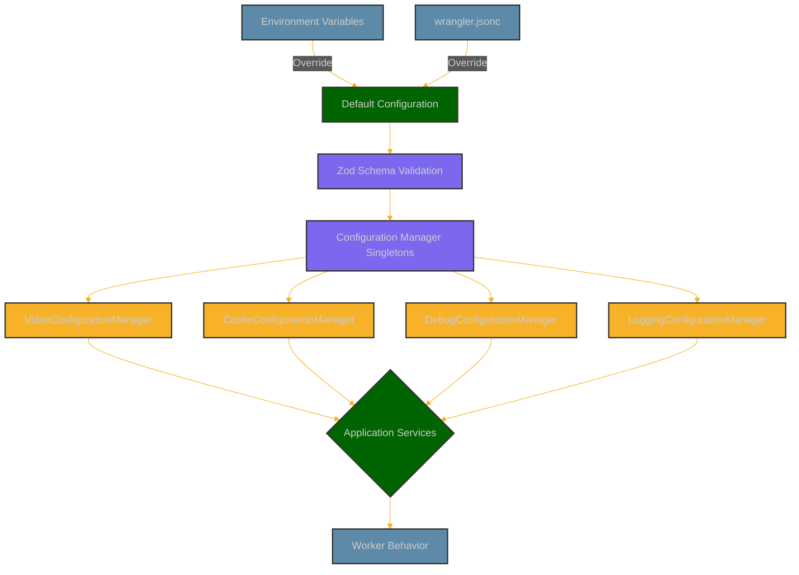

# Video Resizer Configuration Reference

This document provides a comprehensive reference for all configuration options available in the video-resizer project. The configuration system is divided into several managers, each responsible for a specific area of functionality.

## Table of Contents

- [Configuration System Overview](#configuration-system-overview)
- [Video Configuration](#video-configuration)
- [Cache Configuration](#cache-configuration)
- [Logging Configuration](#logging-configuration)
- [Debug Configuration](#debug-configuration)
- [Environment Variables](#environment-variables)

## Configuration System Overview

The video-resizer uses a centralized configuration management system based on Zod schema validation. Each configuration manager is implemented as a singleton and provides type-safe access to configuration values.



### Key Features

- **Runtime Validation**: All configuration is validated at runtime using Zod schemas
- **Type Safety**: Full TypeScript type support with inferred types from Zod schemas
- **Centralized Management**: Configuration accessed through manager classes
- **Environment Variable Support**: Configuration can be overridden with environment variables
- **Default Values**: Sensible defaults for all configuration options

### Usage Example

```typescript
import { VideoConfigurationManager } from './config';

// Get an instance of the configuration manager
const configManager = VideoConfigurationManager.getInstance();

// Access configuration
const paramMapping = configManager.getParamMapping();
const isValidOption = configManager.isValidOption('fit', 'contain');
```

## Video Configuration

The `VideoConfigurationManager` handles all video transformation settings and options.

### Non-MP4 File Passthrough

The video-resizer includes a configurable passthrough capability for non-MP4 video files:

| Option | Type | Default | Description |
|--------|------|---------|-------------|
| `passthrough.enabled` | boolean | true | Enable passthrough for non-MP4 files |
| `passthrough.whitelistedFormats` | string[] | [] | File extensions to process even if not MP4 |

Example configuration in wrangler.jsonc:

```jsonc
{
  "video": {
    "passthrough": {
      "enabled": true,
      "whitelistedFormats": [".webm"]
    }
  }
}
```

Or when using the Configuration API:

```json
{
  "video": {
    "passthrough": {
      "enabled": true,
      "whitelistedFormats": [".webm"]
    }
  }
}
```

**Note**: Cloudflare Media Transformation only fully supports MP4 files with H.264 encoded video and AAC or MP3 encoded audio. Attempting to process other formats may result in errors.

### Video Derivatives

Preset configurations for different use cases:

| Derivative | Description | Example Use Case |
|------------|-------------|------------------|
| `high`     | High quality video | Desktop viewing, high-bandwidth connections |
| `medium`   | Medium quality video | Default for most devices |
| `low`      | Low quality video | Mobile devices, low-bandwidth connections |
| `mobile`   | Mobile-optimized | Small screens, potentially low bandwidth |
| `thumbnail`| Static thumbnail | Video preview/thumbnail images |
| `preview`  | Short preview clip | Hover previews, loading animations |
| `animation`| GIF-like animation | Short animated preview |

### Video Default Options

| Option | Type | Default | Description |
|--------|------|---------|-------------|
| `width` | number | null | Width in pixels |
| `height` | number | null | Height in pixels |
| `mode` | string | 'video' | Transformation mode: 'video', 'frame', or 'spritesheet' |
| `fit` | string | 'contain' | Resize behavior: 'contain', 'scale-down', or 'cover' |
| `audio` | boolean | true | Whether to include audio |
| `format` | string | null | Output format, e.g., 'mp4', 'webm' |
| `time` | string | null | Timestamp for frame extraction, e.g., '5s' |
| `duration` | string | null | Duration for clips, e.g., '10s' |
| `quality` | string | null | Quality level: 'low', 'medium', 'high', 'auto' |
| `compression` | string | null | Compression level: 'low', 'medium', 'high', 'auto' |
| `loop` | boolean | null | Whether video should loop |
| `preload` | string | null | Preload behavior: 'none', 'metadata', 'auto' |
| `autoplay` | boolean | null | Whether video should autoplay |
| `muted` | boolean | null | Whether video should be muted |

### Path Patterns

Configuration for URL path matching and processing:

| Option | Type | Description |
|--------|------|-------------|
| `name` | string | Identifier for the pattern |
| `matcher` | string | Regular expression pattern for matching URLs |
| `processPath` | boolean | Whether to process matched paths |
| `baseUrl` | string | Base URL for transformations |
| `originUrl` | string | Origin URL for fetching content |
| `quality` | string | Quality preset for this pattern |
| `cacheTtl` | number | Cache TTL in seconds |
| `priority` | number | Processing priority |
| `captureGroups` | string[] | Named capture groups in the matcher |

### Methods

- `getConfig()`: Get the entire configuration
- `getDerivative(name)`: Get a derivative configuration
- `getPathPatterns()`: Get all path patterns
- `getValidOptions(param)`: Get valid options for a parameter
- `isValidOption(param, value)`: Check if a value is valid for a parameter
- `getDefaultOption(option)`: Get a default option value
- `getDefaults()`: Get all default options
- `getCdnCgiConfig()`: Get CDN-CGI configuration
- `getCacheConfig()`: Get cache configuration
- `getResponsiveConfig()`: Get responsive design configuration
- `addPathPattern(pattern)`: Add a new path pattern

## Cache Configuration

The `CacheConfigurationManager` handles caching behavior and cache profiles.

### TTL Precedence Hierarchy

The video-resizer uses a hierarchy of TTL configurations with clear precedence:

1. **Path Pattern TTLs** (highest priority) - Specific TTL configuration for a matched URL path pattern
   ```json
   "pathPatterns": [{
     "name": "standard",
     "matcher": "^/(.*\\.(mp4|webm|mov))",
     "ttl": {
       "ok": 300,
       "redirects": 300,
       "clientError": 60,
       "serverError": 10
     }
   }]
   ```

2. **Content-type Profile TTLs** (medium priority) - TTL configuration based on content type or URL pattern
   ```json
   "profiles": {
     "videoFiles": {
       "regex": "\\.(mp4|webm|mov)$",
       "ttl": {
         "ok": 300,
         "redirects": 300,
         "clientError": 60,
         "serverError": 10
       }
     }
   }
   ```

3. **Global Default TTLs** (lowest priority) - Base TTL configuration when no other rules match
   ```json
   "cache": {
     "ttl": {
       "ok": 300,
       "redirects": 300,
       "clientError": 60,
       "serverError": 10
     }
   }
   ```

When determining which TTL to use, the system first checks if the URL matches a path pattern and uses that TTL if available. If no path pattern matches or the path pattern doesn't specify a TTL, it falls back to a matching content-type profile. If no profile matches, it uses the global default TTL.

### Cache Method Options

| Option | Description | Default |
|--------|-------------|---------|
| `cf` | Use Cloudflare's built-in caching with CF object (recommended) | ✓ |
| `cacheApi` | Use the Cache API directly (alternative) | |

### Cache Profiles

Each profile configures caching behavior for a specific content pattern:

| Option | Type | Description |
|--------|------|-------------|
| `regex` | string | Pattern to match content |
| `cacheability` | boolean | Whether content should be cached |
| `videoCompression` | string | Compression for this profile |
| `ttl` | object | TTL settings (see below) |

### TTL Configuration

TTL (Time To Live) settings based on response status:

| Option | Type | Default | Description |
|--------|------|---------|-------------|
| `ok` | number | 86400 | TTL for successful responses (200-299) |
| `redirects` | number | 3600 | TTL for redirects (300-399) |
| `clientError` | number | 60 | TTL for client errors (400-499) |
| `serverError` | number | 10 | TTL for server errors (500-599) |

### KV Cache Configuration

The cache system also supports storing transformed video variants in Cloudflare KV for faster retrieval:

| Option | Type | Default | Description |
|--------|------|---------|-------------|
| `enableKVCache` | boolean | false | Enable KV storage for transformed variants |
| `kvTtl.ok` | number | 86400 | TTL for 2xx responses in KV storage |
| `kvTtl.redirects` | number | 3600 | TTL for 3xx responses in KV storage |
| `kvTtl.clientError` | number | 60 | TTL for 4xx responses in KV storage |
| `kvTtl.serverError` | number | 10 | TTL for 5xx responses in KV storage |

The KV cache system requires a KV namespace binding:

```jsonc
"kv_namespaces": [
  {
    "binding": "VIDEO_TRANSFORMATIONS_CACHE",
    "id": "your-kv-namespace-id"
  }
]
```

For detailed documentation on the KV caching system, see [docs/KV_CACHING.md](./docs/KV_CACHING.md).

### Default Profiles

| Profile | Description | TTL (OK) |
|---------|-------------|----------|
| `default` | Default pattern for all content | 24 hours |
| `highTraffic` | Popular content pattern | 7 days |
| `shortForm` | Short-form video content | 2 days |
| `dynamic` | Dynamic or live content | 5 minutes |

### Methods

- `getConfig()`: Get the entire cache configuration
- `getCacheMethod()`: Get the current cache method
- `isDebugEnabled()`: Check if cache debugging is enabled
- `shouldBypassCache(url)`: Check if cache should be bypassed
- `getProfileForPath(path)`: Get cache profile for a URL path
- `addProfile(name, profile)`: Add a new cache profile

## Logging Configuration

The `LoggingConfigurationManager` handles logging levels, formats, and behavior.

### Logging Options

| Option | Type | Default | Description |
|--------|------|---------|-------------|
| `level` | string | 'info' | Log level: 'debug', 'info', 'warn', 'error' |
| `format` | string | 'text' | Log format: 'json' or 'text' |
| `includeTimestamps` | boolean | true | Include timestamps in logs |
| `includeComponentName` | boolean | true | Include component names in logs |
| `colorize` | boolean | true | Use colors in console output |
| `enabledComponents` | string[] | [] | Components to enable (empty = all) |
| `disabledComponents` | string[] | [] | Components to disable |
| `sampleRate` | number | 1 | Sampling rate for logs (0-1) |
| `enablePerformanceLogging` | boolean | false | Enable performance metrics |
| `performanceThresholdMs` | number | 1000 | Threshold for performance warnings |

### Methods

- `getConfig()`: Get the entire logging configuration
- `getLogLevel()`: Get the current log level
- `shouldLogComponent(componentName)`: Check if a component should be logged
- `shouldSampleLog()`: Check if a log should be sampled
- `shouldLogPerformance()`: Check if performance should be logged
- `getPerformanceThreshold()`: Get the performance threshold

## Debug Configuration

The `DebugConfigurationManager` handles debugging capabilities and settings.

### Debug Options

| Option | Type | Default | Description |
|--------|------|---------|-------------|
| `enabled` | boolean | false | Enable debug mode globally |
| `verbose` | boolean | false | Enable verbose debug output |
| `includeHeaders` | boolean | false | Include headers in debug info |
| `includePerformance` | boolean | false | Include performance metrics |
| `dashboardMode` | boolean | true | Enable debug dashboard |
| `viewMode` | boolean | true | Enable debug view |
| `headerMode` | boolean | true | Enable debug headers |
| `debugQueryParam` | string | 'debug' | Query parameter to enable debug |
| `debugViewParam` | string | 'view' | Value for debug view parameter |
| `debugHeaders` | string[] | [...] | Headers that enable debugging |
| `renderStaticHtml` | boolean | true | Render static HTML for debug views |
| `includeStackTrace` | boolean | false | Include stack traces in debug info |
| `maxContentLength` | number | 50000 | Maximum debug content length |
| `allowedIps` | string[] | [] | IPs allowed to see debug info |
| `excludedPaths` | string[] | [] | Paths excluded from debugging |

### Methods

- `getConfig()`: Get the entire debug configuration
- `isEnabled()`: Check if debugging is enabled
- `isVerbose()`: Check if verbose debugging is enabled
- `shouldIncludeHeaders()`: Check if headers should be included
- `shouldIncludePerformance()`: Check if performance metrics should be included
- `shouldEnableForRequest(request)`: Check if debug should be enabled for a request
- `isDebugViewRequested(request)`: Check if debug view is requested
- `addAllowedIp(ip)`: Add an allowed IP address
- `addExcludedPath(path)`: Add an excluded path

## Environment Variables

Environment variables can be used to override configuration values at runtime. The following variables are supported:

### Debug Configuration

| Variable | Type | Description |
|----------|------|-------------|
| `DEBUG_ENABLED` | boolean | Enable debug mode |
| `DEBUG_VERBOSE` | boolean | Enable verbose debug output |
| `DEBUG_INCLUDE_HEADERS` | boolean | Include headers in debug info |
| `DEBUG_PERFORMANCE` | boolean | Include performance metrics |

### Cache Configuration

| Variable | Type | Description | Default |
|----------|------|-------------|---------|
| `CACHE_METHOD` | string | Cache method: 'cf' or 'cacheApi' | 'cf' |
| `CACHE_DEBUG` | boolean | Enable cache debugging | false |
| `CACHE_ENABLE_KV` | boolean | Enable KV storage for transformed variants | false |
| `CACHE_KV_TTL_OK` | number | TTL for 2xx responses in seconds | 86400 |
| `CACHE_KV_TTL_REDIRECTS` | number | TTL for 3xx responses in seconds | 3600 |
| `CACHE_KV_TTL_CLIENT_ERROR` | number | TTL for 4xx responses in seconds | 60 |
| `CACHE_KV_TTL_SERVER_ERROR` | number | TTL for 5xx responses in seconds | 10 |

### Logging Configuration

| Variable | Type | Description |
|----------|------|-------------|
| `LOG_LEVEL` | string | Log level: 'debug', 'info', 'warn', 'error' |
| `LOG_FORMAT` | string | Log format: 'json' or 'text' |
| `LOG_INCLUDE_TIMESTAMPS` | boolean | Include timestamps in logs |
| `LOG_PERFORMANCE` | boolean | Enable performance logging |

### Video Configuration

| Variable | Type | Description |
|----------|------|-------------|
| `PATH_PATTERNS` | JSON | JSON array of path patterns |
| `VIDEO_DEFAULT_QUALITY` | string | Default video quality |

### Storage Configuration

| Variable | Type | Description |
|----------|------|-------------|
| `STORAGE_CONFIG` | JSON | Configuration for multiple storage backends |
| `VIDEOS_BUCKET` | binding | R2 bucket binding for video storage |
| `VIDEO_TRANSFORMATIONS_CACHE` | binding | KV namespace binding for transformed video variants |
| `VIDEO_TRANSFORMS_KV` | binding | Alternative KV namespace binding name |
| `AWS_ACCESS_KEY_ID` | string | AWS access key for S3-compatible storage (recommended to use Cloudflare Worker secrets) |
| `AWS_SECRET_ACCESS_KEY` | string | AWS secret key for S3-compatible storage (recommended to use Cloudflare Worker secrets) |

The `STORAGE_CONFIG` object supports the following structure:

```json
{
  "priority": ["r2", "remote", "fallback"],
  "r2": {
    "enabled": true,
    "bucketBinding": "VIDEOS_BUCKET"
  },
  "remoteUrl": "https://videos.example.com",
  "remoteAuth": {
    "enabled": false,
    "type": "header",
    "headers": {
      "Authorization": "Bearer YOUR_TOKEN"
    }
  },
  "fallbackUrl": "https://cdn.example.com",
  "fallbackAuth": {
    "enabled": true,
    "type": "aws-s3",
    "accessKeyVar": "AWS_ACCESS_KEY_ID",
    "secretKeyVar": "AWS_SECRET_ACCESS_KEY",
    "region": "us-east-1",
    "service": "s3"
  },
  "fetchOptions": {
    "userAgent": "Cloudflare-Video-Resizer/1.0"
  },
  "pathTransforms": {
    "videos": {
      "r2": {
        "removePrefix": true,
        "prefix": ""
      },
      "remote": {
        "removePrefix": true,
        "prefix": "videos/"
      }
    }
  }
}
```

### General Configuration

| Variable | Type | Description |
|----------|------|-------------|
| `ENVIRONMENT` | string | Environment: 'production', 'staging', 'development' |
| `VERSION` | string | Application version |

## AWS S3 Authentication Options

The video-resizer supports AWS S3 compatible authentication for storage providers like Cloudflare R2, AWS S3, and Google Cloud Storage (with S3 API compatibility). This enables secure access to these storage systems.

### Authentication Types

The `aws-s3` authentication type uses the [aws4fetch](https://github.com/mhart/aws4fetch) library to sign requests according to AWS's Signature Version 4 process. This works with:

- **Cloudflare R2**: Set region to "auto" 
- **Amazon S3**: Set region to your S3 bucket region (e.g., "us-east-1")
- **Google Cloud Storage**: Set region to match your GCS location and use the "s3" service

### Configuration Example

```jsonc
"remoteAuth": {
  "enabled": true,
  "type": "aws-s3",
  "accessKeyVar": "AWS_ACCESS_KEY_ID",       // Environment variable name for access key
  "secretKeyVar": "AWS_SECRET_ACCESS_KEY",   // Environment variable name for secret key
  "region": "us-east-1",                    // AWS region or "auto" for R2
  "service": "s3"                           // Service identifier (always "s3" for S3-compatible APIs)
}
```

### Security Best Practices

For production deployments, it's strongly recommended to use Cloudflare Worker secrets instead of storing credentials directly in wrangler.jsonc:

```bash
# Set AWS credentials as Cloudflare Worker secrets
wrangler secret put AWS_ACCESS_KEY_ID
wrangler secret put AWS_SECRET_ACCESS_KEY
```

This ensures your keys are stored securely and not committed to version control.

### Provider-Specific Configuration

1. **Cloudflare R2**
   ```jsonc
   "remoteAuth": {
     "enabled": true,
     "type": "aws-s3",
     "accessKeyVar": "R2_ACCESS_KEY_ID",
     "secretKeyVar": "R2_SECRET_ACCESS_KEY",
     "region": "auto",
     "service": "s3"
   }
   ```

2. **AWS S3**
   ```jsonc
   "remoteAuth": {
     "enabled": true,
     "type": "aws-s3",
     "accessKeyVar": "AWS_ACCESS_KEY_ID",
     "secretKeyVar": "AWS_SECRET_ACCESS_KEY",
     "region": "us-east-1",  // Replace with your bucket's region
     "service": "s3"
   }
   ```

3. **Google Cloud Storage with S3 API**
   ```jsonc
   "remoteAuth": {
     "enabled": true,
     "type": "aws-s3",
     "accessKeyVar": "GCS_ACCESS_KEY_ID",
     "secretKeyVar": "GCS_SECRET_ACCESS_KEY",
     "region": "us-central1",  // Match your GCS location
     "service": "s3"
   }
   ```

You can apply these same patterns to `fallbackAuth` as well.