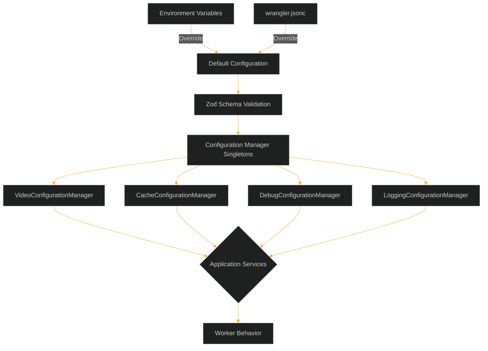

# Video Resizer Configuration Guide

This document provides a comprehensive reference for all configuration options available in the video-resizer project. The configuration system is divided into several managers, each responsible for a specific area of functionality.

## Configuration System Overview

The video-resizer uses a centralized configuration management system based on Zod schema validation. Each configuration manager is implemented as a singleton and provides type-safe access to configuration values.



### Key Features

- **Runtime Validation**: All configuration is validated at runtime using Zod schemas
- **Type Safety**: Full TypeScript type support with inferred types from Zod schemas
- **Centralized Management**: Configuration accessed through manager classes
- **Environment Variable Support**: Configuration can be overridden with environment variables
- **Default Values**: Sensible defaults for all configuration options

## Configuration Managers

The configuration system is made up of several specialized managers:

1. [Video Configuration](./video-configuration.md) - Controls video transformation options
2. [Cache Configuration](./cache-configuration.md) - Manages caching behavior
3. [Debug Configuration](./debug-configuration.md) - Controls debugging features
4. [Logging Configuration](./logging-configuration.md) - Configures logging behavior

## Environment Variables

Environment variables can be used to override configuration values at runtime:

| Category | Variable | Type | Description |
|----------|----------|------|-------------|
| **Debug** | `DEBUG_ENABLED` | boolean | Enable debug mode |
| **Debug** | `DEBUG_VERBOSE` | boolean | Enable verbose debug output |
| **Debug** | `DEBUG_INCLUDE_HEADERS` | boolean | Include headers in debug info |
| **Cache** | `CACHE_METHOD` | string | Cache method: 'cf' or 'cacheApi' |
| **Cache** | `CACHE_DEBUG` | boolean | Enable cache debugging |
| **Cache** | `CACHE_ENABLE_KV` | boolean | Enable KV storage for transformed variants |
| **Logging** | `LOG_LEVEL` | string | Log level: 'debug', 'info', 'warn', 'error' |
| **Video** | `VIDEO_DEFAULT_QUALITY` | string | Default video quality |
| **General** | `ENVIRONMENT` | string | Environment: 'production', 'staging', 'development' |

## Usage Example

```typescript
import { VideoConfigurationManager } from './config';

// Get an instance of the configuration manager
const configManager = VideoConfigurationManager.getInstance();

// Access configuration
const paramMapping = configManager.getParamMapping();
const isValidOption = configManager.isValidOption('fit', 'contain');
```

## Basic Configuration Flow

1. Default configuration values are defined in each manager
2. Values from wrangler.jsonc are applied as overrides
3. Environment variables (if present) override wrangler.jsonc and defaults
4. The final configuration is validated against Zod schemas
5. Manager singletons provide access to validated configuration

## Recommended Practices

1. Use environment-specific configurations for different deployment targets
2. Keep sensitive configuration in environment variables or Worker secrets
3. Validate configuration changes before deployment
4. Use the manager interfaces rather than accessing raw configuration