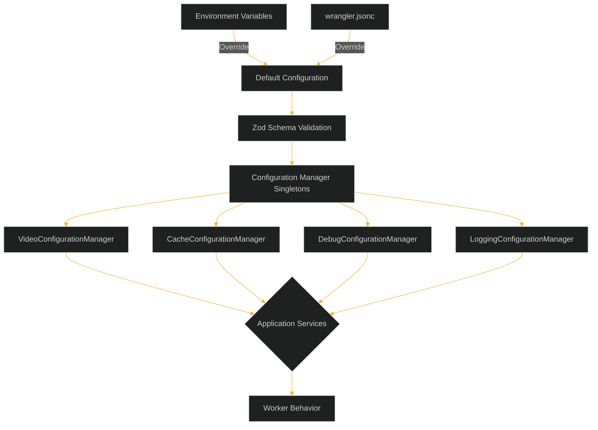

# Video Resizer Configuration Guide

This document provides a comprehensive reference for all configuration options available in the video-resizer project. The configuration system is divided into several managers, each responsible for a specific area of functionality.

## Configuration System Overview

The video-resizer uses a centralized configuration management system based on Zod schema validation. Each configuration manager is implemented as a singleton and provides type-safe access to configuration values.



### Key Features

- **Runtime Validation**: All configuration is validated at runtime using Zod schemas
- **Type Safety**: Full TypeScript type support with inferred types from Zod schemas
- **Centralized Management**: Configuration accessed through manager classes
- **Environment Variable Support**: Configuration can be overridden with environment variables
- **Default Values**: Sensible defaults for all configuration options

## Configuration Managers

The configuration system is made up of several specialized managers:

1. [Video Configuration](./video-configuration.md) - Controls video transformation options
2. [Cache Configuration](./cache-configuration.md) - Manages caching behavior
3. [Debug Configuration](./debug-configuration.md) - Controls debugging features
4. [Logging Configuration](./logging-configuration.md) - Configures logging behavior

## Advanced Configuration Topics

1. [Configuration Loading Process](./configuration-loading.md) - How configurations are loaded and applied
2. [Path Pattern Troubleshooting](./path-pattern-troubleshooting.md) - Debugging path pattern matching issues
3. [Updating Configuration](./updating-configuration.md) - How to update configuration at runtime
4. [Wrangler vs KV Configuration](./wrangler-vs-kv-config.md) - Understanding different configuration sources
5. [Dynamic Configuration](./dynamic-configuration.md) - Using KV for dynamic configuration

## Environment Variables

Environment variables can be used to override configuration values at runtime:

| Category | Variable | Type | Description |
|----------|----------|------|-------------|
| **Debug** | `DEBUG_ENABLED` | boolean | Enable debug mode |
| **Debug** | `DEBUG_VERBOSE` | boolean | Enable verbose debug output |
| **Debug** | `DEBUG_INCLUDE_HEADERS` | boolean | Include headers in debug info |
| **Cache** | `CACHE_METHOD` | string | Cache method: 'cf' or 'cacheApi' |
| **Cache** | `CACHE_DEBUG` | boolean | Enable cache debugging |
| **Cache** | `CACHE_ENABLE_KV` | boolean | Enable KV storage for transformed variants |
| **Logging** | `LOG_LEVEL` | string | Log level: 'debug', 'info', 'warn', 'error' |
| **Video** | `VIDEO_DEFAULT_QUALITY` | string | Default video quality |
| **General** | `ENVIRONMENT` | string | Environment: 'production', 'staging', 'development' |

## Usage Example

```typescript
import { VideoConfigurationManager } from './config';

// Get an instance of the configuration manager
const configManager = VideoConfigurationManager.getInstance();

// Access configuration
const paramMapping = configManager.getParamMapping();
const isValidOption = configManager.isValidOption('fit', 'contain');
```

## Basic Configuration Flow

1. **Default Configuration**: Initial values are defined in each manager (e.g., `videoConfig.ts`)
2. **Static Configuration**: Values from wrangler.jsonc are applied as the first level of overrides
3. **Environment Variables**: Environment variables override both wrangler.jsonc and defaults
4. **KV Configuration**: On first request, configuration is loaded from KV storage (if available)
5. **Validation**: All configuration is validated against Zod schemas to ensure type safety
6. **Configuration Application**: Valid configuration is applied to the appropriate managers
7. **Runtime Access**: Manager singletons provide typed access to the validated configuration

This multi-layered approach allows for flexibility in how configuration is managed, from hardcoded defaults to dynamically updated values via KV storage.

## Recommended Practices

1. **Environment-Specific Configurations**: Use different configurations for development, staging, and production
2. **Secure Sensitive Information**: Keep API keys and secrets in environment variables or Worker secrets
3. **Validate Before Deployment**: Test configuration changes in development or staging before production
4. **Use Manager Interfaces**: Access configuration through manager methods rather than raw objects
5. **Monitor Configuration Loading**: Enable logging during configuration updates to verify successful loading
6. **Debug Configuration Issues**: Use the `?debug=true` parameter to troubleshoot configuration-related problems
7. **Regular Expression Testing**: Carefully test path pattern regular expressions before deployment
8. **Include Fallback Patterns**: Always include a catch-all pattern with lowest priority as a fallback
9. **Proper Escaping**: Remember to properly escape special characters in regex patterns (e.g., `\\.` for literal periods)
10. **Respect Initialization Order**: Be aware that configuration may not be fully loaded on the first few requests