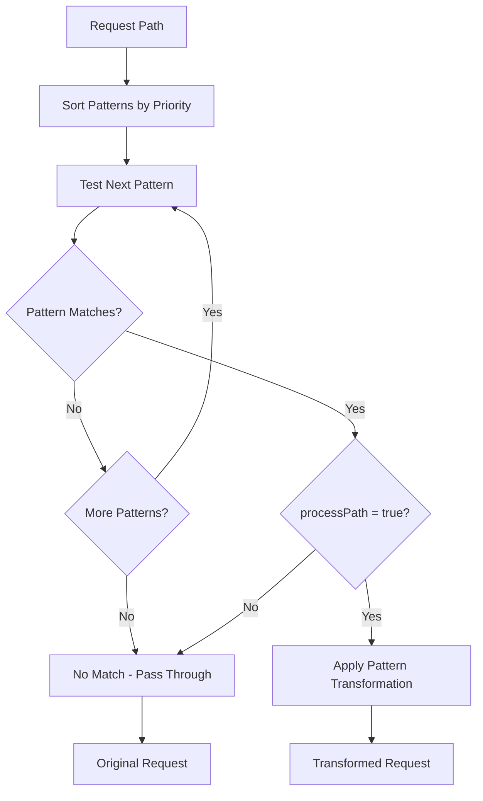

# Path Pattern Matching

*Last Updated: May 10, 2025*

## Table of Contents

- [Introduction](#introduction)
- [Path Pattern Structure](#path-pattern-structure)
- [Pattern Matching Process](#pattern-matching-process)
- [Capture Groups](#capture-groups)
- [URL Transformation](#url-transformation)
- [Advanced Pattern Examples](#advanced-pattern-examples)
- [Pattern Prioritization](#pattern-prioritization)
- [Common Patterns](#common-patterns)
- [Troubleshooting](#troubleshooting)

## Introduction

Path pattern matching is a core feature of the Video Resizer that determines which URLs to transform and how to process them. The system uses regular expression patterns to match incoming request paths and extract parameters from them.

## Path Pattern Structure

A path pattern configuration includes the following properties:

```json
{
  "name": "videos",
  "matcher": "^/videos/([a-z0-9-]+)$",
  "processPath": true,
  "baseUrl": null,
  "originUrl": "https://videos.example.com/{0}.mp4",
  "ttl": {
    "ok": 86400,
    "redirects": 3600,
    "clientError": 60,
    "serverError": 10
  },
  "useTtlByStatus": true,
  "priority": 100,
  "captureGroups": ["videoId"],
  "transformationOverrides": {
    "quality": "high",
    "fit": "cover"
  }
}
```

| Property | Type | Description |
|----------|------|-------------|
| `name` | string | Identifier for the pattern (used in logs and debugging) |
| `matcher` | string | Regular expression for matching request paths |
| `processPath` | boolean | Whether to transform matched paths (`true`) or pass them through (`false`) |
| `baseUrl` | string | Base URL for CDN-CGI transformations (defaults to request host if `null`) |
| `originUrl` | string | URL template for the origin content source |
| `ttl` | object | Cache TTL settings for different status code ranges |
| `useTtlByStatus` | boolean | Whether to use status-specific TTL values |
| `priority` | number | Pattern priority (higher values are evaluated first) |
| `captureGroups` | string[] | Names for the capture groups in the matcher pattern |
| `transformationOverrides` | object | Default transformation parameters for this pattern |

## Pattern Matching Process

The path matching process follows these steps:

1. Request path is extracted from the incoming URL
2. Path patterns are sorted by priority (highest first)
3. Each pattern's `matcher` regex is tested against the path
4. The first matching pattern is selected
5. If `processPath` is `true`, the path is processed for transformation
6. If `processPath` is `false` or no pattern matches, the request is passed through



## Capture Groups

Capture groups in the `matcher` regex can extract parts of the path for use in the transformation process:

```json
{
  "matcher": "^/videos/([a-z0-9-]+)/([a-z0-9-]+)$",
  "captureGroups": ["category", "videoId"],
  "originUrl": "https://{category}.videos.example.com/{videoId}.mp4"
}
```

In this example:
- The first capture group `([a-z0-9-]+)` extracts the category
- The second capture group `([a-z0-9-]+)` extracts the videoId
- These values are used in the `originUrl` template

When a request for `/videos/nature/flowing-river` is processed:
- `{category}` is replaced with `nature`
- `{videoId}` is replaced with `flowing-river`
- The resulting origin URL is `https://nature.videos.example.com/flowing-river.mp4`

You can also use indexed references in the `originUrl`:
- `{0}` refers to the first capture group
- `{1}` refers to the second capture group
- And so on

## URL Transformation

The URL transformation process uses the path pattern to determine:

1. **Origin URL**: Where to fetch the original content from
2. **Base URL**: What base URL to use for the transformed content
3. **Default Parameters**: What transformation parameters to apply by default

### Origin URL Template

The `originUrl` property supports several template variables:

- Named capture groups: `{groupName}`
- Indexed capture groups: `{0}`, `{1}`, etc.
- Special variables:
  - `{path}`: The full request path
  - `{host}`: The request host
  - `{extension}`: The file extension from the path
  - `{query}`: The original query string (excluding transformation parameters)

Example:
```json
{
  "matcher": "^/videos/([^/]+)/([^/]+)$",
  "captureGroups": ["category", "videoId"],
  "originUrl": "https://storage.example.com/{category}/{videoId}.mp4?original=true"
}
```

### Transformation Overrides

The `transformationOverrides` property defines default transformation parameters for the pattern:

```json
{
  "transformationOverrides": {
    "quality": "high",
    "fit": "cover",
    "width": 1280,
    "height": 720
  }
}
```

These overrides are applied by default but can be overridden by query parameters in the request.

## Advanced Pattern Examples

### Multi-Region Content

Using capture groups to route to different regional origins:

```json
{
  "name": "regional-videos",
  "matcher": "^/videos/([a-z]{2})/(.+)$",
  "captureGroups": ["region", "path"],
  "originUrl": "https://{region}.videos.example.com/{path}",
  "processPath": true
}
```

This pattern routes requests like `/videos/us/nature/river.mp4` to `https://us.videos.example.com/nature/river.mp4`.

### Dynamic Quality Settings

Using path components to determine quality:

```json
{
  "name": "quality-based",
  "matcher": "^/videos/(high|medium|low)/(.+)$",
  "captureGroups": ["quality", "path"],
  "originUrl": "https://videos.example.com/{path}",
  "processPath": true,
  "transformationOverrides": {
    "quality": "{quality}"
  }
}
```

This pattern applies quality settings based on the URL path for requests like `/videos/high/documentary.mp4`.

### Path-Based Derivatives

Using path prefixes to apply different derivative presets:

```json
{
  "name": "mobile-videos",
  "matcher": "^/mobile/videos/(.+)$",
  "captureGroups": ["path"],
  "originUrl": "https://videos.example.com/{path}",
  "processPath": true,
  "transformationOverrides": {
    "derivative": "mobile"
  }
}
```

This pattern applies the "mobile" derivative to all videos under the `/mobile/videos/` path.

## Pattern Prioritization

When multiple patterns could match a path, the `priority` property determines which one is used:

```json
[
  {
    "name": "specific-videos",
    "matcher": "^/videos/featured/(.+)$",
    "priority": 200,
    "processPath": true,
    "originUrl": "https://featured.example.com/{0}"
  },
  {
    "name": "general-videos",
    "matcher": "^/videos/(.+)$",
    "priority": 100,
    "processPath": true,
    "originUrl": "https://videos.example.com/{0}"
  }
]
```

In this example:
- `/videos/featured/intro.mp4` matches both patterns
- The "specific-videos" pattern has higher priority (200 > 100)
- So it will be used for the transformation

When priorities are equal, patterns are evaluated in the order they appear in the configuration.

## Common Patterns

### Basic Video Matching

Match all MP4 files:

```json
{
  "name": "videos",
  "matcher": "^/(.*\\.mp4)$",
  "processPath": true,
  "originUrl": "https://videos.example.com/{0}"
}
```

### Path Prefix Matching

Match a specific path prefix:

```json
{
  "name": "content-videos",
  "matcher": "^/content/videos/(.*)$",
  "processPath": true,
  "originUrl": "https://videos.example.com/{0}"
}
```

### Multiple File Types

Match different video formats:

```json
{
  "name": "video-formats",
  "matcher": "^/(.*\\.(mp4|webm|mov))$",
  "processPath": true,
  "originUrl": "https://videos.example.com/{0}"
}
```

### Passthrough Pattern

Create a pattern that matches but doesn't transform:

```json
{
  "name": "static-content",
  "matcher": "^/static/(.*)$",
  "processPath": false,
  "originUrl": "https://static.example.com/{0}"
}
```

## Troubleshooting

### Common Issues

1. **Pattern Not Matching**:
   - Ensure your regex pattern is correct
   - Test with a regex validator
   - Remember to escape special characters (e.g., `\\.` for a literal period)
   - Check if another pattern with higher priority is matching first

2. **Capture Groups Not Working**:
   - Ensure capture groups are properly defined with parentheses in the regex
   - Check that `captureGroups` array matches the number of capture groups
   - Verify the template variables in `originUrl` match the group names or indices

3. **Incorrect Origin URL**:
   - Enable debug mode to see the generated origin URL
   - Check for typos in the template variables
   - Verify that capture group replacements are working correctly

### Debug Mode

Enable debug mode to see detailed information about pattern matching:

```
https://your-domain.com/videos/sample.mp4?debug=view
```

The debug UI will show:
- All patterns that were tested
- Which pattern matched
- Captured values from the path
- Generated origin URL
- Applied transformation parameters

### Testing Patterns

You can test your patterns with the debug tool:

```bash
node tools/config-debug.js --pattern "^/videos/([a-z0-9-]+)$" --test-path "/videos/sample-video"
```

This will show:
- Whether the pattern matches
- What capture groups are extracted
- How the pattern would be applied