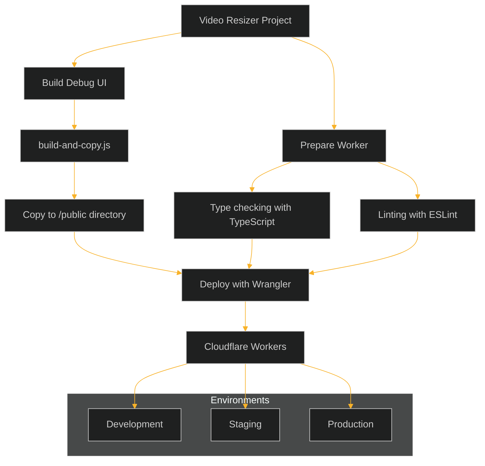

# Video Resizer Deployment Guide

This guide explains how to deploy the Video Resizer application along with its Debug UI.



## Prerequisites

- Node.js 18+ and npm 9+
- Cloudflare account with Workers access
- Wrangler CLI configured with authentication

## Deployment Commands

The project includes several deployment scripts to handle different scenarios:

### Standard Deployment

```bash
# Deploy to default environment (without debug UI)
npm run deploy

# Deploy to production environment (with advanced debug UI build)
npm run deploy:prod

# Deploy to staging environment (with advanced debug UI build)
npm run deploy:staging
```

### Complete Deployment

These commands run typechecking and linting before deployment to ensure code quality:

```bash
# Complete deployment to default environment
npm run deploy:full

# Complete deployment to production environment
npm run deploy:full:prod

# Complete deployment to staging environment
npm run deploy:full:staging
```

## How the Deployment Process Works

All production and staging deployment commands:
1. Build the Debug UI using the advanced build-and-copy script
2. Copy the built files to the worker's public directory
3. Deploy the worker to Cloudflare using wrangler

The advanced build-and-copy script (`scripts/build-and-copy.js`) provides:
- Better error handling during the build process
- Proper handling of file paths across different environments
- Special handling for the debug.html file
- Fallback mechanisms if files are not found

## Debug UI

The Debug UI is automatically built and included with the deployment when using:
- `deploy:prod`
- `deploy:staging`
- `deploy:full`
- `deploy:full:prod`
- `deploy:full:staging`

For development with the Debug UI:

```bash
# Run development server with Debug UI
npm run dev:with-ui
```

## Individual Build Commands

```bash
# Build the Debug UI and copy to worker's public directory
npm run build:debug-ui

# Only copy the Debug UI files to worker's public directory (if already built)
npm run copy:debug-ui

# Build Debug UI with advanced options (uses scripts/build-and-copy.js)
npm run build:debug-ui:advanced

# Run Debug UI development server
npm run dev:debug-ui

# Type check the project
npm run typecheck

# Lint the project
npm run lint
```

## Troubleshooting

If the debug UI shows a "Loading diagnostic data..." message:

1. Make sure you've included `?debug=view` in your request URL
2. Verify that the Debug UI was properly built before deployment
3. Check your browser console for any JavaScript errors
4. Ensure the worker has the ASSETS binding configured correctly

## Production Considerations

- The Debug UI is only accessible when the `debug=view` parameter is included in the URL
- Debug mode affects cache behavior (while CF caching is still enabled, debug responses use max-age=0)
- For security, consider restricting debug access in production using the DebugConfigurationManager settings