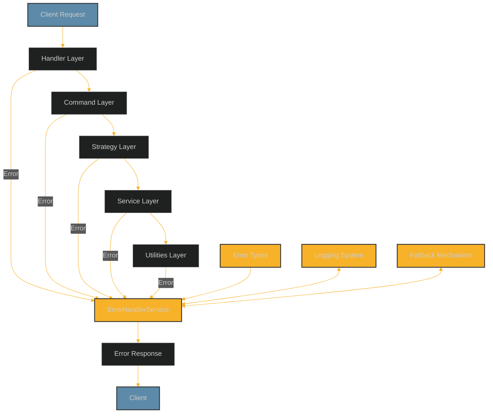
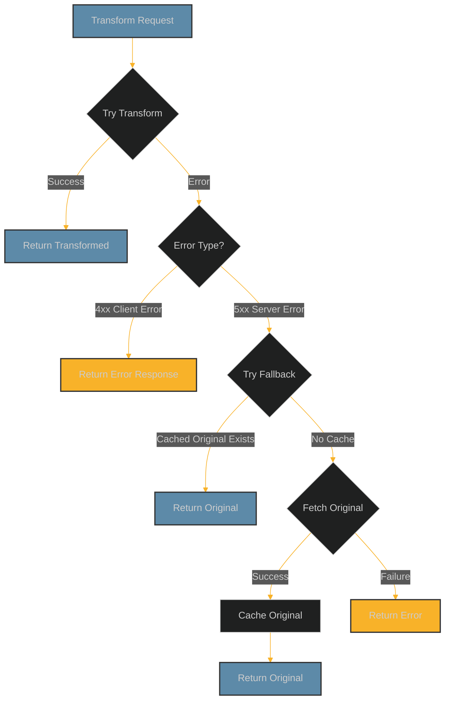

# Error Handling Guide for Video Resizer

## Introduction

This guide provides a comprehensive overview of the error handling system in the video-resizer project, including its architecture, implementation patterns, best practices, and common error scenarios.

## Table of Contents

- [Error Handling Architecture](#error-handling-architecture)
- [Error Handling Utilities](#error-handling-utilities)
- [Error Types and Hierarchy](#error-types-and-hierarchy)
- [Implementation Patterns](#implementation-patterns)
- [Common Error Scenarios](#common-error-scenarios)
- [Best Practices](#best-practices)
- [Performance Considerations](#performance-considerations)
- [Testing Error Handling](#testing-error-handling)
- [Debugging Error Scenarios](#debugging-error-scenarios)
- [Implementation Examples](#implementation-examples)

## Error Handling Architecture

The error handling system in video-resizer follows a layered approach:



### Key Components

1. **Error Types**: Standardized error classes with consistent structure
2. **Error Handling Utilities**: Helper functions for consistent error handling
3. **ErrorHandlerService**: Centralized service for processing and normalizing errors
4. **Logging System**: Structured logging with context for errors
5. **Fallback Mechanism**: Graceful degradation for error scenarios

### Error Flow

1. When an error occurs in any layer, it is caught and handled:
   - Logged with context
   - Converted to a standardized error type
   - Either handled locally or propagated up

2. At the handler layer, the ErrorHandlerService:
   - Normalizes any error to a VideoTransformError
   - Generates an appropriate error response
   - Adds diagnostic information based on environment

3. Fallback mechanisms are applied:
   - For transformation errors, attempt to serve original content
   - For non-critical features, degrade to safe defaults
   - For configuration errors, use default configuration

## Error Handling Utilities

The `errorHandlingUtils.ts` module provides standardized utilities for error handling:

### 1. logErrorWithContext

Log errors with detailed context:

```typescript
logErrorWithContext(
  message: string,
  error: unknown,
  context?: Record<string, unknown>,
  category?: string
): void
```

Example:
```typescript
logErrorWithContext(
  'Failed to transform video',
  error,
  {
    requestUrl: request.url,
    options: transformOptions,
    source: 'R2'
  },
  'TransformationService'
);
```

### 2. withErrorHandling

Higher-order function that wraps async functions with error handling:

```typescript
withErrorHandling<A extends any[], R>(
  fn: (...args: A) => Promise<R>,
  context: {
    functionName: string,
    component: string,
    logErrors?: boolean
  },
  additionalContext?: Record<string, unknown>
): (...args: A) => Promise<R>
```

Example:
```typescript
const transformVideo = withErrorHandling<[string, Options], Response>(
  async function transformVideoImpl(videoId, options) {
    // Implementation that might throw
    return transformedResponse;
  },
  {
    functionName: 'transformVideo',
    component: 'TransformationService',
    logErrors: true
  },
  { serviceVersion: '1.0.0' }
);
```

### 3. tryOrNull

Safe execution with null fallback:

```typescript
tryOrNull<P extends any[], R>(
  fn: (...args: P) => R,
  context: {
    functionName: string,
    component: string,
    logErrors?: boolean
  },
  defaultValue?: R | null
): (...args: P) => R | null
```

Example:
```typescript
const parseTimeParam = tryOrNull<[string], number>(
  function parseTimeParamImpl(timeStr) {
    // Parsing logic that might throw
    return parsedTime;
  },
  {
    functionName: 'parseTimeParam',
    component: 'ParameterParser',
    logErrors: true
  }
);
```

### 4. tryOrDefault

Safe execution with specified default value fallback:

```typescript
tryOrDefault<P extends any[], R>(
  fn: (...args: P) => R,
  context: {
    functionName: string,
    component: string,
    logErrors?: boolean
  },
  defaultValue: R
): (...args: P) => R
```

Example:
```typescript
const getClientConfig = tryOrDefault<[string], ClientConfig>(
  function getClientConfigImpl(clientId) {
    // Config logic that might throw
    return config;
  },
  {
    functionName: 'getClientConfig',
    component: 'ConfigService',
    logErrors: true
  },
  DEFAULT_CLIENT_CONFIG
);
```

### 5. toTransformError

Normalize any error to a VideoTransformError:

```typescript
toTransformError(
  error: unknown,
  errorType?: ErrorType,
  context?: Record<string, unknown>
): VideoTransformError
```

Example:
```typescript
try {
  await transformVideo(videoId, options);
} catch (error) {
  // Convert to standard error type
  const transformError = toTransformError(error, 'processing_error', { 
    videoId, 
    options 
  });
  throw transformError;
}
```

## Error Types and Hierarchy

The error system uses a structured hierarchy:

```
VideoTransformError (base class)
├── ValidationError     - 400 Invalid input parameters
├── NotFoundError       - 404 Resource not found
├── ConfigurationError  - 500 System configuration issue
└── ProcessingError     - 500 Processing/transformation failure
```

### VideoTransformError

Base class for all errors:

```typescript
class VideoTransformError extends Error {
  public readonly statusCode: number;     // HTTP status code
  public readonly errorType: string;      // Error classification
  public readonly details: Record<string, any>; // Additional context
  public readonly cause?: Error;          // Original cause
}
```

### ValidationError

For invalid input parameters:

```typescript
class ValidationError extends VideoTransformError {
  constructor(message: string, details?: Record<string, any>, cause?: Error) {
    super(message, { 
      statusCode: 400, 
      errorType: 'validation_error', 
      details, 
      cause 
    });
  }
}
```

### NotFoundError

For missing resources:

```typescript
class NotFoundError extends VideoTransformError {
  constructor(message: string, details?: Record<string, any>, cause?: Error) {
    super(message, { 
      statusCode: 404, 
      errorType: 'not_found', 
      details, 
      cause 
    });
  }
}
```

### ConfigurationError

For configuration issues:

```typescript
class ConfigurationError extends VideoTransformError {
  constructor(message: string, details?: Record<string, any>, cause?: Error) {
    super(message, { 
      statusCode: 500, 
      errorType: 'configuration_error', 
      details, 
      cause 
    });
  }
}
```

### ProcessingError

For processing/transformation failures:

```typescript
class ProcessingError extends VideoTransformError {
  constructor(message: string, details?: Record<string, any>, cause?: Error) {
    super(message, { 
      statusCode: 500, 
      errorType: 'processing_error', 
      details, 
      cause 
    });
  }
}
```

## Implementation Patterns

### The Implementation/Wrapper Pattern

The primary pattern for error handling is the Implementation/Wrapper pattern:

```typescript
// 1. Private implementation (may throw)
function someOperationImpl(arg1: string, arg2: number): Result {
  // Core implementation that might throw errors
  if (!isValid(arg1)) {
    throw new ValidationError(`Invalid argument: ${arg1}`);
  }
  
  // Processing logic...
  return result;
}

// 2. Public wrapper with error handling
export const someOperation = tryOrDefault<[string, number], Result>(
  someOperationImpl,
  {
    functionName: 'someOperation',
    component: 'ModuleName',
    logErrors: true
  },
  DEFAULT_RESULT // Safe fallback
);
```

This pattern:
- Separates core logic from error handling
- Ensures consistent error handling across the codebase
- Provides safe fallbacks for all operations
- Maintains proper typing for parameters and return values

### Choosing the Right Wrapper

Select the appropriate wrapper based on the function's requirements:

1. **tryOrDefault**: For functions that should never fail and can return a reasonable default value
   - Good for: Parser functions, configuration retrieval, utility operations

2. **tryOrNull**: For functions where null is a valid return value indicating "not found" or "not applicable"
   - Good for: Lookup operations, optional operations

3. **withErrorHandling**: For functions that should propagate errors after logging them
   - Good for: Core business logic, important operations

### Error Propagation Rules

Follow these guidelines for error propagation:

1. **Component Boundaries**: Always handle errors at component boundaries
2. **Service Operations**: Log and propagate errors in service operations
3. **Utilities**: Return safe defaults for utility functions
4. **Business Logic**: Use structured error types for business logic
5. **API Handlers**: Convert all errors to appropriate responses

### Safe Default Values

Guidelines for selecting appropriate default values:

1. Choose defaults that ensure system stability
2. Use recognizable "error state" values where appropriate
3. For complex objects, provide complete default structures
4. Document default values in comments or tests

Examples of good defaults:
- For cache configuration: `{ cacheability: false, ttl: { ok: 0, redirects: 0, clientError: 0, serverError: 0 } }`
- For video sizing: `{ width: 640, height: 480, source: 'error_fallback' }`
- For boolean flags: `false` (for feature flags or enablement options)
- For complex objects: Minimal valid objects with safe behavior

## Common Error Scenarios

### 1. Video Transformation Failures

The most critical errors are video transformation failures. These are handled with a fallback mechanism:



Implementation:
```typescript
try {
  // Attempt video transformation
  const transformedResponse = await transformVideo(videoId, options);
  return transformedResponse;
} catch (error) {
  // Convert any error to VideoTransformError
  const transformError = toTransformError(error);
  
  // Client errors are returned directly
  if (transformError.statusCode < 500) {
    return createErrorResponse(transformError);
  }
  
  // Server errors trigger fallback
  try {
    // Try to fetch and serve original content
    const originalContent = await fetchOriginalContent(videoId);
    
    // Cache the original for future fallbacks
    ctx.waitUntil(cacheOriginalContent(videoId, originalContent.clone()));
    
    // Add fallback headers
    return addFallbackHeaders(originalContent, transformError);
  } catch (fallbackError) {
    // If fallback fails, return original error
    return createErrorResponse(transformError);
  }
}
```

### 2. Configuration Loading Errors

Configuration errors are handled by using default configurations:

```typescript
// Load configuration with safe default fallback
const getConfiguration = tryOrDefault<[string], Configuration>(
  function getConfigurationImpl(environmentName) {
    // Attempt to load configuration
    const kvConfig = env.CONFIG_STORE.get(`config:${environmentName}`);
    if (!kvConfig) {
      throw new ConfigurationError(`Configuration not found for ${environmentName}`);
    }
    
    return JSON.parse(kvConfig);
  },
  {
    functionName: 'getConfiguration',
    component: 'ConfigService',
    logErrors: true
  },
  DEFAULT_CONFIGURATION
);
```

### 3. Storage Service Errors

Storage errors include fallbacks to alternative storage sources:

```typescript
const getVideoContent = withErrorHandling<[string], Response>(
  async function getVideoContentImpl(videoPath) {
    try {
      // Try primary storage (R2)
      return await getFromR2(videoPath);
    } catch (r2Error) {
      logErrorWithContext('R2 retrieval failed, trying remote', r2Error, { videoPath });
      
      try {
        // Try secondary storage (Remote HTTP)
        return await getFromRemote(videoPath);
      } catch (remoteError) {
        // Both failed, throw comprehensive error
        throw new ProcessingError(
          `Failed to retrieve video from all sources: ${videoPath}`,
          { videoPath, primaryError: r2Error.message },
          remoteError
        );
      }
    }
  },
  {
    functionName: 'getVideoContent',
    component: 'StorageService',
    logErrors: true
  }
);
```

### 4. Cache Operation Errors

Cache operations gracefully degrade:

```typescript
const cacheResponse = tryOrDefault<[Request, Response], Response>(
  async function cacheResponseImpl(request, response) {
    // Clone response to avoid consuming it
    const responseClone = response.clone();
    
    try {
      // Try to store in cache
      await cacheStorage.put(request, responseClone);
      return response;
    } catch (cacheError) {
      logErrorWithContext('Failed to cache response', cacheError, {
        url: request.url,
        status: response.status
      });
      
      // Return original response even if caching fails
      return response;
    }
  },
  {
    functionName: 'cacheResponse',
    component: 'CacheService',
    logErrors: true
  },
  // Default is just the original response
  (_, response) => response
);
```

## Best Practices

### 1. Error Context Best Practices

Always include rich error context:

```typescript
logErrorWithContext(
  'Error fetching video content',
  error,
  {
    // Request information
    url: request.url,
    method: request.method,
    
    // Operation details
    videoId: videoId,
    options: transformOptions,
    
    // System state
    cacheStatus: cacheStatus,
    storageSource: source,
    
    // Error details (if available)
    status: error.status,
    errorCode: error.code
  },
  'VideoStorageService'
);
```

Guidelines for error context:
- Include identifying information (request URL, IDs)
- Add operation-specific parameters
- Include system state information
- Avoid sensitive data (authentication tokens, full user details)
- Keep context data reasonably sized

### 2. Breadcrumb Tracking

For complex operations, use breadcrumbs to track the flow:

```typescript
// Initialize breadcrumbs
const breadcrumbs: Breadcrumb[] = [];

// Add breadcrumbs throughout the process
function addBreadcrumb(category: string, message: string, data?: any) {
  breadcrumbs.push({
    category,
    message,
    timestamp: Date.now(),
    data
  });
}

// Example usage
addBreadcrumb('storage', 'Attempting R2 retrieval', { path });
try {
  result = await getFromR2(path);
  addBreadcrumb('storage', 'R2 retrieval successful');
} catch (error) {
  addBreadcrumb('storage', 'R2 retrieval failed', { error: error.message });
  // Fall back to alternative storage
}

// Include breadcrumbs in error context
logErrorWithContext('Operation failed', error, {
  breadcrumbs,
  // Other context
});
```

### 3. Error Response Best Practices

Create error responses with consistent structure:

```typescript
function createErrorResponse(error: VideoTransformError): Response {
  // Create standardized error payload
  const errorPayload = {
    error: error.errorType,
    message: error.message,
    status: error.statusCode,
    timestamp: new Date().toISOString()
  };
  
  // In debug mode, include details
  if (isDebugMode()) {
    Object.assign(errorPayload, {
      details: error.details,
      stack: error.stack,
      cause: error.cause ? {
        message: error.cause.message,
        stack: error.cause.stack
      } : undefined
    });
  }
  
  // Create error response
  return new Response(JSON.stringify(errorPayload), {
    status: error.statusCode,
    headers: {
      'Content-Type': 'application/json',
      'X-Error-Type': error.errorType
    }
  });
}
```

### 4. Handling Third-Party Errors

When integrating with external APIs, normalize errors:

```typescript
try {
  // Call third-party API
  await externalApi.doSomething();
} catch (error) {
  // Convert to application-specific error type
  if (error.name === 'AbortError' || error.code === 'ECONNABORTED') {
    throw new ProcessingError(
      'Request to external API timed out',
      { timeoutMs: timeout },
      error
    );
  } else if (error.response && error.response.status === 404) {
    throw new NotFoundError(
      'Resource not found in external API',
      { resourceId },
      error
    );
  } else {
    throw new ProcessingError(
      'Unknown error from external API',
      {
        status: error.response?.status,
        data: error.response?.data
      },
      error
    );
  }
}
```

## Performance Considerations

### 1. Logging Levels

Adjust logging for performance-critical paths:

```typescript
// High-volume utility - minimal logging
export const parseQueryParam = tryOrDefault<[string], QueryParam>(
  parseQueryParamImpl,
  {
    functionName: 'parseQueryParam',
    component: 'QueryUtils',
    logErrors: false // Disable logging for high-volume function
  },
  DEFAULT_QUERY_PARAM
);

// Critical business logic - full logging
export const transformVideo = withErrorHandling<[string, Options], Response>(
  transformVideoImpl,
  {
    functionName: 'transformVideo',
    component: 'TransformationService',
    logErrors: true // Enable full logging for critical operation
  }
);
```

### 2. Error Context Size

Keep error context size reasonable:

```typescript
// BAD: Too much data in context
logErrorWithContext('Error processing video', error, {
  requestHeaders: request.headers, // Potential large object
  videoContent: videoData,         // Very large binary data
  fullConfig: config                // Large configuration object
});

// GOOD: Focused, relevant context
logErrorWithContext('Error processing video', error, {
  contentType: request.headers.get('content-type'),
  contentLength: videoData.length,
  configVersion: config.version
});
```

### 3. Error Rate Limiting

For high-frequency errors, implement rate limiting:

```typescript
// Error rate limiting helper
const errorRates = new Map<string, { count: number, firstSeen: number }>();

function shouldLogError(errorKey: string, maxPerMinute: number = 10): boolean {
  const now = Date.now();
  const minute = Math.floor(now / 60000);
  const key = `${errorKey}:${minute}`;
  
  if (!errorRates.has(key)) {
    errorRates.set(key, { count: 1, firstSeen: now });
    return true;
  }
  
  const rate = errorRates.get(key)!;
  rate.count++;
  
  // Clean up old entries
  for (const [oldKey, value] of errorRates.entries()) {
    if (now - value.firstSeen > 60000) {
      errorRates.delete(oldKey);
    }
  }
  
  return rate.count <= maxPerMinute;
}

// Usage
if (shouldLogError('fetch_failure', 5)) {
  logErrorWithContext('Fetch operation failed', error, context);
}
```

## Testing Error Handling

### 1. Unit Testing Error Handlers

```typescript
describe('tryOrDefault', () => {
  it('should return function result on success', () => {
    const successFn = vi.fn().mockReturnValue('success');
    const wrapped = tryOrDefault(successFn, {
      functionName: 'testFn',
      component: 'Test',
      logErrors: false
    }, 'default');
    
    expect(wrapped()).toBe('success');
    expect(successFn).toHaveBeenCalled();
  });
  
  it('should return default value on error', () => {
    const errorFn = vi.fn().mockImplementation(() => {
      throw new Error('Test error');
    });
    const wrapped = tryOrDefault(errorFn, {
      functionName: 'testFn',
      component: 'Test',
      logErrors: false
    }, 'default');
    
    expect(wrapped()).toBe('default');
    expect(errorFn).toHaveBeenCalled();
  });
});
```

### 2. Testing Error Cases

Create specific tests for error cases:

```typescript
describe('VideoStorageService', () => {
  // Test happy path
  it('should retrieve video from R2', async () => {
    // Setup mocks for successful R2 retrieval
    vi.spyOn(r2Service, 'getObject').mockResolvedValue(mockResponseBody);
    
    const result = await videoStorageService.getVideoContent('video.mp4');
    expect(result).toBeDefined();
    expect(r2Service.getObject).toHaveBeenCalledWith('video.mp4');
  });
  
  // Test fallback behavior
  it('should fall back to remote when R2 fails', async () => {
    // Setup mocks - R2 fails, remote succeeds
    vi.spyOn(r2Service, 'getObject').mockRejectedValue(new Error('R2 error'));
    vi.spyOn(remoteService, 'fetch').mockResolvedValue(mockResponseBody);
    
    const result = await videoStorageService.getVideoContent('video.mp4');
    expect(result).toBeDefined();
    expect(r2Service.getObject).toHaveBeenCalledWith('video.mp4');
    expect(remoteService.fetch).toHaveBeenCalledWith('video.mp4');
  });
  
  // Test complete failure
  it('should throw when all storage options fail', async () => {
    // Setup mocks - both R2 and remote fail
    vi.spyOn(r2Service, 'getObject').mockRejectedValue(new Error('R2 error'));
    vi.spyOn(remoteService, 'fetch').mockRejectedValue(new Error('Remote error'));
    
    await expect(videoStorageService.getVideoContent('video.mp4'))
      .rejects.toThrow(ProcessingError);
  });
});
```

### 3. Testing Error Logging

Verify error logging behavior:

```typescript
describe('logErrorWithContext', () => {
  let consoleSpy: vi.SpyInstance;
  
  beforeEach(() => {
    consoleSpy = vi.spyOn(console, 'error').mockImplementation(() => {});
  });
  
  afterEach(() => {
    consoleSpy.mockRestore();
  });
  
  it('should log errors with context', () => {
    const error = new Error('Test error');
    const context = { key: 'value' };
    
    logErrorWithContext('Error message', error, context, 'TestComponent');
    
    expect(consoleSpy).toHaveBeenCalled();
    const loggedData = consoleSpy.mock.calls[0][0];
    expect(loggedData).toContain('Error message');
    expect(loggedData).toContain('TestComponent');
    expect(loggedData).toContain('key');
    expect(loggedData).toContain('value');
  });
});
```

## Debugging Error Scenarios

### 1. Debug Headers

Error responses include debug headers for troubleshooting:

```
X-Error-Type: processing_error
X-Error-ID: err_1234567890
X-Error-Source: TransformationService
X-Debug-Mode: true
```

### 2. Debug Mode

Debug mode provides enhanced error information:

```typescript
function createErrorResponse(error: VideoTransformError, request: Request): Response {
  // Get debug info
  const debugInfo = getDebugInfo(request);
  const isDebug = debugInfo && debugInfo.isDebugMode;
  
  // Create base error response
  const errorData: Record<string, any> = {
    error: error.errorType,
    message: error.message,
    statusCode: error.statusCode
  };
  
  // Add debug information if in debug mode
  if (isDebug) {
    errorData.details = error.details;
    errorData.stack = error.stack;
    errorData.breadcrumbs = getCurrentContext()?.breadcrumbs;
  }
  
  // Create headers
  const headers = new Headers({
    'Content-Type': 'application/json',
    'X-Error-Type': error.errorType,
    'X-Error-ID': generateErrorId()
  });
  
  if (isDebug) {
    headers.set('X-Debug-Mode', 'true');
  }
  
  return new Response(JSON.stringify(errorData), {
    status: error.statusCode,
    headers
  });
}
```

### 3. Error ID Tracking

Generate unique IDs for errors to enable tracking:

```typescript
function generateErrorId(): string {
  return `err_${Math.random().toString(36).substring(2, 15)}`;
}

function logErrorWithId(message: string, error: unknown, context?: any): string {
  const errorId = generateErrorId();
  
  logErrorWithContext(
    `${message} [${errorId}]`,
    error,
    { ...context, errorId }
  );
  
  return errorId;
}
```

### 4. Error Monitoring

Implement error monitoring for production debugging:

```typescript
// Monitor error rates by type
const errorCounts = new Map<string, number>();

function incrementErrorCount(errorType: string): void {
  const current = errorCounts.get(errorType) || 0;
  errorCounts.set(errorType, current + 1);
}

// Report to monitoring system
async function reportErrorMetrics(): Promise<void> {
  const metrics = Array.from(errorCounts.entries()).map(([key, value]) => ({
    name: `error.${key}`,
    value
  }));
  
  await sendMetrics(metrics);
  
  // Reset counts
  errorCounts.clear();
}
```

## Implementation Examples

### 1. Basic Error Handling

```typescript
// Implementation function
function parseUrlImpl(urlString: string): URL {
  return new URL(urlString);
}

// Wrapped with error handling
export const parseUrl = tryOrNull<[string], URL>(
  parseUrlImpl,
  {
    functionName: 'parseUrl',
    component: 'URLUtils',
    logErrors: true
  }
);

// Usage
const url = parseUrl(urlString);
if (!url) {
  // Handle invalid URL
}
```

### 2. Service with Error Handling

```typescript
export class VideoTransformationService {
  constructor(private env: Env) {}
  
  // Public method with error handling
  public transformVideo = withErrorHandling<[string, TransformOptions], Response>(
    // Implementation
    async function transformVideoImpl(this: VideoTransformationService, videoId, options) {
      // Validate inputs
      if (!videoId) {
        throw new ValidationError('Video ID is required');
      }
      
      // Get source video
      const sourceVideo = await this.getSourceVideo(videoId);
      if (!sourceVideo) {
        throw new NotFoundError(`Video not found: ${videoId}`);
      }
      
      // Perform transformation
      const transformParams = this.buildTransformParams(options);
      const transformedVideo = await this.applyTransformation(sourceVideo, transformParams);
      
      // Return response
      return new Response(transformedVideo, {
        headers: {
          'Content-Type': 'video/mp4',
          'Cache-Control': 'max-age=86400'
        }
      });
    },
    {
      functionName: 'transformVideo',
      component: 'VideoTransformationService',
      logErrors: true
    }
  );
  
  // Helper method with null fallback
  private getSourceVideo = tryOrNull<[string], ArrayBuffer>(
    async function getSourceVideoImpl(this: VideoTransformationService, videoId) {
      // Implementation that might fail
      const response = await fetch(`${this.env.VIDEO_ORIGIN}/${videoId}`);
      if (!response.ok) {
        throw new Error(`Failed to fetch video: ${response.status}`);
      }
      return await response.arrayBuffer();
    },
    {
      functionName: 'getSourceVideo',
      component: 'VideoTransformationService',
      logErrors: true
    }
  );
  
  // Helper method with default fallback
  private buildTransformParams = tryOrDefault<[TransformOptions], TransformParams>(
    function buildTransformParamsImpl(options) {
      // Implementation that might throw
      return {
        width: Number(options.width) || undefined,
        height: Number(options.height) || undefined,
        format: validateFormat(options.format),
        quality: validateQuality(options.quality)
      };
    },
    {
      functionName: 'buildTransformParams',
      component: 'VideoTransformationService',
      logErrors: true
    },
    DEFAULT_TRANSFORM_PARAMS
  );
}
```

### 3. Complete Handler with Error Handling

```typescript
export async function videoHandler(
  request: Request,
  env: Env,
  ctx: ExecutionContext
): Promise<Response> {
  try {
    // Create request context
    const requestContext = createRequestContext(request, { env, ctx });
    setCurrentContext(requestContext);
    
    // Add request breadcrumb
    addBreadcrumb(requestContext, 'request', 'Video handler processing request', { 
      url: request.url,
      method: request.method
    });
    
    // Parse URL and options
    const url = new URL(request.url);
    const videoId = extractVideoId(url.pathname);
    if (!videoId) {
      throw new ValidationError('Invalid video path', { path: url.pathname });
    }
    
    const options = parseTransformOptions(url.searchParams);
    
    // Setup services
    const transformService = new VideoTransformationService(env);
    const cacheService = new CacheManagementService(env);
    
    // Check cache first
    addBreadcrumb(requestContext, 'cache', 'Checking cache');
    const cachedResponse = await cacheService.getCachedResponse(request);
    if (cachedResponse) {
      addBreadcrumb(requestContext, 'cache', 'Cache hit', { status: cachedResponse.status });
      return cachedResponse;
    }
    
    // Transform video
    addBreadcrumb(requestContext, 'transform', 'Transforming video', { videoId, options });
    const response = await transformService.transformVideo(videoId, options);
    
    // Cache response in background
    addBreadcrumb(requestContext, 'cache', 'Storing in cache');
    ctx.waitUntil(cacheService.cacheResponse(request, response.clone()));
    
    // Add debug headers if requested
    if (isDebugMode(request)) {
      return addDebugHeaders(response, requestContext);
    }
    
    return response;
  } catch (error) {
    // Convert to standard error format
    const transformError = toTransformError(error);
    
    // Log with current context
    const requestContext = getCurrentContext();
    logErrorWithContext(
      'Error handling video request',
      transformError,
      {
        url: request.url,
        method: request.method,
        breadcrumbs: requestContext?.breadcrumbs
      },
      'VideoHandler'
    );
    
    // For server errors, try fallback
    if (transformError.statusCode >= 500) {
      try {
        const fallbackResponse = await handleFallback(request, transformError, env);
        if (fallbackResponse) {
          return fallbackResponse;
        }
      } catch (fallbackError) {
        // Fallback failed, continue to error response
      }
    }
    
    // Return error response
    return createErrorResponse(transformError, request);
  } finally {
    clearCurrentContext();
  }
}
```

## Conclusion

The error handling system in video-resizer is designed to:

1. **Provide Consistency**: Standardized patterns and utilities across the codebase
2. **Enable Graceful Degradation**: Fallback mechanisms for robust operation
3. **Improve Debuggability**: Rich context and breadcrumb tracking
4. **Maintain Performance**: Optimized error handling for critical paths
5. **Ensure Type Safety**: Full TypeScript integration

By following the patterns and best practices in this guide, you can maintain and extend the error handling system effectively, ensuring robust operation and excellent user experience even when errors occur.