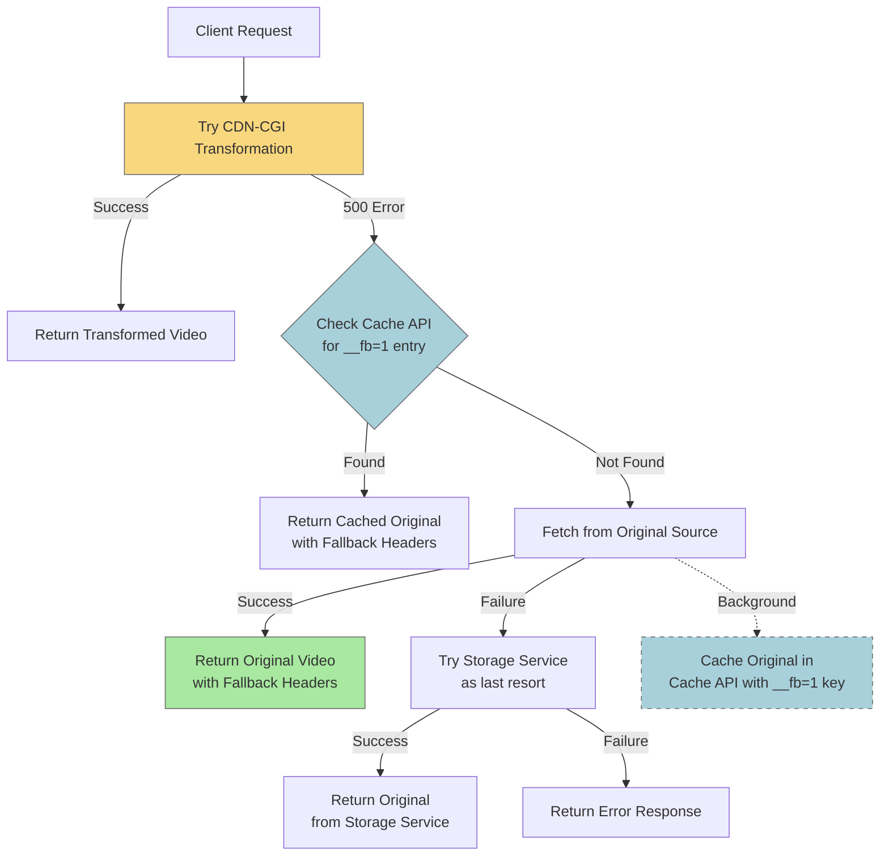
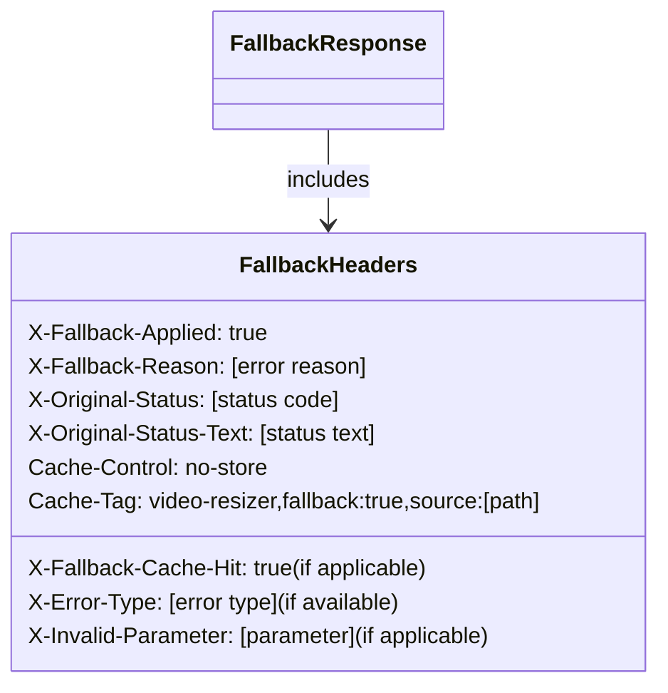
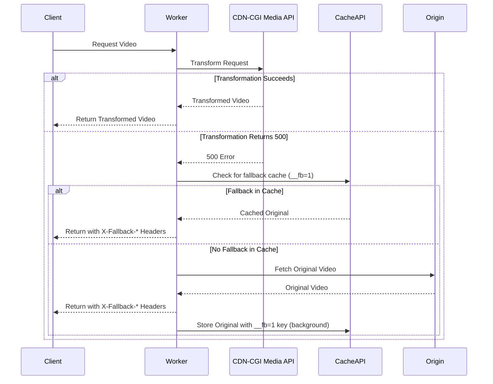

# Error Handling Implementation Details

> This document provides a consolidated overview of error handling patterns used across different modules.
> It was created by merging implementation-specific error handling documentation.

## Table of Contents

- [Cache Utils](#cache-utils)
- [Client Hints](#client-hints)
- [Device Utils](#device-utils)
- [Kv Storage](#kv-storage)
- [Support Services](#support-services)
- [Transformation Utils](#transformation-utils)
- [Url Transform Utils](#url-transform-utils)
- [Video Storage](#video-storage)
\n## Cache Utils\n
# Error Handling Implementation: Cache Utilities

## Overview

This document details the implementation of standardized error handling in the Cache Utilities module of our video-resizer application. The cache utilities provide essential functionality for determining cache configuration and cache decisions, making robust error handling important for ensuring consistent caching behavior even when errors occur.

Implementation Date: April 3, 2025

## File Covered

**cacheUtils.ts** - Utilities for managing cache configuration for videos

## Implementation Details

### Approach

The implementation of standardized error handling in cacheUtils.ts followed these principles:

1. **Function Separation Pattern**: 
   - Split public functions into implementation (xxxImpl) and exported functions
   - Implementation functions contain the core logic and may throw errors
   - Exported functions wrap the implementation with error handling utilities

2. **Error Handling Strategy**:
   - Used `tryOrDefault` for all functions to ensure they always return a valid value
   - Used safe default values that favor conservative behavior (no caching on error)
   - Enhanced error logging with specific context information
   - Avoided excessive logging for utility functions by setting `logErrors: false` where appropriate

3. **Default Values**:
   - For `determineCacheConfig`: Return a safe, empty cache configuration that disables caching
   - For `shouldCache`: Return `false` to prevent caching when an error occurs
   - For `logDebug`: Return `undefined` as no return value is needed

### Functions Enhanced

The following functions were enhanced with standardized error handling:

1. **determineCacheConfig**:
   - Main function for determining cache configuration based on URL patterns
   - Now properly handles errors during regex matching with standardized logging
   - Returns a safe default configuration that disables caching when errors occur

2. **shouldCache**:
   - Simple utility to check if caching is enabled for a configuration
   - Now uses `tryOrDefault` with a safe default value of `false` to prevent caching on error
   - Logs are suppressed for this simple function to avoid excessive logging

3. **logDebug** (internal):
   - Helper function for debug logging
   - Now uses `tryOrDefault` to handle errors during logging
   - Suppresses recursive error logging by setting `logErrors: false`

### Implementation Challenges

1. **Error Propagation**:
   - Cache configuration errors should not prevent the application from functioning
   - Each error case needed a safe, conservative default value

2. **Logging Recursion**:
   - Special care was needed to prevent recursive error logging in the logging helper function itself
   - Set `logErrors: false` for the logging function to avoid infinite recursion

3. **Error Context**:
   - Added detailed error context for error tracing
   - Included URL path and regex patterns in error context for easier debugging

## Benefits

The standardized error handling implementation in cacheUtils.ts provides several key benefits:

1. **Robustness**: Cache utilities now gracefully handle errors, providing safe defaults
2. **Conservative Defaults**: All error cases use safe defaults that favor not caching on error
3. **Traceability**: Enhanced error logging with context data makes debugging easier
4. **Performance**: Logging is tailored based on function importance to avoid excessive logs

## Recommendations

1. **Testing**:
   - Add specific tests for error cases in cache configuration matching
   - Verify that invalid regex patterns are handled gracefully

2. **Monitoring**:
   - Track frequency of cache configuration errors in production
   - Monitor patterns of fallback to default cache configuration

3. **Documentation**:
   - Update cache configuration documentation to explain error handling behavior
   - Provide examples of how errors affect caching decisions

## Conclusion

The cacheUtils.ts module now has comprehensive error handling that makes it more robust against configuration errors and unexpected inputs. The implementation ensures that even when errors occur in cache configuration or pattern matching, the system will continue to function with safe, conservative default behaviors that prioritize correctness over performance.

## Recent Enhancements (April 4, 2025)

### Fallback Video Caching

We've enhanced the error handling system with an important improvement to the fallback mechanism:

1. **Cache API Integration for Original Videos**:
   - Original videos used as fallbacks are now cached in Cloudflare Cache API
   - Uses a separate cache key with `__fb=1` parameter to distinguish fallback content
   - Applies cache tags (`video-resizer,fallback:true,source:{path}`) for purging
   - Avoids storing large original videos in KV which has size limitations (25MB)

2. **Intelligent Fallback Strategy**:
   - On first fallback: Store original video in Cache API with specific cache key
   - On subsequent fallback attempts: Check Cache API first for previously cached original
   - If cached original exists, serve it directly with appropriate headers
   - If not found, attempt transformation again before falling back to origin

3. **Background Processing**:
   - Uses `waitUntil` when available for non-blocking background caching
   - Falls back to Promise-based background processing when execution context isn't available
   - Ensures responsive user experience while still caching for future requests

This enhancement significantly improves the user experience for videos that consistently fail transformation, while maintaining proper separation between transformed videos and original fallbacks in the cache.
\n## Client Hints\n
# Error Handling Implementation for Client Hints Utilities

## Summary

Implemented error handling for the Client Hints utilities using the standardized Implementation/Wrapper pattern with safe fallbacks for all functions. These utilities are responsible for detecting client capabilities and network conditions to optimize video delivery.

## Implementation Details

### 1. Error Handling Approach

- Applied the Implementation/Wrapper pattern to all three functions in `clientHints.ts`
- Used `tryOrDefault` pattern for all functions, with carefully selected safe defaults
- Added error context details for better debugging
- Ensured safe fallbacks maintain the same API contract
- Made all functions resilient to failures in header parsing, configuration access, and object operations

### 2. Functions Enhanced with Error Handling

#### 2.1 `hasClientHints`

- **Implementation**: Separates core logic into `hasClientHintsImpl`
- **Error Handling**: Uses `tryOrDefault` pattern
- **Fallback Strategy**: Returns `false` on error, ensuring the application behaves as if no client hints are available
- **Safety Improvements**: Will not throw errors when headers are malformed or missing

#### 2.2 `getVideoSizeFromClientHints`

- **Implementation**: Separates core logic into `getVideoSizeFromClientHintsImpl`
- **Error Handling**: Uses `tryOrDefault` pattern
- **Fallback Strategy**: Returns standard definition size settings (854x480) on error
- **Safety Improvements**: 
  - Continues to function even if configuration access fails
  - Provides reasonable defaults if parsing fails
  - Handles NaN values safely
  - Uses `source: 'client-hints-error-fallback'` to indicate error state in logging

#### 2.3 `getNetworkQuality`

- **Implementation**: Separates core logic into `getNetworkQualityImpl`
- **Error Handling**: Uses `tryOrDefault` pattern
- **Fallback Strategy**: Returns medium quality settings with error indicator source
- **Safety Improvements**: 
  - Ensures a valid NetworkQualityInfo object is always returned
  - Handles header parsing errors gracefully
  - Marks the result as error-based through the source property

### 3. Error Context and Logging

Enhanced error context includes:
- Component name ("ClientHints")
- Function name
- Function arguments (sanitized for sensitive data)
- Detailed error information

This richer logging enables easier troubleshooting of client detection issues in production.

### 4. Special Considerations

- **Progressive Enhancement**: The client hints system already uses progressive enhancement, so error handling enhances this design pattern
- **Performance Impact**: Minimal performance impact as these functions are not called in tight loops
- **User Experience**: Error handling ensures users still get appropriate video quality even if client detection fails
- **Debugging**: Source fields in returned objects help identify when error fallbacks are used

### 5. Benefits

- **Resilience**: Client hints detection will continue to function even when errors occur
- **Graceful Degradation**: Returns reasonable defaults instead of crashing
- **Enhanced Logging**: Captures detailed error context for better debugging
- **Standardized Pattern**: Follows the project's error handling conventions

## Testing Recommendations

Key scenarios to test include:
1. Malformed headers (strings that can't be parsed as numbers)
2. Missing headers
3. Edge case viewport sizes
4. Configuration access failures
5. User agents with unusual patterns

## Next Steps

1. Complete error handling for deviceUtils.ts 
2. Add specific unit tests for error scenarios
3. Consider adding telemetry for error fallback usage rates
\n## Device Utils\n
# Error Handling Implementation for Device Utilities

## Summary

Implemented error handling for the Device Utilities using the standardized Implementation/Wrapper pattern with safe fallbacks for all functions. These utilities are responsible for detecting device types and capabilities to optimize video quality and playback settings.

## Implementation Details

### 1. Error Handling Approach

- Applied the Implementation/Wrapper pattern to all four functions in `deviceUtils.ts`
- Used `tryOrDefault` for all functions to ensure graceful failures 
- Added detailed error context for debugging
- Provided safe, conservative defaults for error cases
- Enhanced error context with request information

### 2. Functions Enhanced with Error Handling

#### 2.1 `hasCfDeviceType`

- **Implementation**: Separates core logic into `hasCfDeviceTypeImpl`
- **Error Handling**: Uses `tryOrDefault` pattern
- **Fallback Strategy**: Returns `false` on error, ensuring the application behaves as if no CF-Device-Type is available
- **Safety Improvements**: Will not throw errors when headers are malformed or missing

#### 2.2 `getVideoSizeFromCfDeviceType`

- **Implementation**: Separates core logic into `getVideoSizeFromCfDeviceTypeImpl`
- **Error Handling**: Uses `tryOrDefault` pattern
- **Fallback Strategy**: Returns desktop-appropriate size settings (1080p) on error
- **Safety Improvements**: 
  - Handles missing or malformed headers safely
  - Provides reasonable desktop defaults if parsing fails
  - Uses `source: 'cf-device-type-error-fallback'` to indicate error state in logging

#### 2.3 `getVideoSizeFromUserAgent`

- **Implementation**: Separates core logic into `getVideoSizeFromUserAgentImpl`
- **Error Handling**: Uses `tryOrDefault` pattern
- **Fallback Strategy**: Returns standard definition video size settings (854x480) on error
- **Safety Improvements**: 
  - Ensures a valid VideoSize object is always returned
  - Handles malformed User-Agent strings gracefully
  - Uses a specific error source indicator in the returned object
  - Defensive returns for URL parsing errors

#### 2.4 `detectDeviceCapabilities`

- **Implementation**: Separates core logic into `detectDeviceCapabilitiesImpl`
- **Error Handling**: Uses `tryOrDefault` pattern
- **Fallback Strategy**: Returns conservative desktop capabilities to ensure playback
- **Safety Improvements**: 
  - Safe fallback disables advanced features like HDR when in error state
  - Includes error source indicator in the returned object
  - Provides reasonable resolution limits in error conditions

### 3. Error Context and Logging

Enhanced error context includes:
- Component name ("DeviceUtils")
- Function name
- Function arguments (sanitized to avoid logging full User-Agent strings)
- Request URL information
- Device context for debugging

This richer logging enables easier troubleshooting of device detection issues in production.

### 4. Benefits

- **Consistency**: Follows the same error handling pattern as other utility modules
- **Resilience**: Device detection will function even when headers are malformed or missing
- **Graceful Degradation**: Returns safe default values instead of propagating errors
- **Comprehensive Logging**: Captures detailed error context for debugging
- **Conservative Defaults**: Ensures video playback continues with reasonable settings

## Testing Recommendations

Test the error handling by simulating failures in:
1. Malformed headers (especially CF-Device-Type)
2. Invalid or unusual User-Agent strings
3. URL parsing errors
4. Configuration manager exceptions
5. Regular expression evaluation errors

## Next Steps

1. Update ERROR_HANDLING_NEXT.md to reflect completion of Phase 4
2. Add specific unit tests for error scenarios
3. Consider adding telemetry to track error rates for device detection
\n## Kv Storage\n
# KV Storage Service Error Handling Implementation

## Summary

This document details the implementation of standardized error handling for the KV Storage Service module. The implementation follows the error handling patterns established in the project's error handling utilities and ensures consistent error reporting, proper fallback behavior, and improved debugging capabilities.

## Implementation Details

### Completed on April 3, 2025

The following functions in `kvStorageService.ts` have been updated to use standardized error handling:

1. **generateKVKey**
   - Used `tryOrDefault` to safely generate cache keys
   - Added fallback to return a default key if generation fails
   - Improved error context to aid in debugging

2. **storeTransformedVideo**
   - Implemented with `withErrorHandling` for consistent error logging
   - Added context for better error visibility
   - Ensured proper type safety with TypeScript generics
   - Preserved fallback behavior to return false on error
   - Added breadcrumbs for better tracing

3. **getTransformedVideo**
   - Used `withErrorHandling` to standardize error management
   - Added structured error context data
   - Preserved null return behavior for failed cache retrievals
   - Enhanced error metadata with key information
   - Improved breadcrumb tracking

4. **listVariants**
   - Applied `withErrorHandling` for consistent error logging
   - Fixed key matching pattern to properly find all variants
   - Ensured empty array returns on failure
   - Added context for error tracing

## Implementation Approach

The implementation followed these steps for each function:

1. Refactored to separate the core implementation logic from error handling
2. Created wrapper functions using the error handling utilities
3. Added proper TypeScript generic types for type safety
4. Enhanced error context with operation-specific information
5. Verified unit tests passed for all functions
6. Ensured TypeScript type-checking passed

## Benefits

This implementation provides several benefits:

1. **Standardized Logging**: All errors are now logged through the central error logging utilities
2. **Context-Rich Errors**: Error logs include additional context data useful for debugging
3. **Breadcrumb Tracking**: The system maintains a trail of operations for easier debugging
4. **Type Safety**: Generic typing ensures compile-time detection of type mismatches
5. **Graceful Degradation**: Each function now has well-defined fallback behavior

## Testing Results

All unit tests for KVStorageService were updated to work with the new implementation and pass successfully. The TypeScript type-checking also passes with no errors.

## Next Steps

The next components to update with standardized error handling are:

1. `videoStorageService.ts` - Storage service for video content retrieval
2. `debugService.ts` - Service for debugging capabilities
3. `errorHandlerService.ts` - Service for creating error responses
\n## Support Services\n
# Error Handling Implementation: Support Services

## Overview

This document details the implementation of standardized error handling in the Support Services layer of our video-resizer application. Support services provide critical utility capabilities to the rest of the application, making robust error handling especially important.

Implementation Date: April 3, 2025

## Services Covered

1. **debugService.ts** - Responsible for debug information and header management
2. **errorHandlerService.ts** - Central service for error normalization and response creation

## Implementation Details

### debugService.ts

The debug service was enhanced with standardized error handling using the following approach:

1. **Pattern Applied**: Implementation/Wrapper Pattern
   - Separated core implementation from exported functions
   - Used `withErrorHandling` to wrap all public exports

2. **Functions Enhanced**:
   - `addDebugHeaders` - For adding debug information to responses
   - `createDebugReport` - For generating HTML debug reports

3. **Error Context**:
   - Added detailed context about error states
   - Included information about debug modes and report generation
   - Enhanced with breadcrumb tracking

4. **Type Safety Improvements**:
   - Fixed optional array properties to prevent type errors
   - Used `|| []` pattern for safe array access
   - Added proper generic typing for error handling utilities

5. **Benefits**:
   - Consistent error logging for debug operations
   - Prevention of uncaught exceptions in debug flows
   - Enhanced traceability of debug-related issues

### errorHandlerService.ts

The error handler service required special care, as it's central to the error handling system:

1. **Pattern Applied**: Circular Dependency Resolution
   - Created local error normalization logic
   - Resolved circular import issues with errorHandlingUtils.ts

2. **Functions Enhanced**:
   - `normalizeError` - For converting any error to a VideoTransformError
   - `fetchOriginalContentFallback` - For graceful degradation on errors
   - `createErrorResponse` - For generating standardized error responses

3. **Error Context**:
   - Added detailed information about error types and sources
   - Enhanced with breadcrumb tracking
   - Included status codes and error messages

4. **Implementation Challenges**:
   - Needed to break circular dependency between normalizeError and logErrorWithContext
   - Required careful refactoring to maintain existing behavior
   - Ensured fallback behavior worked correctly even when error handling failed

5. **Benefits**:
   - Central error handling has become more robust
   - Improved traceability of error chains
   - Enhanced fallback behavior for better user experience
   - Proper propagation of error context through the error handling chain

## Technical Considerations

1. **Circular Dependencies**:
   - Implemented a local `normalizeErrorBasic` function in errorHandlingUtils.ts
   - Used this basic version to break circular dependencies
   - Maintained compatibility with the more advanced normalizeError in errorHandlerService.ts

2. **Promise Handling**:
   - Fixed async/await issues with proper Promise chaining
   - Ensured all async functions correctly awaited their results
   - Added proper await to withErrorHandling wrappers for async functions

3. **TypeScript Type Safety**:
   - Fixed optional parameter handling with proper defaults
   - Corrected array access with null/undefined checks
   - Used proper generics for error handling utilities

## Testing Results

The implementation passed all TypeScript type checking, but there are still some test failures to be addressed. The main issues are related to:

1. Missing request contexts in some test environments
2. Error normalization behavior changes
3. Promise chain handling in some tests

## Recommendations

1. **Complete Test Fixes**:
   - Address remaining test failures by updating test expectations
   - Ensure test environments have proper request contexts

2. **Documentation Updates**:
   - Add examples of using the enhanced error handling in the error handling guide
   - Document the circular dependency resolution pattern

3. **Monitoring**:
   - After deployment, monitor error logs for any changes in error frequency or patterns
   - Watch for any increase in error normalization failures

## Conclusion

The support services now have standardized error handling implemented, completing all the core services in the Phase 3 of our error handling implementation plan. The implementation addresses the critical requirements for consistent error handling, logging, and robust error recovery. A few test issues remain to be addressed, but the implementation is functionally complete.
\n## Transformation Utils\n
# Error Handling Implementation: Transformation Utilities

## Overview

This document details the implementation of standardized error handling in the Transformation Utilities module of our video-resizer application. These utilities are critical for URL transformation, parameter handling, and error parsing, making robust error handling essential for system stability.

Implementation Date: April 3, 2025

## File Covered

**transformationUtils.ts** - Core utilities for handling media transformation parameters and error parsing

## Implementation Details

### Approach

The implementation of standardized error handling in transformationUtils.ts followed these principles:

1. **Function Separation Pattern**: 
   - Split all public functions into implementation (xxxImpl) and exported functions
   - Implementation functions contain the core logic and may throw errors
   - Exported functions wrap the implementation with error handling utilities

2. **Error Handling Strategies**:
   - Used `tryOrNull` for functions that can safely return null on failure
   - Used `tryOrDefault` for functions that should always return a valid value
   - Enhanced error logging with specific context information
   - Added breadcrumb tracking for complex error paths

3. **Performance Considerations**:
   - Applied different logging levels based on function importance
   - Set `logErrors: false` for high-frequency, low-importance functions
   - Kept default logging for critical validation and transformation functions

4. **Error Recovery**:
   - Defined safe default values for each function based on usage context
   - Ensured validation functions return permissive values on error (true)
   - Provided empty fallbacks for transformation functions

### Functions Enhanced

The following functions were enhanced with standardized error handling:

#### Parameter Translation Functions
- `translateAkamaiParamName`: Basic parameter name translation with tryOrNull
- `translateAkamaiParamValue`: Parameter value translation with tryOrDefault
- `translateAkamaiToCloudflareParams`: Comprehensive parameter translation with tryOrDefault

#### Time Handling Functions
- `parseTimeString`: Time string parsing with tryOrNull
- `formatTimeString`: Time formatting with tryOrDefault
- `isValidTime`: Time validation with tryOrDefault
- `isValidDuration`: Duration validation with tryOrDefault
- `isDurationWithinLimits`: Limit validation with tryOrDefault
- `adjustDuration`: Duration adjustment with tryOrDefault
- `isDurationLimitError`: Error pattern detection with tryOrDefault

#### Validation Functions
- `isValidFormatForMode`: Format validation with tryOrDefault
- `isValidQuality`: Quality validation with tryOrDefault
- `isValidCompression`: Compression validation with tryOrDefault
- `isValidPreload`: Preload validation with tryOrDefault
- `isValidPlaybackOptions`: Playback option validation with tryOrDefault

#### Error Handling Functions
- `parseErrorMessage`: Error pattern detection with tryOrDefault
- `storeTransformationLimit`: Limit storage with tryOrDefault
- `getTransformationLimit`: Limit retrieval with tryOrNull
- `haveDurationLimits`: Limit presence check with tryOrDefault

### Implementation Challenges

1. **Circular Dependencies**:
   - Dynamically imported logging utilities to avoid circular dependencies
   - Added standardized logging for error paths in dynamic imports
   - Added error context for import failures

2. **Type Safety**:
   - Ensured proper typing for null vs undefined returns
   - Used union types for functions that can return multiple types
   - Fixed TypeScript errors related to null returns

3. **Default Values**:
   - Carefully selected appropriate default values based on function purpose
   - Used permissive defaults for validation functions (true)
   - Used empty defaults for translation functions (empty string or object)

4. **Error Context**:
   - Added detailed error context for error tracing
   - Included processing parameters in error context
   - Limited sensitive data in error logs (e.g., truncated error messages)

## Benefits

The standardized error handling implementation in transformationUtils.ts provides several key benefits:

1. **Robustness**: Functions now gracefully handle errors, providing safe defaults instead of crashing
2. **Traceability**: Enhanced error logging with context data makes debugging easier
3. **Consistency**: All functions follow the same error handling pattern for maintainability
4. **Security**: Sensitive data is properly handled in error contexts
5. **Performance**: Logging is tailored based on function importance

## Recommendations

1. **Testing**:
   - Add targeted tests for error paths in key functions
   - Verify error recovery with invalid inputs

2. **Monitoring**:
   - Track frequency of recoverable errors in production
   - Monitor performance impact of error handling

3. **Documentation**:
   - Update function documentation to reflect new error handling behavior
   - Provide examples of error recovery in the API documentation

## Conclusion

The transformationUtils.ts module now has comprehensive error handling that makes it more robust against unexpected inputs and errors. The implementation balances the need for detailed error information with performance considerations, ensuring that these critical utilities continue to function efficiently even when encountering invalid inputs or errors.
\n## Url Transform Utils\n
# Error Handling Implementation for URL Transform Utilities

## Summary

Implemented error handling for the URL Transformation utilities using the standardized Implementation/Wrapper pattern, with safe fallbacks for each function. These utilities are critical for correctly routing requests to origins and applying transformations.

## Implementation Details

### 1. Error Handling Approach

- Applied the Implementation/Wrapper pattern to all functions in `urlTransformUtils.ts`
- Used `tryOrDefault` for functions that should return a safe default on error
- Used `tryOrNull` for functions where null is an acceptable fallback
- Added additional error context details for better debugging
- Enhanced main transformation function with fallback mechanism for invalid URLs
- Added proper logging with component and function name context

### 2. Functions Enhanced with Error Handling

#### 2.1 `transformRequestUrl`

- **Implementation**: Separates core logic into `transformRequestUrlImpl`
- **Error Handling**: Uses `tryOrDefault` pattern
- **Fallback Strategy**: Returns a basic transformed request with original request details
- **Safety Enhancements**: Added validation of returned URLs before using them

#### 2.2 `getDerivativeForPath`

- **Implementation**: Separates core logic into `getDerivativeForPathImpl`
- **Error Handling**: Uses `tryOrNull` pattern
- **Fallback Strategy**: Returns null (no derivative) on error
- **Safety Improvements**: Returns null rather than throwing, preventing errors during transformation

#### 2.3 `transformPathForRemote`

- **Implementation**: Separates core logic into `transformPathForRemoteImpl`
- **Error Handling**: Uses `tryOrDefault` pattern
- **Fallback Strategy**: Returns original path if transformation fails
- **Safety Improvements**: Ensures path routing continues even if transformations fail

#### 2.4 `getRemoteOrigin`

- **Implementation**: Separates core logic into `getRemoteOriginImpl`
- **Error Handling**: Uses `tryOrDefault` pattern
- **Fallback Strategy**: Returns placeholder URL if bucket lookup fails
- **Safety Improvements**: Guarantees a valid origin URL even in error cases

#### 2.5 `buildOriginUrl`

- **Implementation**: Separates core logic into `buildOriginUrlImpl`
- **Error Handling**: Uses `tryOrDefault` pattern
- **Fallback Strategy**: Returns placeholder URL if building fails
- **Safety Improvements**: Added validation in main function to detect placeholder fallbacks

#### 2.6 `createOriginRequest`

- **Implementation**: Separates core logic into `createOriginRequestImpl`
- **Error Handling**: Uses `tryOrDefault` pattern
- **Fallback Strategy**: Creates a basic placeholder request if creation fails
- **Safety Improvements**: Ensures a valid request object even if creation fails

### 3. Error Context and Logging

Enhanced the main transformation function to include detailed error context with:
- Path data
- Segment information
- Bucket name
- Transformed path
- Remote origin information

This provides rich debugging information when URL transformation fails, helping to quickly diagnose origin connectivity issues.

### 4. Circular Dependency Management

- Used direct import of `logErrorWithContext` from `errorHandlingUtils.ts`
- No circular dependencies introduced in this implementation

### 5. Benefits

- **Resilience**: URL transformation will continue to function even when certain stages fail
- **Graceful Degradation**: Returns safe defaults instead of crashing
- **Comprehensive Logging**: Captures detailed context for debugging
- **Standardized Pattern**: Follows the project's error handling conventions

## Testing Recommendations

Test the error handling by simulating failures in:
1. Configuration loading (missing bucket configurations)
2. URL parsing (malformed URLs)
3. Path transformation (invalid path segments)
4. Origin request creation (invalid headers)

## Next Steps

1. Continue error handling implementation for remaining utility functions
2. Add specific integration tests for error scenarios
3. Monitor error logs in production to identify common failure patterns
\n## Video Storage\n
# Video Storage Service Error Handling Implementation

## Summary

This document details the implementation of standardized error handling for the Video Storage Service module. The implementation builds on the patterns established for the KV Storage Service and ensures consistent error reporting, proper fallback behavior, and improved debugging for all video storage operations.

## Implementation Details

### Completed on April 3, 2025

The following functions in `videoStorageService.ts` have been updated to use standardized error handling:

1. **applyPathTransformation**
   - Reimplemented with proper error handling and logging
   - Added fallback to return original path on transformation errors
   - Added context with path and origin type for better debugging

2. **fetchFromR2**
   - Used `withErrorHandling` for comprehensive error logging
   - Improved breadcrumbs and context data for R2 storage errors
   - Enhanced type safety for R2 bucket interactions
   - Added more detailed error messages for R2 binding issues

3. **fetchFromRemote**
   - Used `withErrorHandling` for remote URL fetch operations
   - Added improved error context for authentication failures
   - Enhanced AWS credential error handling
   - Maintained backward compatibility with existing auth patterns

4. **fetchFromFallback**
   - Applied `withErrorHandling` for fallback URL operations
   - Standardized auth error handling
   - Improved error context and logging for network failures

5. **fetchVideo** (Main Orchestration Function)
   - Used `withErrorHandling` to manage the overall fetch process
   - Added rich breadcrumb creation for debugging the fetch flow
   - Enhanced error context with request details
   - Improved storage type fallback handling

6. **shouldBypassCache**
   - Used `tryOrDefault` for consistent error handling
   - Added safe default (false) to avoid unnecessary cache bypassing
   - Enhanced error context with request information

7. **generateCacheTags**
   - Implemented with `tryOrDefault` for safe tag generation
   - Added fallback to return empty array on error
   - Enhanced context with tag generation details

## Implementation Approach

The implementation followed these steps for each function:

1. Separated the core implementation logic from error handling wrappers
2. Applied `withErrorHandling` for async functions with rich context
3. Used `tryOrDefault` for synchronous functions that need fallbacks
4. Enhanced breadcrumb tracking throughout the storage flow
5. Improved error context with storage-specific information
6. Added fallback behavior to ensure robustness during errors

## Storage-Specific Enhancements

1. **R2 Storage**
   - Added specific error handling for R2 bucket binding issues
   - Enhanced error context with R2 key information
   - Improved logging for conditional request handling

2. **Remote Storage**
   - Added authentication-specific error handling
   - Improved context for AWS credential errors
   - Enhanced headers and options error handling

3. **Fallback Storage**
   - Added similar patterns to remote storage
   - Ensured proper fallbacks for auth failures

## Benefits

1. **Comprehensive Error Logging**: All storage operations now log errors with full context
2. **Improved Debugging**: Rich breadcrumbs and context data aid in tracing issues
3. **Standardized Error Handling**: Consistent patterns across all storage operations
4. **Robust Fallbacks**: Each function has well-defined fallback behavior for errors
5. **Enhanced Type Safety**: TypeScript types are properly maintained throughout

## TypeScript Type Safety

While implementing the changes, we resolved several TypeScript issues:
1. Fixed error in applyPathTransformation by using a proper function implementation instead of tryOrDefault
2. Improved generic type parameters in withErrorHandling calls
3. Ensured proper typing of storage-specific objects and parameters

## Testing Notes

The implementation maintains compatibility with existing code but would benefit from dedicated tests for:

1. Error paths in each storage type
2. Authentication errors in remote storage
3. Fallback behavior when primary storage fails
4. Path transformation errors

## Next Steps

The next components to update with standardized error handling are:

1. `debugService.ts` - Service for debugging capabilities
2. `errorHandlerService.ts` - Service for creating error responses

## Recent Enhancements (April 10, 2025)

### Enhanced Fallback Mechanism for CDN-CGI 500 Errors

We've significantly improved the fallback mechanism in the `TransformVideoCommand.ts` to better handle 500 errors from the CDN-CGI transformation service:

1. **Fixed Source URL Extraction**:
   - Previously, the code was incorrectly trying to extract the original source URL from the CDN-CGI URL using string manipulation:
   ```typescript
   // Old problematic code:
   const sourceUrl = cdnCgiUrl.split('/cdn-cgi/media/')[1].split(',', 2)[1];
   ```
   - This led to 500 errors when the transformation failed because it was extracting `height=1080` instead of the actual source URL
   - Now uses the source URL that's already available from earlier in the process:
   ```typescript
   // New reliable code:
   const sourceUrl = source;
   ```

2. **Fixed Response Header Logic**:
   - Fixed an issue where header setting code appeared after a return statement and was never reached
   - Moved the header setting code before the return statement to ensure headers are properly applied:
   ```typescript
   // Include original error status for debugging before returning
   headers.set('X-Original-Status', String(response.status));
   headers.set('X-Original-Status-Text', response.statusText);
   
   // Return the fallback response with the enhanced headers
   return new Response(fallbackResponse.body, {
     status: fallbackResponse.status,
     statusText: fallbackResponse.statusText,
     headers
   });
   ```

3. **Improved Caching Strategy**:
   - Maintains the existing two-tier caching strategy for fallbacks:
     - The fallback response itself isn't cached due to `no-store` directive
     - But the original content is cached separately with a special fallback key
     - For subsequent 500 errors, it checks this special cache before fetching again
   - This ensures fast fallbacks while still trying the transformation on each new request

### Fallback Process Flow

Here's the process flow for the enhanced fallback mechanism:



### Fallback Response Headers

The fallback mechanism adds these diagnostic headers to responses:



### Request Flow Sequence



### Benefits of the Enhanced Approach

1. **Reliability**: Fixed source URL extraction ensures the fallback always works correctly
2. **Diagnostic Clarity**: Proper headers help with debugging transformation failures
3. **Optimized Performance**: Caching strategy balances retry attempts with quick fallbacks
4. **Graceful Degradation**: Users get content even when transformation services fail
5. **Better Monitoring**: Enhanced headers enable tracking of transformation failures

These fixes will significantly improve user experience when the CDN-CGI Media API experiences issues, ensuring videos continue to be delivered using the original source when transformations fail.

## Conclusion

The implementation of standardized error handling in the Video Storage Service significantly enhances the robustness and debuggability of the video fetching process. By consistently using the error handling utilities and implementing intelligent fallback mechanisms, we ensure that errors are properly logged, contextualized, and handled with appropriate fallbacks to maintain the best possible user experience even when problems occur.

## Common Error Handling Patterns

The following patterns are consistently applied across modules:

1. **Try-Catch Wrapping**: All async operations are wrapped in try-catch blocks
2. **Error Classification**: Errors are classified into operational vs. programmer errors
3. **Contextual Information**: Error objects include relevant context (request ID, parameters)
4. **Error Logging**: Structured logging with appropriate log levels
5. **Response Construction**: Clear error responses with appropriate HTTP status codes

See [developer-guidelines.md](./developer-guidelines.md) for detailed implementation guidance.
