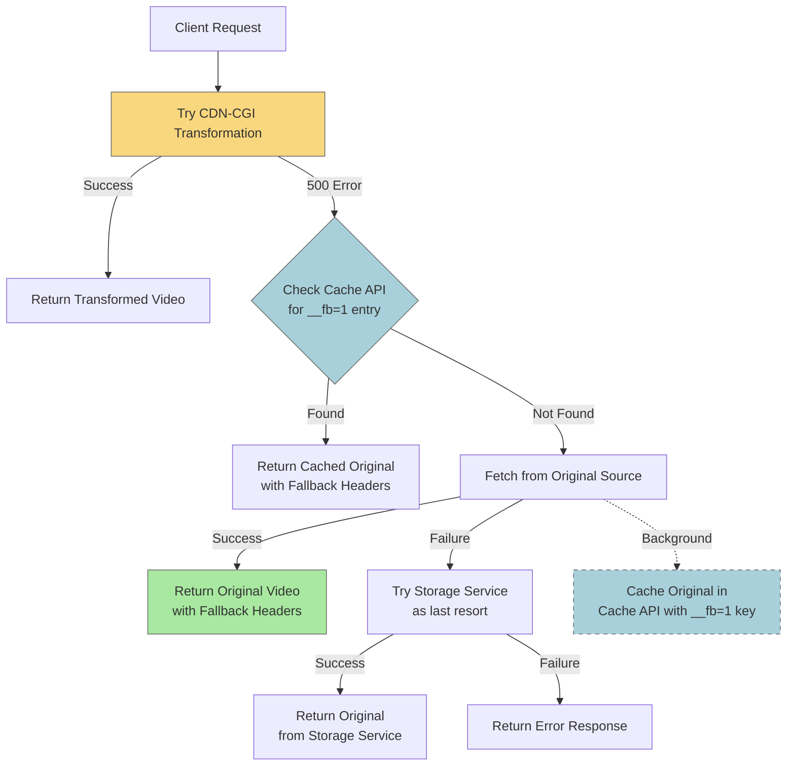
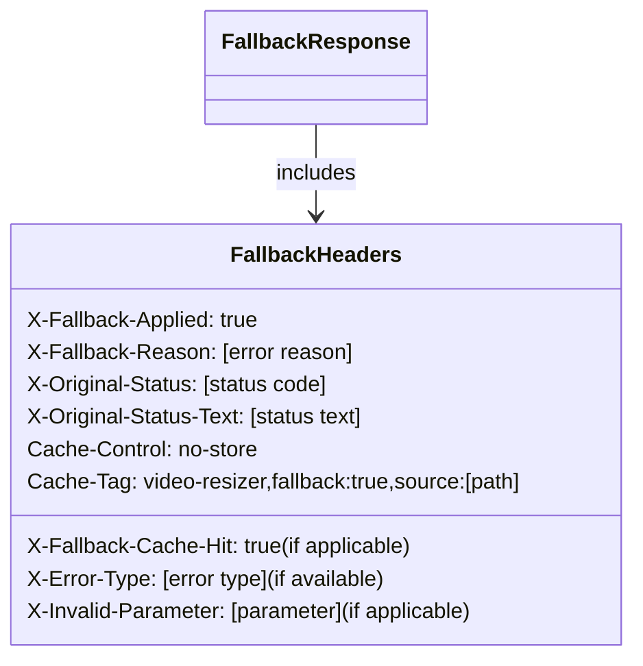
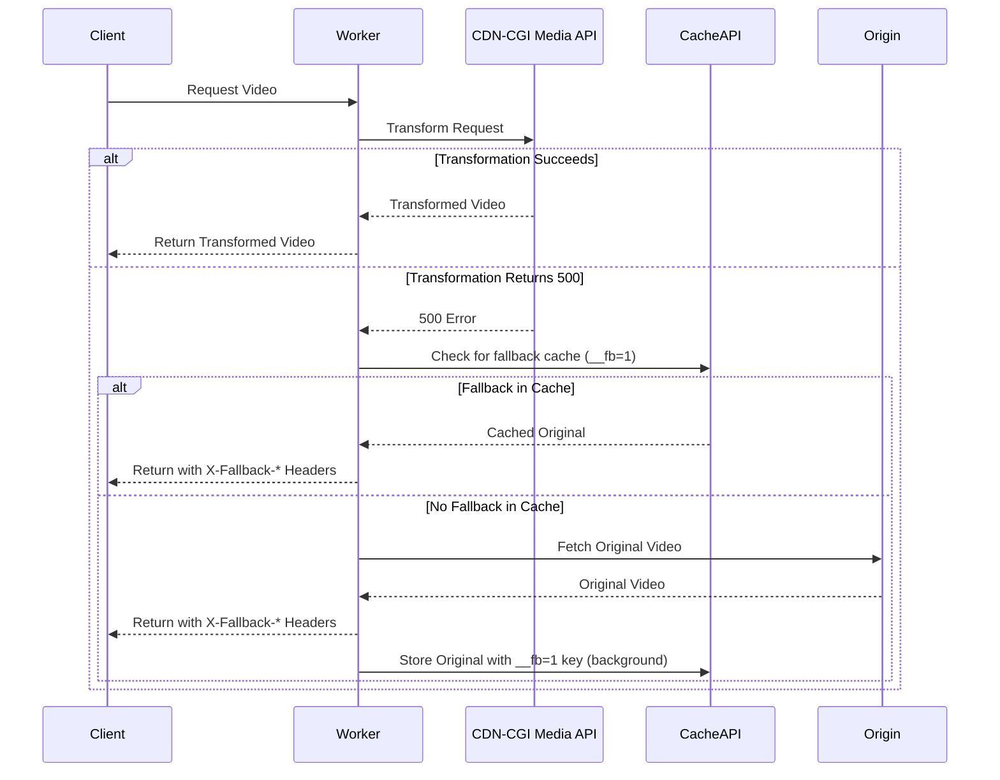

# Video Storage Service Error Handling Implementation

## Summary

This document details the implementation of standardized error handling for the Video Storage Service module. The implementation builds on the patterns established for the KV Storage Service and ensures consistent error reporting, proper fallback behavior, and improved debugging for all video storage operations.

## Implementation Details

### Completed on April 3, 2025

The following functions in `videoStorageService.ts` have been updated to use standardized error handling:

1. **applyPathTransformation**
   - Reimplemented with proper error handling and logging
   - Added fallback to return original path on transformation errors
   - Added context with path and origin type for better debugging

2. **fetchFromR2**
   - Used `withErrorHandling` for comprehensive error logging
   - Improved breadcrumbs and context data for R2 storage errors
   - Enhanced type safety for R2 bucket interactions
   - Added more detailed error messages for R2 binding issues

3. **fetchFromRemote**
   - Used `withErrorHandling` for remote URL fetch operations
   - Added improved error context for authentication failures
   - Enhanced AWS credential error handling
   - Maintained backward compatibility with existing auth patterns

4. **fetchFromFallback**
   - Applied `withErrorHandling` for fallback URL operations
   - Standardized auth error handling
   - Improved error context and logging for network failures

5. **fetchVideo** (Main Orchestration Function)
   - Used `withErrorHandling` to manage the overall fetch process
   - Added rich breadcrumb creation for debugging the fetch flow
   - Enhanced error context with request details
   - Improved storage type fallback handling

6. **shouldBypassCache**
   - Used `tryOrDefault` for consistent error handling
   - Added safe default (false) to avoid unnecessary cache bypassing
   - Enhanced error context with request information

7. **generateCacheTags**
   - Implemented with `tryOrDefault` for safe tag generation
   - Added fallback to return empty array on error
   - Enhanced context with tag generation details

## Implementation Approach

The implementation followed these steps for each function:

1. Separated the core implementation logic from error handling wrappers
2. Applied `withErrorHandling` for async functions with rich context
3. Used `tryOrDefault` for synchronous functions that need fallbacks
4. Enhanced breadcrumb tracking throughout the storage flow
5. Improved error context with storage-specific information
6. Added fallback behavior to ensure robustness during errors

## Storage-Specific Enhancements

1. **R2 Storage**
   - Added specific error handling for R2 bucket binding issues
   - Enhanced error context with R2 key information
   - Improved logging for conditional request handling

2. **Remote Storage**
   - Added authentication-specific error handling
   - Improved context for AWS credential errors
   - Enhanced headers and options error handling

3. **Fallback Storage**
   - Added similar patterns to remote storage
   - Ensured proper fallbacks for auth failures

## Benefits

1. **Comprehensive Error Logging**: All storage operations now log errors with full context
2. **Improved Debugging**: Rich breadcrumbs and context data aid in tracing issues
3. **Standardized Error Handling**: Consistent patterns across all storage operations
4. **Robust Fallbacks**: Each function has well-defined fallback behavior for errors
5. **Enhanced Type Safety**: TypeScript types are properly maintained throughout

## TypeScript Type Safety

While implementing the changes, we resolved several TypeScript issues:
1. Fixed error in applyPathTransformation by using a proper function implementation instead of tryOrDefault
2. Improved generic type parameters in withErrorHandling calls
3. Ensured proper typing of storage-specific objects and parameters

## Testing Notes

The implementation maintains compatibility with existing code but would benefit from dedicated tests for:

1. Error paths in each storage type
2. Authentication errors in remote storage
3. Fallback behavior when primary storage fails
4. Path transformation errors

## Next Steps

The next components to update with standardized error handling are:

1. `debugService.ts` - Service for debugging capabilities
2. `errorHandlerService.ts` - Service for creating error responses

## Recent Enhancements (April 10, 2025)

### Enhanced Fallback Mechanism for CDN-CGI 500 Errors

We've significantly improved the fallback mechanism in the `TransformVideoCommand.ts` to better handle 500 errors from the CDN-CGI transformation service:

1. **Fixed Source URL Extraction**:
   - Previously, the code was incorrectly trying to extract the original source URL from the CDN-CGI URL using string manipulation:
   ```typescript
   // Old problematic code:
   const sourceUrl = cdnCgiUrl.split('/cdn-cgi/media/')[1].split(',', 2)[1];
   ```
   - This led to 500 errors when the transformation failed because it was extracting `height=1080` instead of the actual source URL
   - Now uses the source URL that's already available from earlier in the process:
   ```typescript
   // New reliable code:
   const sourceUrl = source;
   ```

2. **Fixed Response Header Logic**:
   - Fixed an issue where header setting code appeared after a return statement and was never reached
   - Moved the header setting code before the return statement to ensure headers are properly applied:
   ```typescript
   // Include original error status for debugging before returning
   headers.set('X-Original-Status', String(response.status));
   headers.set('X-Original-Status-Text', response.statusText);
   
   // Return the fallback response with the enhanced headers
   return new Response(fallbackResponse.body, {
     status: fallbackResponse.status,
     statusText: fallbackResponse.statusText,
     headers
   });
   ```

3. **Improved Caching Strategy**:
   - Maintains the existing two-tier caching strategy for fallbacks:
     - The fallback response itself isn't cached due to `no-store` directive
     - But the original content is cached separately with a special fallback key
     - For subsequent 500 errors, it checks this special cache before fetching again
   - This ensures fast fallbacks while still trying the transformation on each new request

### Fallback Process Flow

Here's the process flow for the enhanced fallback mechanism:



### Fallback Response Headers

The fallback mechanism adds these diagnostic headers to responses:



### Request Flow Sequence



### Benefits of the Enhanced Approach

1. **Reliability**: Fixed source URL extraction ensures the fallback always works correctly
2. **Diagnostic Clarity**: Proper headers help with debugging transformation failures
3. **Optimized Performance**: Caching strategy balances retry attempts with quick fallbacks
4. **Graceful Degradation**: Users get content even when transformation services fail
5. **Better Monitoring**: Enhanced headers enable tracking of transformation failures

These fixes will significantly improve user experience when the CDN-CGI Media API experiences issues, ensuring videos continue to be delivered using the original source when transformations fail.

## Conclusion

The implementation of standardized error handling in the Video Storage Service significantly enhances the robustness and debuggability of the video fetching process. By consistently using the error handling utilities and implementing intelligent fallback mechanisms, we ensure that errors are properly logged, contextualized, and handled with appropriate fallbacks to maintain the best possible user experience even when problems occur.