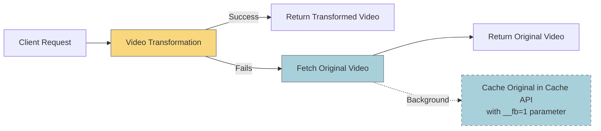
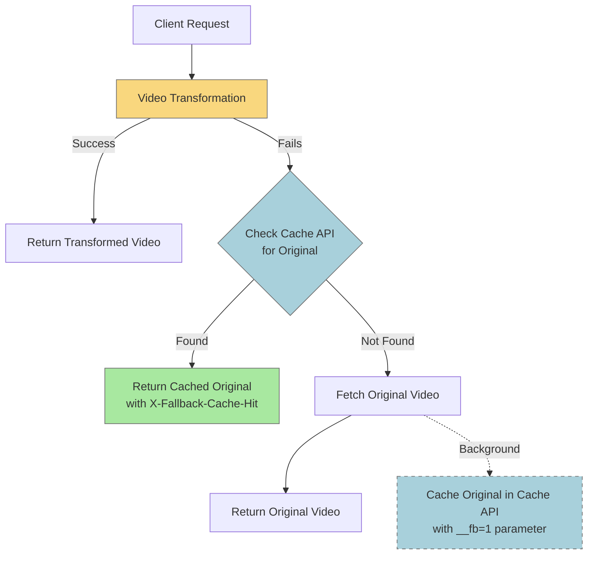
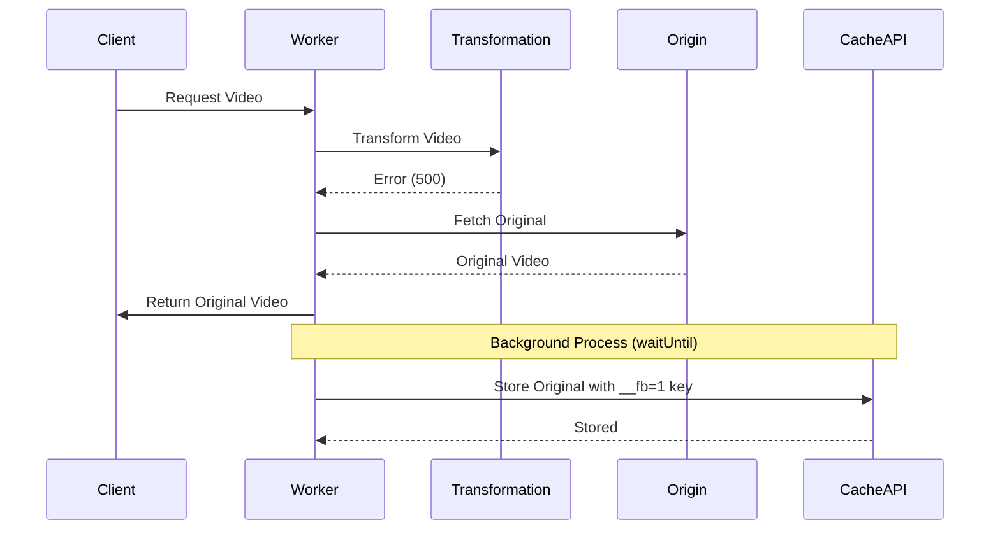

# Video Storage Service Error Handling Implementation

## Summary

This document details the implementation of standardized error handling for the Video Storage Service module. The implementation builds on the patterns established for the KV Storage Service and ensures consistent error reporting, proper fallback behavior, and improved debugging for all video storage operations.

## Implementation Details

### Completed on April 3, 2025

The following functions in `videoStorageService.ts` have been updated to use standardized error handling:

1. **applyPathTransformation**
   - Reimplemented with proper error handling and logging
   - Added fallback to return original path on transformation errors
   - Added context with path and origin type for better debugging

2. **fetchFromR2**
   - Used `withErrorHandling` for comprehensive error logging
   - Improved breadcrumbs and context data for R2 storage errors
   - Enhanced type safety for R2 bucket interactions
   - Added more detailed error messages for R2 binding issues

3. **fetchFromRemote**
   - Used `withErrorHandling` for remote URL fetch operations
   - Added improved error context for authentication failures
   - Enhanced AWS credential error handling
   - Maintained backward compatibility with existing auth patterns

4. **fetchFromFallback**
   - Applied `withErrorHandling` for fallback URL operations
   - Standardized auth error handling
   - Improved error context and logging for network failures

5. **fetchVideo** (Main Orchestration Function)
   - Used `withErrorHandling` to manage the overall fetch process
   - Added rich breadcrumb creation for debugging the fetch flow
   - Enhanced error context with request details
   - Improved storage type fallback handling

6. **shouldBypassCache**
   - Used `tryOrDefault` for consistent error handling
   - Added safe default (false) to avoid unnecessary cache bypassing
   - Enhanced error context with request information

7. **generateCacheTags**
   - Implemented with `tryOrDefault` for safe tag generation
   - Added fallback to return empty array on error
   - Enhanced context with tag generation details

## Implementation Approach

The implementation followed these steps for each function:

1. Separated the core implementation logic from error handling wrappers
2. Applied `withErrorHandling` for async functions with rich context
3. Used `tryOrDefault` for synchronous functions that need fallbacks
4. Enhanced breadcrumb tracking throughout the storage flow
5. Improved error context with storage-specific information
6. Added fallback behavior to ensure robustness during errors

## Storage-Specific Enhancements

1. **R2 Storage**
   - Added specific error handling for R2 bucket binding issues
   - Enhanced error context with R2 key information
   - Improved logging for conditional request handling

2. **Remote Storage**
   - Added authentication-specific error handling
   - Improved context for AWS credential errors
   - Enhanced headers and options error handling

3. **Fallback Storage**
   - Added similar patterns to remote storage
   - Ensured proper fallbacks for auth failures

## Benefits

1. **Comprehensive Error Logging**: All storage operations now log errors with full context
2. **Improved Debugging**: Rich breadcrumbs and context data aid in tracing issues
3. **Standardized Error Handling**: Consistent patterns across all storage operations
4. **Robust Fallbacks**: Each function has well-defined fallback behavior for errors
5. **Enhanced Type Safety**: TypeScript types are properly maintained throughout

## TypeScript Type Safety

While implementing the changes, we resolved several TypeScript issues:
1. Fixed error in applyPathTransformation by using a proper function implementation instead of tryOrDefault
2. Improved generic type parameters in withErrorHandling calls
3. Ensured proper typing of storage-specific objects and parameters

## Testing Notes

The implementation maintains compatibility with existing code but would benefit from dedicated tests for:

1. Error paths in each storage type
2. Authentication errors in remote storage
3. Fallback behavior when primary storage fails
4. Path transformation errors

## Next Steps

The next components to update with standardized error handling are:

1. `debugService.ts` - Service for debugging capabilities
2. `errorHandlerService.ts` - Service for creating error responses

## Recent Enhancements (April 4, 2025)

### Enhanced Fallback Mechanism

We've significantly improved the fallback mechanism in the error handling system:

1. **Cache API for Original Videos**:
   - Original videos used as fallbacks are now cached in Cloudflare Cache API
   - Uses a separate cache key with `__fb=1` parameter to distinguish fallback content
   - Applies cache tags (`video-resizer,fallback:true,source:{path}`) for efficient purging
   - Avoids using KV for large original videos (which has 25MB size limitation)

2. **Intelligent Fallback Strategy**:
   - When transformation fails (especially for 500 errors), the system now:
     - First checks if a cached original already exists in Cache API
     - If found, serves it immediately with appropriate headers
     - If not found, attempts to fetch and cache the original video
   - For subsequent requests:
     - Always tries the transformation first to see if the issue is resolved
     - Falls back to cached original if transformation still fails
     - This provides optimal balance between transformation attempts and fallback performance

3. **Background Processing**:
   - Uses Cloudflare's `waitUntil` when available for non-blocking background caching
   - Falls back to Promise-based background processing when execution context isn't available
   - Ensures responsive user experience while still caching for future requests

4. **Enhanced Diagnostics**:
   - Added new diagnostic headers to indicate fallback cache usage:
     - `X-Fallback-Cache-Hit: true` when using a cached original
     - `X-Fallback-Applied: true` for all fallback scenarios
     - `Cache-Tag: video-resizer,fallback:true,source:{path}` enabling cache management
     - Additional headers to explain the specific failure reason

This enhancement significantly improves the user experience for videos that consistently fail transformation, while maintaining a clear separation between transformed videos and fallback originals in the cache.

### Detailed Flow Diagrams

The enhanced fallback mechanism follows these flows, illustrated using Mermaid diagrams:

#### 1. Initial Request Flow



#### 2. Subsequent Request Flow



#### 3. Cache Structure

```mermaid
classDiagram
    class TransformedVideo {
        Cache Key: {url}
        Cache Tags: video-resizer,derivative:{type}
        Headers: Cache-Control, Etag
    }
    
    class FallbackOriginal {
        Cache Key: {url}?__fb=1
        Cache Tags: video-resizer,fallback:true,source:{path}
        Headers: X-Fallback-Applied, Cache-Tag
    }
    
    CloudflareCache --> TransformedVideo : stores
    CloudflareCache --> FallbackOriginal : stores
```

#### 4. Background Operations (with waitUntil)



This design pattern balances several important priorities:
- Always tries transformation first to recover from transient errors
- Avoids redundant origin fetches for persistent transformation failures
- Maintains separate cache entries for transformed vs. original content
- Uses async background caching to minimize response time
- Provides clear diagnostic information via response headers

## Conclusion

The implementation of standardized error handling in the Video Storage Service significantly enhances the robustness and debuggability of the video fetching process. By consistently using the error handling utilities and implementing intelligent fallback mechanisms, we ensure that errors are properly logged, contextualized, and handled with appropriate fallbacks to maintain the best possible user experience even when problems occur.