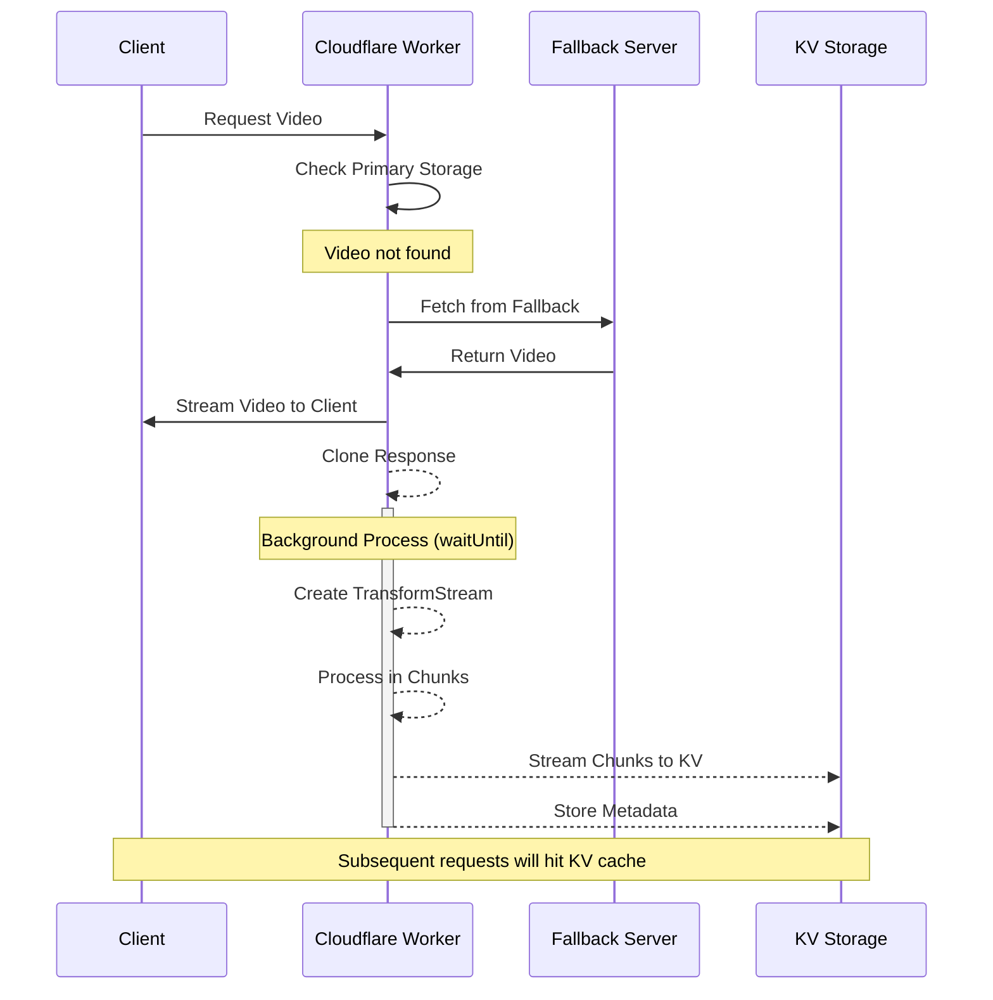

# Background Fallback Caching

*Last Updated: May 14, 2025*

## Overview

Background Fallback Caching is a feature that enables the system to asynchronously cache fallback video content in KV storage without impacting the user's response time. When a fallback source is accessed, the video is streamed back to the client immediately while simultaneously being stored in the KV cache in the background using chunking for large files.

This feature addresses two key challenges:
1. **Performance**: Ensures users get fast responses directly from fallback sources without waiting for caching operations
2. **Memory Limitations**: Handles large video files that exceed Workers' memory limits by using streaming and chunking approaches

## How It Works

The background fallback caching process follows these steps:

1. **Initial Request**: When a video is not found in primary storage (R2/Remote), the system falls back to the configured fallback URL
2. **Immediate Response**: The fallback response is immediately sent to the client without delay
3. **Background Processing**: In parallel, a `waitUntil` process is started that:
   - Clones the fallback response
   - Creates a TransformStream to efficiently process the video content
   - Streams the content to KV storage using existing chunking logic for large files
   - Handles errors without affecting the user's response

### Flow Diagram



## Implementation Details

The background fallback caching is implemented in both the fallback storage module and the transformation error handler, ensuring that all fallback paths utilize the same caching mechanism:

### Fallback Detection

When a fallback fetch succeeds, the system checks the file size and initiates the background caching process using the worker's `executionCtx.waitUntil()` mechanism:

```typescript
// After successful fallback response (in fetchFromFallbackImpl)
if (response.ok && env.executionCtx?.waitUntil && env.VIDEO_TRANSFORMATIONS_CACHE) {
  // Check file size to avoid memory issues with very large files
  const contentLengthHeader = response.headers.get('Content-Length');
  const contentLength = contentLengthHeader ? parseInt(contentLengthHeader, 10) : 0;
  const isVeryLargeFile = contentLength > 100 * 1024 * 1024; // 100MB threshold
  
  // Skip background caching for very large files
  if (isVeryLargeFile) {
    logDebug('VideoStorageService', `Skipping background storage for very large file (${Math.round(contentLength/1024/1024)}MB)`);
    return;
  }
  
  // For normal-sized files, proceed with background caching
  env.executionCtx.waitUntil(
    streamFallbackToKV(env, transformedPath, response.clone(), config)
  );
}
```

### Error Handler Integration

The transformation error handler also implements background caching via a helper function that's called for all fallback types, with a file size threshold to prevent memory issues:

```typescript
// Helper function for consistent background caching across multiple code paths
async function initiateBackgroundCaching(
  env: EnvVariables,
  path: string,
  fallbackResponse: Response,
  requestContext: RequestContext,
  tagInfo?: {
    pattern?: string,
    isLargeVideo?: boolean
  }
): Promise<void> {
  // Check for required environment components
  if (!env || !env.executionCtx?.waitUntil || !env.VIDEO_TRANSFORMATIONS_CACHE) {
    return;
  }
  
  // Check file size to avoid memory issues with very large files
  const contentLengthHeader = fallbackResponse.headers.get('Content-Length');
  const contentLength = contentLengthHeader ? parseInt(contentLengthHeader, 10) : 0;
  const isVeryLargeFile = contentLength > 100 * 1024 * 1024; // 100MB threshold
  
  // Skip background caching for very large files
  if (isVeryLargeFile) {
    logDebug('handleTransformationError', `Skipping background KV storage for very large file (${Math.round(contentLength/1024/1024)}MB)`, {
      path,
      contentLength
    });
    return;
  }
  
  // For normal-sized files, proceed with background caching
  const fallbackClone = fallbackResponse.clone();
  
  // Background caching implementation
  env.executionCtx.waitUntil(
    streamFallbackToKV(env, path, fallbackClone, videoConfig)
      .catch(storeError => {
        // Error handling for background process
      })
  );
}
```

### Streaming Process

The streaming implementation uses TransformStream to efficiently process large videos without buffering the entire content in memory:

```typescript
async function streamFallbackToKV(env, path, response, config) {
  // Create streaming pipeline
  const { readable, writable } = new TransformStream();
  const writer = writable.getWriter();
  
  // Stream the response to the writer
  (async () => {
    const reader = response.body.getReader();
    try {
      while (true) {
        const { done, value } = await reader.read();
        if (done) break;
        await writer.write(value);
      }
    } finally {
      await writer.close();
    }
  })();
  
  // Use the existing chunking logic to store the streamed content
  await storeTransformedVideo(
    env.VIDEO_TRANSFORMATIONS_CACHE,
    path,
    new Response(readable, { 
      headers: new Headers(response.headers)
    }),
    transformOptions,
    ttl
  );
}
```

### Chunked Storage

For large videos (>20MB), the system leverages the existing KV chunking implementation to:
1. Split the video into 5MB chunks
2. Create a manifest file with metadata
3. Store each chunk with a unique key
4. Apply consistent cache tags to all parts

This approach ensures that even very large videos can be cached without exceeding KV or Worker memory limits.

## Error Handling

The background caching process includes robust error handling to ensure that any issues during the background caching don't affect the user experience:

1. **Isolation**: All errors in the background process are contained and don't propagate to the main response
2. **Logging**: Detailed logging for diagnosis of any issues during background caching
3. **Graceful Degradation**: If caching fails, the system continues functioning with direct fallback access
4. **Consistent Implementation**: The same error handling approach is used across both the fallback storage service and transformation error handler
5. **Contextual Logging**: Logs include detailed context based on the type of fallback (large video, pattern-specific, or standard)

## Memory Efficiency with Streaming API

The implementation leverages Cloudflare Workers' Streaming API to efficiently handle large files without running into memory limitations:

1. **Memory-Efficient Processing**: Uses the modern Streams API to process data in chunks without loading the entire file into memory
2. **Response Cloning**: Properly manages response cloning to avoid the `ReadableStream.tee() buffer limit exceeded` error
3. **Streaming Architecture**: Direct consumption of the response body without unnecessary buffering
4. **Size Awareness**: Logs detailed information about large file sizes (>100MB) for monitoring and diagnostics
5. **User Transparency**: The video is delivered to the user without interruption regardless of file size
6. **Worker Protection**: Prevents memory errors through proper stream handling techniques

This approach allows background caching to work efficiently with files of any size, including very large videos.

## Performance Considerations

1. **Non-Blocking**: The background caching happens after the main response is sent
2. **Streaming**: Content is processed in chunks without buffering the entire video
3. **Resource Management**: Uses Workers' efficient streaming primitives to minimize memory usage
4. **Cooperative Scheduling**: Uses `waitUntil` to properly manage background tasks

## Testing

The background fallback caching includes comprehensive tests for both the fallback storage service and the transformation error handler:

1. **Fallback Storage Tests**:
   - Verifies background caching initiation on successful fallback fetch
   - Confirms no caching attempts on fallback fetch failures
   - Validates immediate response delivery without waiting for background storage
   - Tests proper error isolation between main response and background processing

2. **Transformation Error Handler Tests**:
   - Tests background caching for large video files (>256MiB)
   - Tests pattern-specific fallback caching with correct context
   - Verifies regular fallback caching implementation
   - Confirms graceful handling when executionCtx or KV namespace is unavailable

## Configuration

No additional configuration is required. The feature automatically activates when:

1. A fallback source is configured
2. The environment has `executionCtx.waitUntil` capability 
3. The `VIDEO_TRANSFORMATIONS_CACHE` KV namespace is available

Special fallback cases are automatically detected and handled appropriately:

- **Very large videos** (>100MB): Processed with enhanced memory-efficient streaming
- **Large videos** (>20MB): Chunked for optimal storage and retrieval
- **Pattern-specific fallbacks**: Cached with pattern information for diagnostic purposes
- **Standard fallbacks**: Cached with standard configuration

## Best Practices

1. **Monitor Logs**: Watch for background caching errors in logs
2. **TTL Settings**: Configure appropriate TTL values based on content update frequency
3. **Memory Monitoring**: Keep an eye on memory usage patterns in Worker metrics
4. **Streaming Awareness**: Understand how the system uses streaming to efficiently process files of any size
5. **Performance Tuning**: For very large files (>500MB), consider additional performance monitoring

## Related Features

- [KV Chunking](./kv-chunking.md) - Implementation details of the chunking system
- [Caching Architecture](../caching/caching-architecture.md) - Overall caching architecture
- [Fallback Storage](../architecture/service-separation.md#fallback-storage) - Fallback storage configuration