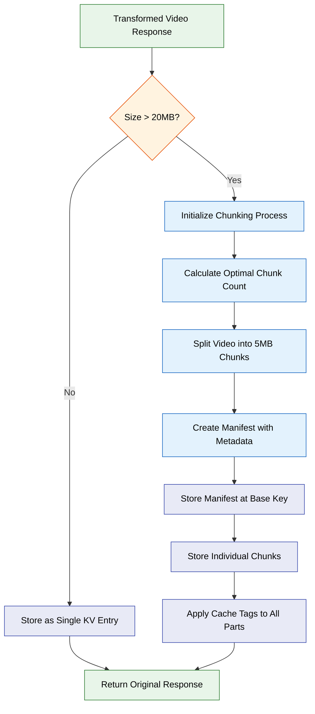
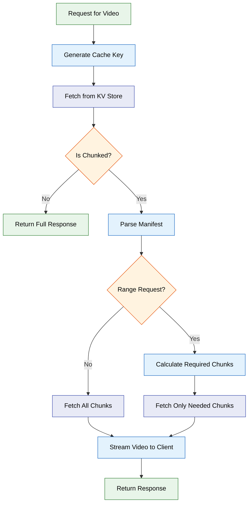
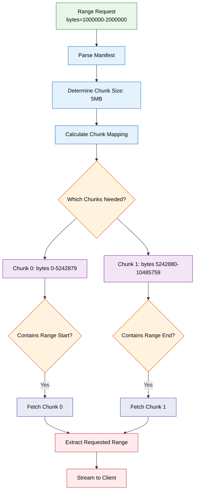
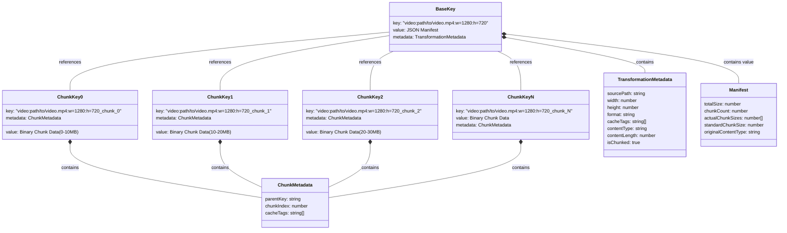
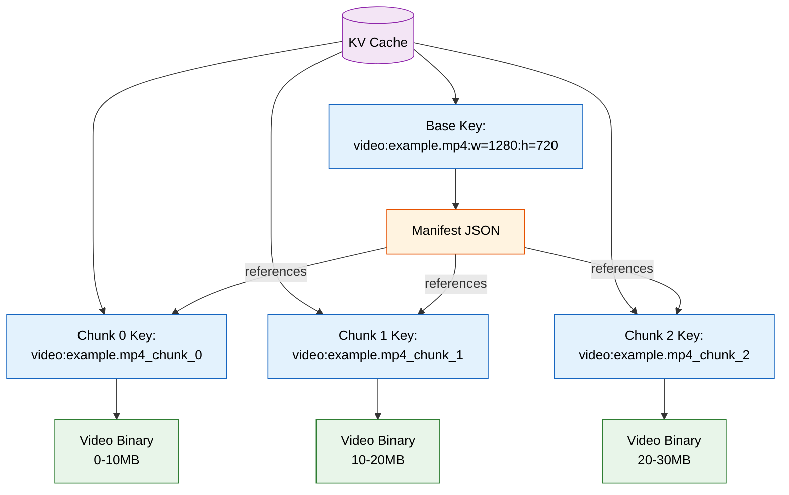
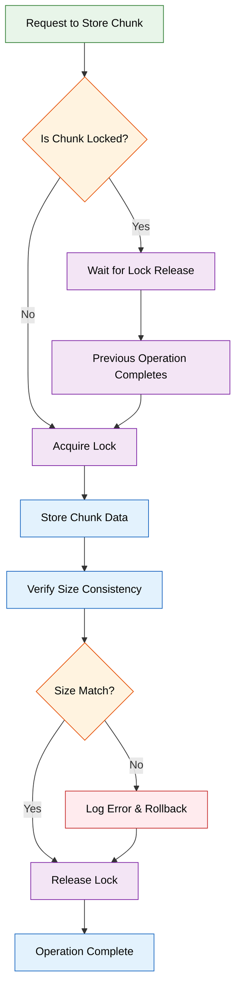
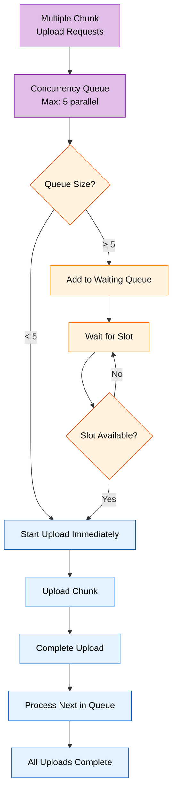
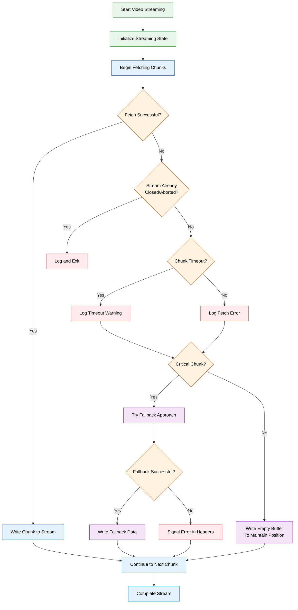
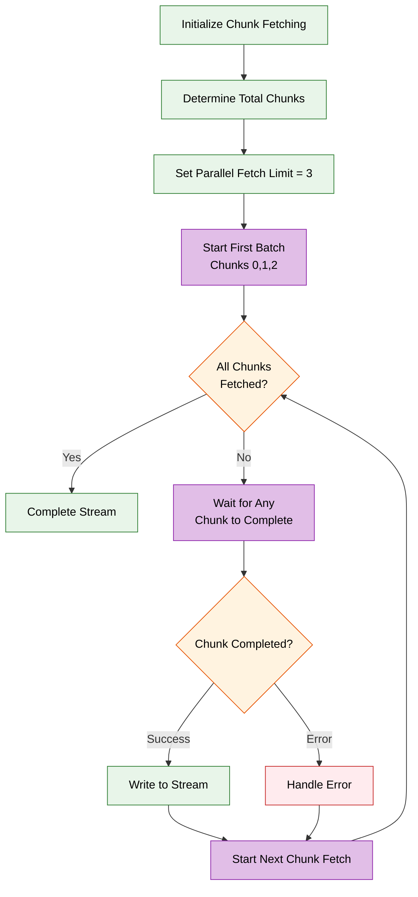

# KV Chunking for Large Videos

_Last Updated: February 18, 2026_

## Table of Contents

- [Overview](#overview)
- [How KV Chunking Works](#how-kv-chunking-works)
- [Implementation Details](#implementation-details)
- [Chunk Size Rationale](#chunk-size-rationale)
- [Storage Architecture](#storage-architecture)
- [Range Request Support](#range-request-support)
- [Concurrency and Chunk Locking](#concurrency-and-chunk-locking)
- [Error Resilience](#error-resilience)
- [Cache Management](#cache-management)
- [Performance Considerations](#performance-considerations)
- [Testing and Verification](#testing-and-verification)
- [Configuration Options](#configuration-options)
- [Best Practices](#best-practices)

## Overview

KV Chunking is a feature that enables storing large video files in Cloudflare KV storage by splitting them into smaller, manageable chunks. This addresses the 25MB value size limit of Cloudflare KV while maintaining efficient storage and retrieval of videos of any size.

Key benefits of KV Chunking include:

- Support for videos larger than 25MB (Cloudflare KV's size limit)
- Optimized streaming with precise range request handling
- Improved resilience with per-chunk error recovery
- Efficient memory usage during video streaming
- Comprehensive data integrity validation
- Automatic detection and handling based on video size

## How KV Chunking Works

The KV Chunking system follows a simple decision flow:

1. **Size Detection**: When storing a video, its size is checked
   - Videos under 20MB are stored as single KV entries
   - Videos 20MB or larger are stored as multiple chunks

2. **Chunking Process**: For large videos, the system:
   - Splits the video into 10MB chunks
   - Creates a manifest file with metadata
   - Stores each chunk with a unique key
   - Applies consistent cache tags to all parts

3. **Retrieval Process**: When fetching a chunked video:
   - The manifest is retrieved first
   - Required chunks are fetched based on the manifest
   - For range requests, only needed chunks are retrieved
   - The video is streamed to the client

4. **Integrity Verification**: The system ensures:
   - All chunks maintain the correct size
   - The total size matches the original video
   - Content type is preserved

### Process Flow Diagrams

#### Storage Flow



#### Retrieval Flow



#### Range Request Optimization



## Implementation Details

The KV Chunking implementation involves several key components:

### Manifest Structure

The manifest is stored in the value of the base key and contains all necessary metadata:

```json
{
  "totalSize": 52428800,
  "chunkCount": 10,
  "actualChunkSizes": [
    5242880, 5242880, 5242880, 5242880, 5242880, 5242880, 5242880, 5242880, 5242880, 5242880
  ],
  "standardChunkSize": 5242880,
  "originalContentType": "video/mp4"
}
```

### Storage Process

1. Generate a base key for the video
2. Determine if chunking is needed based on size
3. For chunked videos:
   - Split into 5MB chunks
   - Create a manifest with metadata
   - Store each chunk with key pattern: `baseKey_chunk_X`
   - Apply the same cache tags to all parts

```typescript
// Example of storing a chunked video
async function storeChunkedVideo(namespace, baseKey, videoBuffer, contentType) {
  // Prepare chunks from video buffer
  const CHUNK_SIZE = 10 * 1024 * 1024; // 10MB chunks
  const totalSize = videoBuffer.byteLength;
  const chunks = [];
  const chunkSizes = [];
  let currentPosition = 0;

  // Split video into chunks
  while (currentPosition < totalSize) {
    const endPosition = Math.min(currentPosition + CHUNK_SIZE, totalSize);
    const chunkData = videoBuffer.slice(currentPosition, endPosition);
    chunks.push(chunkData);
    chunkSizes.push(chunkData.byteLength);
    currentPosition = endPosition;
  }

  // Generate consistent cache tags for all parts
  const cacheTags = generateCacheTags(baseKey);

  // Create manifest with metadata
  const manifest = {
    totalSize,
    chunkCount: chunks.length,
    actualChunkSizes: chunkSizes,
    standardChunkSize: CHUNK_SIZE,
    originalContentType: contentType,
  };

  // Store manifest at base key
  await namespace.put(baseKey, JSON.stringify(manifest), {
    metadata: {
      isChunked: true,
      cacheTags,
      contentType: 'application/json',
      contentLength: JSON.stringify(manifest).length,
    },
  });

  // Store chunks with related metadata
  for (let i = 0; i < chunks.length; i++) {
    const chunkKey = `${baseKey}_chunk_${i}`;
    await namespace.put(chunkKey, chunks[i], {
      metadata: {
        parentKey: baseKey,
        chunkIndex: i,
        cacheTags,
        contentLength: chunks[i].byteLength,
      },
    });
  }

  return manifest;
}
```

### Retrieval Process

1. Fetch the base key to determine if it's a regular video or a chunked manifest
2. For chunked videos:
   - Parse the manifest
   - For full videos, fetch all chunks
   - For range requests, calculate which chunks contain the requested range
   - Stream the video content to the client

```typescript
// Example of retrieving a chunked video with range support
async function getChunkedVideo(namespace, baseKey, request) {
  // Get manifest from base key
  const manifestValue = await namespace.get(baseKey, 'text');
  if (!manifestValue) {
    return null; // Not found
  }

  // Parse manifest
  const manifest = JSON.parse(manifestValue);
  const isRangeRequest = request?.headers?.has('Range');

  if (isRangeRequest) {
    // Handle range request
    const rangeHeader = request.headers.get('Range') || '';
    const { start, end } = parseRange(rangeHeader, manifest.totalSize);

    // Calculate which chunks contain the requested range
    const neededChunks = calculateNeededChunks(start, end, manifest);

    // Create streaming response for efficient memory usage
    const { readable, writable } = new TransformStream();
    const writer = writable.getWriter();

    // Create and return the response with range headers immediately
    const response = new Response(readable, {
      status: 206,
      headers: {
        'Content-Type': manifest.originalContentType,
        'Accept-Ranges': 'bytes',
        'Content-Range': `bytes ${start}-${end}/${manifest.totalSize}`,
        'Content-Length': (end - start + 1).toString(),
        'Cache-Control': 'public, max-age=3600',
      },
    });

    // Start async chunk fetching and streaming
    // This happens in the background while response is already being sent
    streamChunksForRange(writer, namespace, baseKey, neededChunks, start, end);

    return response;
  } else {
    // Full video request - fetch all chunks
    const { readable, writable } = new TransformStream();
    const writer = writable.getWriter();

    // Create full response
    const response = new Response(readable, {
      status: 200,
      headers: {
        'Content-Type': manifest.originalContentType,
        'Content-Length': manifest.totalSize.toString(),
        'Accept-Ranges': 'bytes',
        'Cache-Control': 'public, max-age=3600',
      },
    });

    // Start async chunk fetching for full video
    streamFullVideo(writer, namespace, baseKey, manifest);

    return response;
  }
}

// Fetch and stream chunks for range request
async function streamChunksForRange(writer, namespace, baseKey, neededChunks, start, end) {
  try {
    let processedBytes = 0;
    let videoPosition = 0;

    // Process each needed chunk
    for (const chunk of neededChunks) {
      // Fetch the chunk
      const chunkKey = `${baseKey}_chunk_${chunk.index}`;
      const chunkData = await namespace.get(chunkKey, 'arrayBuffer');

      if (!chunkData) {
        throw new Error(`Chunk ${chunk.index} not found`);
      }

      // Calculate slice within this chunk
      const sliceStart = chunk.index === neededChunks[0].index ? start - videoPosition : 0;
      const sliceEnd = Math.min(chunk.size, end - videoPosition + 1);

      // Write the slice to the stream
      await writer.write(new Uint8Array(chunkData.slice(sliceStart, sliceEnd)));

      videoPosition += chunk.size;
      processedBytes += sliceEnd - sliceStart;

      // Check if we've fulfilled the range request
      if (processedBytes >= end - start + 1) {
        break;
      }
    }
  } catch (error) {
    console.error('Error streaming chunks:', error);
  } finally {
    await writer.close();
  }
}
```

## Chunk Size Rationale

The 10MB (10,485,760 bytes) chunk size was carefully chosen for several reasons:

- **Balance**: Provides optimal balance between minimizing chunk count and staying well below KV's 25MB limit
- **Safety margin**: ~40% of KV's limit allows room for metadata overhead and future adjustments
- **Performance**: Large enough to significantly reduce KV operation count and metadata overhead
- **Technical efficiency**: As a power-of-2 multiple (10 \* 2^20), it aligns well with memory operations
- **Scalability**: 10MB chunks support videos up to several GB in size without excessive chunk counts
- **Metadata optimization**: Reduces the number of chunks, thereby reducing metadata size

## Storage Architecture

The KV Chunking system uses a two-level storage architecture:

### Base Key

- **Value**: Contains the JSON manifest data
- **Metadata**: Contains `TransformationMetadata` with `isChunked: true` flag and `cacheTags` for purging

### Chunk Keys

- **Key Pattern**: `originalKey_chunk_X` (where X is the chunk index)
- **Value**: Contains the actual binary video chunk data
- **Metadata**: Contains chunk metadata (parent key, index) and the same `cacheTags` as the parent

This architecture ensures:

- Consistent cache invalidation
- Clear relationship between chunks and parent video
- Efficient lookup and retrieval

### Key-Value Structure Diagram



### Manifest-Chunk Relationship



## Range Request Support

The KV Chunking system includes advanced range request support:

1. **Precise Chunk Selection**:
   - Only chunks containing the requested byte range are fetched
   - Avoids unnecessary data transfer for seeking operations

2. **Optimized Range Slicing**:
   - For ranges spanning multiple chunks, only the necessary portions are used
   - Minimizes memory usage and improves performance

3. **Streaming Architecture**:
   - Uses `TransformStream` for efficient streaming
   - Begins sending data immediately while fetching remaining chunks

```typescript
// Example: Handling a range request spanning multiple chunks
function streamChunksForRange(writer, namespace, baseKey, neededChunks, start, end) {
  let processedBytes = 0;
  let videoPosition = 0;

  // Process each needed chunk
  for (const chunk of neededChunks) {
    // Fetch the chunk
    const chunkKey = `${baseKey}_chunk_${chunk.index}`;
    const chunkData = await namespace.get(chunkKey, 'arrayBuffer');

    // Calculate slice within this chunk
    const sliceStart = chunk.index === 0 ? start : 0;
    const sliceEnd = Math.min(chunk.size, end - videoPosition + 1);

    // Write the slice to the stream
    await writer.write(new Uint8Array(chunkData.slice(sliceStart, sliceEnd)));

    videoPosition += chunk.size;
    processedBytes += sliceEnd - sliceStart;

    // Check if we've fulfilled the range request
    if (processedBytes >= end - start + 1) {
      break;
    }
  }

  // Close the stream
  await writer.close();
}
```

## Concurrency and Chunk Locking

The KV Chunking system includes sophisticated concurrency control to prevent data corruption and size mismatches during high-traffic scenarios:

### Chunk Lock Manager

The `ChunkLockManager` ensures that only one process can write to a specific chunk at a time, preventing race conditions that could lead to chunk size mismatches.

#### Key Features:

1. **Per-Chunk Locking**: Each chunk has its own lock, allowing parallel operations on different chunks
2. **Automatic Lock Release**: Locks are automatically released after operations complete
3. **Stale Lock Cleanup**: A background process cleans up locks older than 30 seconds
4. **Wait Queue**: Concurrent requests for the same chunk wait in a queue

#### Implementation Flow:



### Chunk Size Validation

To handle edge cases where chunk sizes might vary slightly due to concurrent operations:

1. **Storage Validation**:
   - Creates a fresh copy of chunk data before storing
   - Verifies size matches expected value
   - Updates metadata with actual size

2. **Retrieval Tolerance**:
   - Allows minor size differences (< 0.1% or < 2KB)
   - Recalculates slice boundaries for actual sizes
   - Logs warnings for monitoring

```typescript
// Example: Chunk locking during storage
async function storeChunkWithLock(namespace, chunkKey, chunkData, metadata) {
  // Acquire lock for this specific chunk
  const releaseLock = await chunkLockManager.acquireLock(chunkKey);

  try {
    // Create a fresh copy to avoid shared buffer issues
    const dataToStore = chunkData.slice().buffer;

    // Verify size consistency
    if (dataToStore.byteLength !== metadata.size) {
      throw new Error(`Size mismatch: expected ${metadata.size}, got ${dataToStore.byteLength}`);
    }

    // Store with verified size
    await namespace.put(chunkKey, dataToStore, {
      metadata: {
        ...metadata,
        size: dataToStore.byteLength,
      },
    });

    return true;
  } finally {
    // Always release the lock
    releaseLock();
  }
}

// Example: Tolerant chunk retrieval
async function retrieveChunkWithTolerance(namespace, chunkKey, expectedSize) {
  const chunk = await namespace.get(chunkKey, 'arrayBuffer');

  if (!chunk) {
    throw new Error(`Chunk not found: ${chunkKey}`);
  }

  const sizeDiff = chunk.byteLength - expectedSize;
  const percentDiff = (Math.abs(sizeDiff) / expectedSize) * 100;

  // Allow minor differences
  if (percentDiff < 0.1 || Math.abs(sizeDiff) < 2048) {
    logger.debug('Minor chunk size difference detected', {
      chunkKey,
      expected: expectedSize,
      actual: chunk.byteLength,
      difference: sizeDiff,
      percentage: percentDiff.toFixed(3) + '%',
    });
    return chunk;
  }

  // Throw error for significant mismatches
  throw new Error(`Critical chunk size mismatch: ${sizeDiff} bytes (${percentDiff.toFixed(2)}%)`);
}
```

### Concurrency Queue

The system uses a concurrency queue to limit parallel chunk uploads:



### Lock Manager Statistics

The chunk lock manager provides real-time statistics for monitoring:

```typescript
interface LockStats {
  activeLocks: number; // Current number of active locks
  oldestLockAge: number; // Age of the oldest lock in milliseconds
}

// Usage example
const stats = chunkLockManager.getStats();
if (stats.activeLocks > 100) {
  logger.warn('High number of active chunk locks', stats);
}
```

## Chunk Cleanup on Failure

When a chunked storage operation fails partway through (e.g., one chunk fails to upload, or size integrity verification fails, or the manifest write fails), the `cleanupStoredChunks()` function automatically deletes all successfully uploaded chunks. This prevents orphaned chunk keys from accumulating in KV storage. Cleanup runs deletions in parallel using `Promise.allSettled` and logs any deletion failures without throwing.

## Error Resilience

The KV Chunking implementation includes several error resilience features:

### 1. Stream State Management

- Tracks stream state with flags (`isStreamClosed`, `isStreamAborted`)
- Prevents writing to closed or aborted streams
- Avoids errors when client disconnects mid-stream

### 2. Timeout Handling

- Implements a 10-second timeout for chunk fetches
- Prevents hanging on problematic chunks
- Continues streaming when possible despite partial failures

### 3. Graceful Degradation

- Handles missing chunks after streaming has started
- Logs detailed error information
- Attempts to provide as much content as possible

### Error Handling Flow



### Parallel Fetching



```typescript
// Example: Resilient error handling during streaming
async function fetchChunkWithErrorHandling(namespace, chunkKey, chunkSize, writer, streamState) {
  try {
    // Fetch with timeout using Promise.race
    const chunkData = await Promise.race([
      namespace.get(chunkKey, 'arrayBuffer'),
      new Promise((_, reject) => setTimeout(() => reject(new Error('Chunk fetch timeout')), 10000)),
    ]);

    // Successfully fetched chunk
    if (!streamState.isStreamClosed && !streamState.isStreamAborted) {
      await writer.write(new Uint8Array(chunkData));
      return true;
    }
  } catch (error) {
    // Log the error for diagnostics
    logError('Error fetching chunk', {
      chunkKey,
      error: error.message,
      errorType: error.name,
      timeout: error.message === 'Chunk fetch timeout',
    });

    // Try to continue streaming if possible
    if (!streamState.isStreamClosed && !streamState.isStreamAborted) {
      try {
        // For non-critical chunks, write an empty buffer to maintain position
        // This allows playback to continue with some missing data
        await writer.write(new Uint8Array(chunkSize));

        // Add diagnostic headers if possible
        streamState.errorCount = (streamState.errorCount || 0) + 1;

        return false;
      } catch (streamError) {
        // Client likely disconnected, set abort flag
        streamState.isStreamAborted = true;
        logError('Stream write error', {
          reason: 'Client likely disconnected',
          error: streamError.message,
        });
      }
    }
  }

  return false;
}
```

## Cache Management

The chunking system integrates with the cache management system:

### 1. Consistent Cache Tags

- Applies identical cache tags to manifest and all chunks
- Enables purging all components with a single operation
- Prevents orphaned chunks when purging videos

### 2. TTL Management

- Supports consistent TTL across all chunks
- Implements TTL refresh for frequently accessed chunks
- Maintains cache hygiene with coordinated expiration

### 3. Versioning Support

- Integrates with the cache versioning system
- Supports cache invalidation through version increments
- Prevents serving stale data after updates

## Performance Considerations

The KV Chunking implementation includes optimizations for performance:

### 1. Edge Cache Integration

- Uses edge cache for KV reads (60 minute TTL)
- Reduces KV read operations for frequently accessed videos
- Decreases latency and origin load

### 2. Pre-computed Chunk Mapping

- Pre-calculates which chunks to fetch for range requests
- Avoids unnecessary chunk lookups
- Optimizes memory usage by fetching only what's needed

### 3. Sequential Processing

- Processes chunks in order to optimize streaming start time
- Prioritizes initial chunks for faster playback start
- Provides a better user experience for video playback

### 4. Memory Management

- Uses streaming techniques to minimize memory usage
- Processes chunks individually rather than loading entire video
- Enables efficient handling of very large videos

## Testing and Verification

The KV Chunking implementation includes comprehensive testing:

### 1. Unit Tests

- Tests for small videos (single entry)
- Tests for large videos (chunked storage)
- Range request handling tests
- Data integrity verification tests

### 2. Integration Tests

- Tests with the full caching layer
- Tests with different video variants
- Error handling and fallback behavior tests

### 3. Performance Tests

- Memory usage measurements
- Streaming performance tests
- Range request optimization tests

## Configuration Options

The KV Chunking behavior can be configured:

```json
{
  "kvChunking": {
    "enabled": true,
    "sizeThreshold": 20971520,
    "chunkSize": 10485760,
    "timeoutMs": 10000,
    "maxChunks": 1000,
    "parallelFetches": 3,
    "logChunkOperations": true,
    "useEdgeCache": true,
    "edgeCacheTtl": 3600
  }
}
```

| Option               | Type    | Default  | Description                        |
| -------------------- | ------- | -------- | ---------------------------------- |
| `enabled`            | boolean | true     | Enable KV chunking                 |
| `sizeThreshold`      | number  | 20971520 | Size threshold for chunking (20MB) |
| `chunkSize`          | number  | 10485760 | Size of each chunk (10MB)          |
| `timeoutMs`          | number  | 10000    | Timeout for chunk operations (10s) |
| `maxChunks`          | number  | 1000     | Maximum allowed chunks             |
| `parallelFetches`    | number  | 3        | Maximum parallel chunk fetches     |
| `logChunkOperations` | boolean | true     | Log detailed chunk operations      |
| `useEdgeCache`       | boolean | true     | Use edge cache for KV reads        |
| `edgeCacheTtl`       | number  | 3600     | Edge cache TTL in seconds (60m)    |

## Best Practices

1. **Configure Appropriate Size Threshold**:
   - Adjust the `sizeThreshold` based on your video characteristics
   - Consider lowering for videos with frequent range requests
   - Consider raising for videos rarely accessed with ranges

2. **Optimize Chunk Size for Content**:
   - The default 10MB is optimal for most use cases
   - Smaller chunks (2-5MB) may be better for videos with frequent seeking
   - The current 10MB setting provides a good balance for sequential streaming

3. **Monitor and Adjust Cache TTLs**:
   - Longer TTLs reduce origin load
   - Consider content update frequency when setting TTLs
   - Use cache tags for effective invalidation

4. **Leverage Range Request Optimizations**:
   - Configure your video player to use optimal chunk sizes
   - Consider adding range prediction for HLS/DASH content
   - Test with different range sizes to optimize performance

5. **Implement Proper Error Handling**:
   - Handle client disconnections gracefully
   - Log chunk errors for troubleshooting
   - Configure appropriate timeouts for your network conditions
