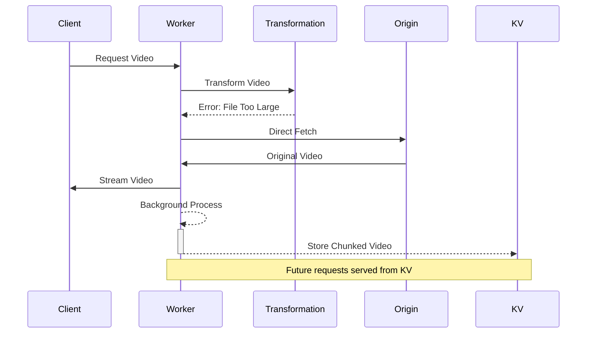

# Large Video Fallback Chunking

*Last Updated: May 14, 2025*

## Overview

Large Video Fallback Chunking enables efficient background caching of large video files that trigger transformation errors. When a video exceeds Cloudflare's transformation limits (particularly the 256MiB size limit), the system streams the original video directly to the client while simultaneously caching it in KV storage using chunking.

## Key Benefits

1. **Improved Performance**: Large videos are streamed directly to clients without transformation delays
2. **Efficient Resource Usage**: Handles videos that exceed Workers memory limits through chunking
3. **Background Processing**: Uses `waitUntil` to avoid blocking the user response
4. **Persisted Results**: Future requests can be served from KV cache rather than direct origins

## Implementation Details

The implementation integrates with the transformation error handler to detect three scenarios:

1. **Large Video (>256MiB)**: Videos that exceed Cloudflare's transformation size limits
2. **Pattern-specific Fallbacks**: Videos fetched from pattern-matched origins with auth (e.g., S3)
3. **Standard Fallbacks**: Other transformation errors that fall back to direct fetches

### Architecture



### Integration Points

The feature integrates at three key points in the transformation error handler:

1. **Large video case**: Triggered by 256MiB size limit error
2. **Pattern-specific fallback**: When using auth/presigned URLs
3. **Standard fallbacks**: For other transformation server errors

Each integration follows the same pattern:
- Clone the fallback response for background processing
- Start background chunking using `waitUntil`
- Stream the original response directly to the client

### Background Processing

The background chunking process uses TransformStreams to efficiently process the video content:

```typescript
async function streamFallbackToKV(env, path, response, config) {
  // Create streaming pipeline with TransformStream
  const { readable, writable } = new TransformStream();
  
  // Feed response to the writer in chunks
  (async () => { /* stream processing */ })();
  
  // Use KV chunking to store the streamed content
  await storeTransformedVideo(env, path, 
    new Response(readable, { headers: response.headers }),
    transformOptions, ttl
  );
}
```

## Error Handling

To prevent background processing errors from affecting the user experience:

1. Each background operation is wrapped in a try/catch block
2. Errors are logged but do not propagate to the main response
3. The `waitUntil` function takes a promise chain with a `.catch()` handler

## Testing

The implementation includes comprehensive tests that verify:

1. Background chunking is initiated for large videos (>256MiB)
2. Background chunking is initiated for pattern-specific fallbacks
3. Background chunking is initiated for standard fallbacks
4. Error handling properly isolates background processing failures

## Related Features

- [KV Chunking](./kv-chunking.md) - Details of the chunking implementation
- [Background Fallback Caching](./background-fallback-caching.md) - General background caching architecture
- [Transformation Error Handling](../error-handling/implementation.md) - Error handling architecture