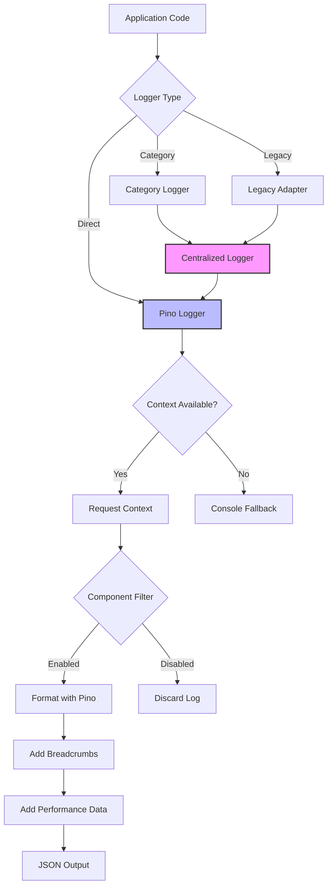

# Logging System

*Last Updated: June 19, 2025*

## Table of Contents

- [Overview](#overview)
- [Logging Architecture](#logging-architecture)
- [Log Levels](#log-levels)
- [Log Formats](#log-formats)
- [Structured Logging](#structured-logging)
- [Component-Based Logging](#component-based-logging)
- [Performance Logging](#performance-logging)
- [Log Sampling](#log-sampling)
- [Configuration Options](#configuration-options)
- [Error Logging](#error-logging)
- [Debug Logging](#debug-logging)
- [Log Breadcrumbs](#log-breadcrumbs)
- [Request Context Tracking](#request-context-tracking)
- [Best Practices](#best-practices)
- [Examples](#examples)

## Overview

The Video Resizer implements a comprehensive logging system that provides structured, configurable logs for monitoring, debugging, and performance analysis. The logging system is built around a centralized logging service with support for different log levels, formats, and component-specific filtering.

The logging system helps developers and operators:
- Monitor system behavior and performance
- Diagnose issues and errors
- Track request processing details
- Analyze performance bottlenecks
- Support debugging efforts

## Logging Architecture

The logging system follows a centralized Pino-based architecture:



### Key Components

1. **Centralized Logger** (`logger.ts`): Main entry point with category-based logging
2. **Pino Logger** (`pinoLogger.ts`): High-performance JSON logger
3. **Legacy Adapter** (`legacyLoggerAdapter.ts`): Backward compatibility layer
4. **Request Context** (`requestContext.ts`): Request-scoped context and breadcrumbs
5. **Configuration** (`LoggingConfigurationManager`): Runtime configuration

## Log Levels

The logging system supports four standard log levels:

| Level | Priority | Function | Description | Log Volume (per 100 requests) |
|-------|----------|----------|-------------|-------------------------------|
| `error` | 4 | `error(context, logger, component, message, error?, data?)` | Error conditions | ~500 lines |
| `warn` | 3 | `warn(context, logger, component, message, data?)` | Warning conditions | ~1,000 lines |
| `info` | 2 | `info(context, logger, component, message, data?)` | General informational messages | ~4,000 lines |
| `debug` | 1 | `debug(context, logger, component, message, data?)` | Detailed debugging information | ~20,000 lines |

The configured log level acts as a threshold—messages with a level below the threshold are not logged. For example, with `level: 'info'`, debug messages are suppressed while info, warn, and error messages are logged.

**Important**: There are TWO log level settings that must match:
1. `logging.level` - The main log level
2. `logging.pino.level` - The Pino logger level (overrides the main level)

Both must be set to the same value for the configuration to work correctly.

## Log Formats

The logging system supports two output formats:

### Text Format

Human-readable format ideal for development and debugging:

```
[2023-09-15T12:34:56.789Z] [INFO] [VideoHandler] Processing video request url=https://example.com/video.mp4 options={"width":720,"height":480}
```

### JSON Format

Machine-parsable format ideal for production and log aggregation:

```json
{
  "timestamp": "2023-09-15T12:34:56.789Z",
  "level": "info",
  "component": "VideoHandler",
  "message": "Processing video request",
  "data": {
    "url": "https://example.com/video.mp4",
    "options": {
      "width": 720,
      "height": 480
    }
  },
  "requestId": "01HBZGRPR1DQVT5ZP13VWXNDPZ"
}
```

## Structured Logging

All logs follow a structured format with consistent fields:

| Field | Description | Example |
|-------|-------------|---------|
| `timestamp` | ISO timestamp of the log event | `2023-09-15T12:34:56.789Z` |
| `level` | Log level | `info` |
| `component` | Source component | `VideoHandler` |
| `message` | Primary log message | `Processing video request` |
| `data` | Additional structured data | `{"url": "https://example.com/video.mp4"}` |
| `requestId` | Unique request identifier | `01HBZGRPR1DQVT5ZP13VWXNDPZ` |
| `error` | Error information (for error logs) | `{"name": "ValidationError", "message": "Invalid width"}` |
| `breadcrumbs` | Previous log events in the request | `[{"component": "PathMatcher", "message": "Matched path pattern"}]` |

This structured approach enables easy filtering, searching, and analysis of logs.

## Component-Based Logging

The logging system uses a component-based approach, where each log is associated with a specific component. This enables filtering and organization of logs by system area:

```typescript
// Import the logging utilities
import { debug, info, warn, error } from './utils/loggerUtils';

// Log with component context
info(context, logger, 'VideoHandler', 'Processing video request', { 
  url: request.url,
  options: transformOptions
});
```

Common components include:
- `VideoHandler`: Main request handling
- `PathMatcher`: URL pattern matching
- `TransformationService`: Video transformation
- `CacheService`: Caching operations
- `ConfigManager`: Configuration management
- `DebugService`: Debugging features

## Performance Logging

The logging system includes special support for performance metrics:

```typescript
// Start performance measurement
const startTime = performance.now();

// Record the start time
debug(context, logger, 'VideoHandler', 'Starting video transformation', {
  startTime,
  options: transformOptions
});

// Perform the operation
const result = await transformVideo(options);

// Calculate and log the duration
const duration = performance.now() - startTime;
info(context, logger, 'VideoHandler', 'Completed video transformation', {
  duration,
  options: transformOptions
});

// Emit a warning if the operation was slow
if (duration > 1000) {
  warn(context, logger, 'Performance', 'Slow video transformation', {
    duration,
    options: transformOptions
  });
}
```

When `includePerformance` is enabled, the system also tracks:
- Detailed timing of key operations
- Method execution time
- Cache lookup performance
- Origin fetch duration
- Processing pipeline stages

## Log Sampling

To reduce log volume in high-traffic environments, the logging system supports sampling:

```typescript
// Configure sampling rate
{
  "logging": {
    "sampleRate": 0.1  // Log ~10% of requests
  }
}
```

The sampling is applied consistently across a request—if a request is selected for logging, all log messages for that request are logged.

This is implemented via a deterministic hashing approach:

```typescript
// Simplified sampling implementation
function shouldSampleLog(requestId: string, sampleRate: number): boolean {
  // Hash the request ID to a value between 0-1
  const hash = hashString(requestId) / Number.MAX_SAFE_INTEGER;
  
  // Sample if hash is below the sample rate
  return hash < sampleRate;
}
```

## Configuration Options

Logging behavior is highly configurable through `config/worker-config.json`:

```json
{
  "logging": {
    "level": "info",
    "format": "json",
    "includeTimestamps": true,
    "includeComponentName": true,
    "colorize": false,
    "enabledComponents": [],
    "disabledComponents": ["PathMatcher"],
    "sampleRate": 1,
    "enablePerformanceLogging": true,
    "performanceThresholdMs": 1000,
    "breadcrumbs": {
      "enabled": true,
      "maxItems": 25,
      "logAdditions": false
    },
    "pino": {
      "level": "info",
      "browser": {
        "asObject": true
      },
      "base": {
        "service": "video-resizer",
        "env": "production"
      }
    }
  }
}
```

| Option | Type | Default | Description |
|--------|------|---------|-------------|
| `level` | string | 'info' | Log level: 'debug', 'info', 'warn', 'error' |
| `format` | string | 'json' | Log format: 'json' or 'text' |
| `includeTimestamps` | boolean | true | Include timestamps in logs |
| `includeComponentName` | boolean | true | Include component names in logs |
| `colorize` | boolean | true | Use colors in console output |
| `enabledComponents` | string[] | [] | Components to enable (empty = all) |
| `disabledComponents` | string[] | [] | Components to disable |
| `sampleRate` | number | 1 | Sampling rate for logs (0-1) |
| `enablePerformanceLogging` | boolean | false | Enable performance metrics |
| `performanceThresholdMs` | number | 1000 | Threshold for performance warnings |
| `breadcrumbs.enabled` | boolean | true | Enable breadcrumb collection |
| `breadcrumbs.maxItems` | number | 25 | Maximum breadcrumbs to track |
| `breadcrumbs.logAdditions` | boolean | false | Log each breadcrumb addition (verbose!) |
| `pino.level` | string | 'info' | Pino logger level (MUST match main level) |
| `pino.browser` | object | {...} | Browser-specific Pino configuration |
| `pino.base` | object | {...} | Base fields for all logs |

## Error Logging

Error logging includes additional context:

```typescript
try {
  // Attempt an operation
  const result = await riskyOperation();
  return result;
} catch (err) {
  // Log the error with context
  error(context, logger, 'VideoHandler', 'Error during video processing', err, {
    url: request.url,
    options: transformOptions
  });
  
  // Return an error response
  return createErrorResponse(err);
}
```

The error logging function extracts error details:
- Error name and message
- Stack trace (when available and enabled)
- Error code and status (for custom errors)
- Additional properties from the error object

## Debug Logging

Debug logs provide detailed information for troubleshooting:

```typescript
// Log detailed debugging information
debug(context, logger, 'PathMatcher', 'Pattern matching details', {
  url: request.url,
  pattern: pathPattern.matcher,
  captures: extractedCaptures,
  matched: isMatched
});
```

Debug logs are only emitted when:
1. The log level is set to 'debug' in the configuration, OR
2. Debug mode is enabled for the request (via debug parameter)

### Runtime Debug Mode

You can enable debug logging for specific requests without changing the global configuration:

1. **URL Parameter**: Add `?debug=true` to any request
   ```
   https://example.com/videos/abc123?width=720&debug=true
   ```

2. **HTTP Header**: Add `X-Debug-Logging: true`
   ```bash
   curl -H "X-Debug-Logging: true" https://example.com/videos/abc123
   ```

3. **Debug View**: Use `?debug=view` for an HTML debug report
   ```
   https://example.com/videos/abc123?width=720&debug=view
   ```

This allows you to get detailed logs for specific requests while keeping production logs minimal.

## Log Breadcrumbs

The logging system maintains a "breadcrumb trail" of previous log events in a request:

```typescript
// Example breadcrumb implementation
interface LogBreadcrumb {
  timestamp: number;
  level: string;
  component: string;
  message: string;
  data?: Record<string, any>;
}

// Add a breadcrumb
function addBreadcrumb(context: RequestContext, breadcrumb: LogBreadcrumb): void {
  if (!context.breadcrumbs) {
    context.breadcrumbs = [];
  }
  
  // Add breadcrumb, respecting maximum count
  context.breadcrumbs.push(breadcrumb);
  if (context.breadcrumbs.length > maxBreadcrumbs) {
    context.breadcrumbs.shift();
  }
}

// Extract breadcrumbs for error logging
function getBreadcrumbs(context: RequestContext): LogBreadcrumb[] {
  return context.breadcrumbs || [];
}
```

Breadcrumbs provide crucial context for error diagnosis, showing the sequence of events leading up to an error.

### Breadcrumb Configuration

The breadcrumb system has been optimized to reduce log volume while maintaining error context:

```json
{
  "breadcrumbs": {
    "enabled": true,      // Always collect breadcrumbs
    "maxItems": 25,       // Max breadcrumbs per request
    "logAdditions": false // Don't log each addition (saves ~37% log volume)
  }
}
```

- **enabled**: Should always be `true` to collect breadcrumbs for error context
- **maxItems**: Limits memory usage and log size (25-100 typical)
- **logAdditions**: When `false`, breadcrumbs are collected silently without logging each addition

## Request Context Tracking

The logging system leverages a request context object to track information across a request:

```typescript
interface RequestContext {
  url: string;
  method: string;
  id: string;
  startTime: number;
  breadcrumbs?: LogBreadcrumb[];
  timers?: Record<string, { start: number; end?: number }>;
  clientInfo?: {
    ip: string;
    userAgent: string;
    device?: string;
    browser?: string;
  };
  // Additional context properties
}
```

This context is passed to all logging functions:

```typescript
// Create request context
const context: RequestContext = {
  url: request.url,
  method: request.method,
  id: generateRequestId(),
  startTime: performance.now()
};

// Log with context
info(context, logger, 'VideoHandler', 'Processing request', {
  url: context.url
});
```

## Common Configurations

### Production (Minimal Logging)
```json
{
  "logging": {
    "level": "info",
    "breadcrumbs": {
      "enabled": true,
      "maxItems": 25,
      "logAdditions": false
    },
    "pino": {
      "level": "info"
    }
  }
}
```
Expected: ~4,000 lines per 100 requests

### Development (Full Visibility)
```json
{
  "logging": {
    "level": "debug",
    "breadcrumbs": {
      "enabled": true,
      "maxItems": 100,
      "logAdditions": true
    },
    "pino": {
      "level": "debug"
    }
  }
}
```
Expected: ~20,000 lines per 100 requests

### Performance Monitoring
```json
{
  "logging": {
    "level": "info",
    "enablePerformanceLogging": true,
    "performanceThresholdMs": 500,
    "sampleRate": 0.1,
    "pino": {
      "level": "info"
    }
  }
}
```

## Quick Commands

### Enable Debug Logging
```bash
# Update both log levels and enable breadcrumb logging
sed -i 's/"level": "info"/"level": "debug"/g' config/worker-config.json
sed -i 's/"logAdditions": false/"logAdditions": true/g' config/worker-config.json
```

### Disable Debug Logging
```bash
# Revert to info level and disable breadcrumb logging
sed -i 's/"level": "debug"/"level": "info"/g' config/worker-config.json
sed -i 's/"logAdditions": true/"logAdditions": false/g' config/worker-config.json
```

### Check Current Log Level
```bash
grep -E '"level":|"pino":' config/worker-config.json
```

### Deploy Configuration
```bash
npm run deploy:config
```

## Best Practices

1. **Use Appropriate Log Levels**:
   - `debug`: Detailed information for developers
   - `info`: General operational information
   - `warn`: Warning conditions that don't cause errors
   - `error`: Error conditions that affect functionality

2. **Structure Data Appropriately**:
   - Use the message for concise, human-readable information
   - Put details in the data object for machine parsing
   - Group related data together in nested objects

3. **Include Relevant Context**:
   - URL and method for request-related logs
   - Input parameters for operations
   - Result summaries for completed operations
   - Timing information for performance-sensitive operations

4. **Component Organization**:
   - Use consistent component naming
   - Keep component names concise but descriptive
   - Use hierarchical naming for related components

5. **Performance Considerations**:
   - Avoid excessive logging in hot paths
   - Use debug level for high-volume diagnostics
   - Consider sampling for high-traffic production environments
   - Avoid logging large objects or binary data

## Examples

### Basic Information Logging

```typescript
// Log basic information
info(context, logger, 'VideoHandler', 'Processing video request', {
  url: request.url,
  width: options.width,
  height: options.height,
  mode: options.mode
});
```

### Debug Logging with Detail

```typescript
// Log detailed debug information
debug(context, logger, 'CacheService', 'Cache key generation details', {
  url: request.url,
  options: transformOptions,
  generatedKey: cacheKey,
  strategy: 'derivative-based'
});
```

### Warning Logging

```typescript
// Log a warning condition
warn(context, logger, 'TransformationService', 'Using fallback transformation', {
  reason: 'Unsupported format',
  requestedFormat: options.format,
  fallingBackTo: 'mp4',
  url: request.url
});
```

### Error Logging with Context

```typescript
try {
  await transformVideo(options);
} catch (err) {
  // Log error with rich context
  error(context, logger, 'TransformationService', 'Video transformation failed', err, {
    url: request.url,
    options: transformOptions,
    originUrl: pathPattern.originUrl,
    duration: performance.now() - startTime
  });
}
```

### Performance Logging

```typescript
// Start performance measurement
const startTransform = performance.now();

// Perform operation
const result = await transformVideo(options);

// Calculate and log duration
const transformDuration = performance.now() - startTransform;
info(context, logger, 'Performance', 'Video transformation completed', {
  duration: transformDuration,
  url: request.url,
  options: {
    width: options.width,
    height: options.height,
    mode: options.mode
  }
});

// Log warning if slow
if (transformDuration > 1000) {
  warn(context, logger, 'Performance', 'Slow video transformation', {
    duration: transformDuration,
    threshold: 1000,
    url: request.url
  });
}
```