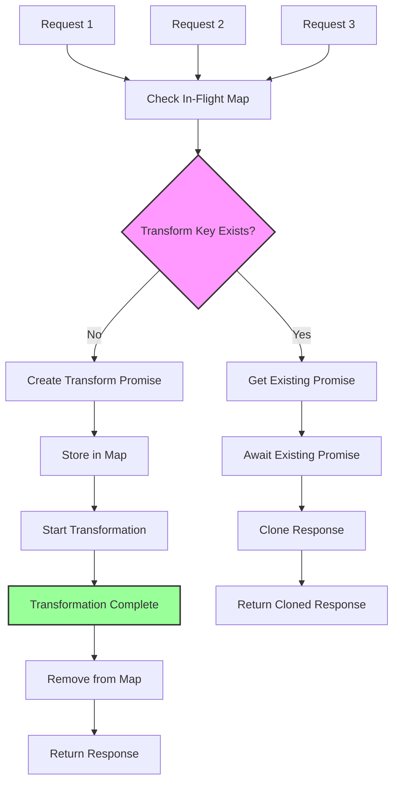

# Request Coalescing

## Overview

Request coalescing prevents duplicate origin fetches when multiple concurrent requests arrive for the same video transformation. Instead of making multiple identical requests to the origin, subsequent requests wait for and share the response from the first request.

## How It Works

### Visual Flow



### In-Flight Tracking

The system maintains a map of ongoing transformations:
```typescript
const inFlightTransformations = new Map<string, Promise<Response>>();
```

### Transform Key Generation

Each unique transformation is identified by a key containing:
- Origin name
- Source path
- Transformation parameters (width, height, quality, format, etc.)

```typescript
const transformKey = `${origin}:${path}:${JSON.stringify(transformParams)}`;
```

### Request Flow

1. **First Request**: Creates a new transformation promise and stores it in the map
2. **Concurrent Requests**: Check for existing transformation and await the same promise
3. **Completion**: The transformation is removed from the map when complete
4. **Response Sharing**: All waiting requests receive cloned responses

## Implementation

### Detection and Joining
```typescript
const existingTransform = inFlightTransformations.get(transformKey);

if (existingTransform) {
  // Join existing transformation
  response = await existingTransform;
} else {
  // Create new transformation
  const transformPromise = transformVideo(...);
  inFlightTransformations.set(transformKey, transformPromise);
  
  try {
    response = await transformPromise;
  } finally {
    inFlightTransformations.delete(transformKey);
  }
}
```

### Response Cloning

To prevent stream lock errors, coalesced requests receive cloned responses:
```typescript
if (existingTransform) {
  finalResponse = response.clone();
}
```

## Benefits

1. **Reduced Origin Load**: Prevents duplicate requests to origin servers
2. **Improved Performance**: Subsequent requests complete faster
3. **Resource Efficiency**: Saves bandwidth and processing power
4. **Automatic Deduplication**: No configuration required

## Monitoring

The system logs coalescing activity:
- When requests join existing transformations
- The number of in-flight transformations
- When transformations complete and are cleaned up

## Edge Cases

### Request Cancellation
If the first request is cancelled, waiting requests will receive an error. The system handles this gracefully without affecting other transformations.

### Memory Management
The in-flight map automatically cleans up completed transformations to prevent memory leaks.

### Error Propagation
If the original transformation fails, all waiting requests receive the same error response.

## Performance Considerations

- **Memory Usage**: Each in-flight transformation holds a promise, not the full response
- **Scalability**: The map size is limited by the number of unique concurrent transformations
- **Timeout Handling**: Transformations that exceed timeouts are automatically cleaned up