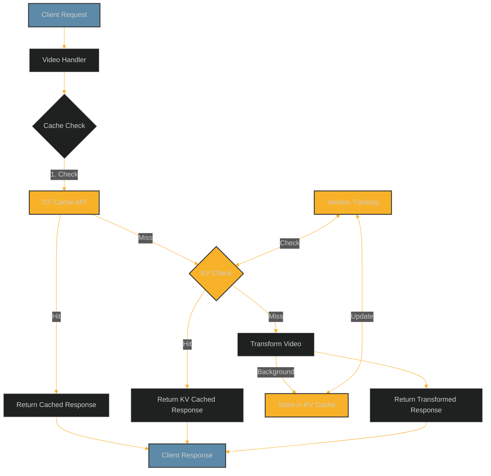

# KV Cache System Guide

## Introduction

This guide provides a comprehensive overview of the KV caching system in the video-resizer project, including its architecture, implementation details, configuration options, and best practices.

## Table of Contents

- [Overview](#overview)
- [How It Works](#how-it-works)
- [Architecture](#architecture)
- [Configuration](#configuration)
- [Key Components](#key-components)
- [Cache Keys and Metadata](#cache-keys-and-metadata)
- [Cache Versioning](#cache-versioning)
- [Performance Considerations](#performance-considerations)
- [Troubleshooting](#troubleshooting)
- [Best Practices](#best-practices)
- [Implementation Examples](#implementation-examples)

## Overview

The KV cache system is a multi-layered caching solution that stores transformed video variants in Cloudflare's KV storage, providing faster delivery and reduced computational costs by avoiding repeated video transformations.

### Key Benefits

- **Faster response times**: Pre-transformed videos delivered directly from KV
- **Reduced compute costs**: Avoid repeated transformation operations
- **Origin traffic reduction**: Minimize requests to origin storage
- **Granular cache control**: Specific TTLs for different response types
- **Cache versioning**: Automatic cache busting when content changes
- **Metadata support**: Store transformation details with content

## How It Works

The KV cache system operates in a multi-layered approach:

1. **Request Processing**:
   - Parse video URL and extract transformation parameters
   - Generate a cache key based on the source path and transformation options
   - Normalize URL to strip version parameters for consistent caching

2. **Cache Lookup**:
   - Check for a cached response in Cloudflare's Cache API
   - If not found, check KV storage for a cached variant
   - If still not found, proceed with video transformation

3. **Response Processing**:
   - If cache hit, return the cached response
   - If cache miss, transform the video and store in KV in the background
   - Return the response to the client immediately while caching happens asynchronously

4. **Cache Management**:
   - Store metadata alongside the video content
   - Apply appropriate TTL based on response status
   - Add cache tags for coordinated purging
   - Update version information for cache busting

## Architecture

The KV cache system follows a layered architecture:



### Multi-Layer Approach

The system uses two complementary cache layers:

1. **Cloudflare Cache API** (First Layer)
   - HTTP-based cache controlled via cache headers
   - Automatically distributed across Cloudflare's edge network
   - Great for frequently accessed content
   - Limited control over storage and metadata

2. **Cloudflare KV** (Second Layer)
   - Key-value storage with metadata support
   - Explicit control over cache operations
   - Support for background operations via `waitUntil()`
   - Enables variant-specific caching with rich metadata

This dual-layer approach combines the performance of edge caching with the control and flexibility of KV storage.

## Configuration

The KV cache system is highly configurable through environment variables and the worker configuration.

### Basic Configuration

```json
{
  "cache": {
    "enableKVCache": true,
    "method": "cf",
    "enableCacheTags": true,
    "ttl": {
      "ok": 86400,
      "redirects": 3600,
      "clientError": 60,
      "serverError": 10
    }
  }
}
```

### Required KV Namespaces

The system requires these KV namespace bindings:

```json
"kv_namespaces": [
  {
    "binding": "VIDEO_TRANSFORMATIONS_CACHE",
    "id": "your-kv-namespace-id-here"
  },
  {
    "binding": "VIDEO_CACHE_KEY_VERSIONS",
    "id": "your-version-namespace-id-here"
  }
]
```

### Environment Variables

```
CACHE_ENABLE_KV=true
CACHE_METHOD=cf
CACHE_KV_TTL_OK=86400
CACHE_KV_TTL_REDIRECTS=3600
CACHE_KV_TTL_CLIENT_ERROR=60
CACHE_KV_TTL_SERVER_ERROR=10
```

### Configuration Parameters

| Parameter | Type | Default | Description |
|-----------|------|---------|-------------|
| `enableKVCache` | boolean | `true` | Master switch for KV caching |
| `method` | string | `"cf"` | Cache method: `"cf"` or `"cacheApi"` |
| `enableCacheTags` | boolean | `true` | Enable cache tag support |
| `ttl.ok` | number | `86400` | TTL for 2xx responses (seconds) |
| `ttl.redirects` | number | `3600` | TTL for 3xx responses (seconds) |
| `ttl.clientError` | number | `60` | TTL for 4xx responses (seconds) |
| `ttl.serverError` | number | `10` | TTL for 5xx responses (seconds) |

## Key Components

The KV cache system consists of several key components:

### 1. `kvStorageService.ts`

The core service responsible for KV operations:

```typescript
export class KVStorageService {
  constructor(private readonly env: Env) {}

  // Store transformed video in KV
  async storeTransformedVideo(
    sourcePath: string,
    options: VideoTransformOptions,
    response: Response
  ): Promise<Response> {
    // Implementation details
  }

  // Retrieve transformed video from KV
  async getTransformedVideo(
    sourcePath: string,
    options: VideoTransformOptions,
    request: Request
  ): Promise<Response | null> {
    // Implementation details
  }

  // Generate a cache key for video variants
  generateCacheKey(
    sourcePath: string,
    options: VideoTransformOptions
  ): string {
    // Implementation details
  }
}
```

### 2. `cacheVersionService.ts`

Manages version tracking for cache keys:

```typescript
export class CacheVersionService {
  constructor(private readonly env: Env) {}

  // Get the current version of a cache key
  async getCacheKeyVersion(cacheKey: string): Promise<number> {
    // Implementation details
  }

  // Increment and get the next version
  async getNextCacheKeyVersion(
    cacheKey: string,
    forceIncrement: boolean = false
  ): Promise<number> {
    // Implementation details
  }

  // Store a version for a cache key
  async storeCacheKeyVersion(
    cacheKey: string,
    version: number,
    ttl?: number
  ): Promise<void> {
    // Implementation details
  }
}
```

### 3. `cacheOrchestrator.ts`

Coordinates the caching workflow:

```typescript
export async function handleRequestWithCaching(
  request: Request,
  env: Env,
  ctx: ExecutionContext
): Promise<Response> {
  // Create cache orchestrator
  const orchestrator = new CacheOrchestrator(env, ctx);

  // Try to get from cache
  const cachedResponse = await orchestrator.getCachedResponse(request);
  if (cachedResponse) {
    return cachedResponse;
  }

  // Transform video
  const response = await transformVideo(request, env, ctx);

  // Store in cache (in background)
  return orchestrator.cacheResponse(request, response);
}
```

### 4. `urlVersionUtils.ts`

Utilities for URL version manipulation:

```typescript
// Strip version parameter for consistent caching
export function normalizeUrlForCaching(url: string): string {
  try {
    const parsedUrl = new URL(url);
    parsedUrl.searchParams.delete('v');
    return parsedUrl.toString();
  } catch (err) {
    // Handle invalid URLs
    return url;
  }
}

// Add version parameter for cache busting
export function addVersionToUrl(url: string, version: number): string {
  try {
    const parsedUrl = new URL(url);
    parsedUrl.searchParams.set('v', version.toString());
    return parsedUrl.toString();
  } catch (err) {
    // Handle invalid URLs
    const separator = url.includes('?') ? '&' : '?';
    return `${url}${separator}v=${version}`;
  }
}
```

## Cache Keys and Metadata

### Key Generation

Cache keys are structured to enable efficient variant retrieval:

```
video:<source_path>[:option=value][:option=value]...
```

For example:
- `video:videos/sample.mp4` (original video)
- `video:videos/sample.mp4:w=640:h=360:q=high:f=mp4` (specific transformation)
- `video:videos/sample.mp4:derivative=mobile` (mobile derivative)

### Metadata Structure

Each cached video includes detailed metadata:

```typescript
interface TransformationMetadata {
  // Source information
  sourcePath: string;
  
  // Transformation parameters
  width?: number | null;
  height?: number | null;
  format?: string | null;
  quality?: string | null;
  compression?: string | null;
  derivative?: string | null;
  
  // Cache information
  cacheTags: string[];
  cacheVersion?: number;
  
  // Content information
  contentType: string;
  contentLength: number;
  
  // Timestamps
  createdAt: number;
  expiresAt?: number;
  
  // Additional metadata
  duration?: number | null;
  fps?: number | null;
  customData?: Record<string, unknown>;
}
```

This metadata is used for:
- Setting correct response headers
- Managing cache lifecycle
- Supporting cache tags
- Integrating with cache versioning
- Debugging and diagnostics

## Cache Versioning

The cache versioning system ensures clients receive fresh content after updates by tracking version numbers and adding version parameters to URLs.

### Version Tracking

Versions are stored in a dedicated KV namespace:

```
version-<cache_key>
```

Only metadata is stored, no actual values:

```typescript
interface VersionMetadata {
  version: number;
  createdAt?: number;
  updatedAt?: number;
}
```

### Version Incrementation

Versions are automatically incremented in specific scenarios:

1. **Cache Misses**: When content isn't found in KV
   ```typescript
   if (!cachedResponse) {
     // Increment version on cache miss
     await cacheVersionService.getNextCacheKeyVersion(cacheKey, true);
   }
   ```

2. **Errors**: When storage operations fail
   ```typescript
   try {
     // Attempt storage operation
   } catch (err) {
     // Increment version on error
     await cacheVersionService.getNextCacheKeyVersion(cacheKey, true);
   }
   ```

3. **Forced Updates**: When explicitly requested
   ```typescript
   // Force increment the version
   const nextVersion = await cacheVersionService.getNextCacheKeyVersion(
     cacheKey, 
     true
   );
   ```

### URL Versioning

Version parameters are added to URLs for automatic cache busting:

```typescript
// Only add version if > 1 to avoid unnecessary parameters
if (version > 1) {
  const versionedUrl = addVersionToUrl(url, version);
  return versionedUrl;
} else {
  return url;
}
```

### Diagnostics

Version information is available in response headers and the debug UI:

```
X-Cache-Version: 3
```

## Performance Considerations

The KV cache system is designed with performance in mind:

### 1. Background Storage

Cache storage operations happen in the background using `waitUntil()`:

```typescript
// Return response immediately while storing in cache
if (ctx && ctx.waitUntil) {
  ctx.waitUntil(
    storeInKvCache(cacheKey, response.clone(), metadata, env)
  );
}
return response;
```

This ensures responses are returned to clients immediately without waiting for cache operations to complete.

### 2. Cache Bypass Rules

Several conditions trigger cache bypass:

- **Debug Mode**: Requests with `?debug=true` skip KV cache
- **Error Responses**: 4xx and 5xx responses are not cached
- **Non-Video Content**: Only video MIME types are cached
- **Large Content**: Content exceeding size limits is not cached

### 3. TTL Optimization

TTLs are optimized based on response type:

- **Success (2xx)**: Longer TTL (24h default)
- **Redirects (3xx)**: Medium TTL (1h default)
- **Client Errors (4xx)**: Short TTL (1m default)
- **Server Errors (5xx)**: Very short TTL (10s default)

### 4. Performance Metrics

The system tracks key performance metrics:

- Cache hit/miss ratio
- Storage operation timing
- Error rates
- Version incrementation frequency

## Troubleshooting

### Common Issues and Solutions

#### 1. Missing KV Namespaces

**Symptoms**: KV cache operations fail with errors about missing KV namespace

**Solution**: Ensure the required KV namespaces are bound in wrangler.jsonc:

```json
"kv_namespaces": [
  {
    "binding": "VIDEO_TRANSFORMATIONS_CACHE",
    "id": "your-kv-namespace-id"
  },
  {
    "binding": "VIDEO_CACHE_KEY_VERSIONS",
    "id": "your-version-namespace-id"
  }
]
```

#### 2. Unexpected Cache Misses

**Symptoms**: Content is repeatedly transformed instead of being served from cache

**Possible Causes**:
- `enableKVCache` is set to `false`
- Debug mode is enabled (`?debug=true`)
- Content is larger than the KV size limits
- Content is not a supported video type

**Solution**: Check the debug headers or debug UI for caching information:

```
X-Cache-Status: miss (reason: debug_mode)
```

#### 3. Stale Content Issues

**Symptoms**: Clients continue to receive old content after updates

**Solution**: The cache versioning system should handle this automatically, but you can:

1. Force a version increment:
   ```typescript
   await cacheVersionService.getNextCacheKeyVersion(cacheKey, true);
   ```

2. Check if the versioning system is enabled:
   ```typescript
   const isVersioningEnabled = !!env.VIDEO_CACHE_KEY_VERSIONS;
   ```

3. Add a unique query parameter to bypass cache entirely:
   ```
   https://example.com/video.mp4?_bypass=12345
   ```

#### 4. High Storage Usage

**Symptoms**: Increased KV storage usage and costs

**Solution**:
- Review and optimize TTL settings
- Consider implementing a cleanup strategy for old variants
- Use cache tags to purge unnecessary variants

### Debugging Tools

#### 1. Debug Headers

Enable debug headers to see cache information:

```
X-Cache-Status: hit
X-Cache-Key: video:videos/sample.mp4:w=640:h=360
X-Cache-Version: 2
X-Cache-TTL: 86400
```

#### 2. Debug UI

Enable the debug UI with `?debug=true&view=true` to see detailed caching information:

```json
{
  "cache": {
    "status": "hit",
    "key": "video:videos/sample.mp4:w=640:h=360",
    "version": 2,
    "ttl": 86400,
    "storage": "kv",
    "metadata": {
      // Detailed metadata
    }
  }
}
```

#### 3. Logging

Enable debug logging to see detailed cache operations:

```
CACHE_DEBUG=true
```

## Best Practices

### 1. Cache Configuration

- **Use appropriate TTLs** based on content update frequency
- **Enable cache tags** for coordinated purging
- **Configure version tracking** for automatic cache busting

### 2. Cache Key Design

- **Keep cache keys consistent** across deployments
- **Include all relevant parameters** that affect output
- **Use descriptive key formats** for easier debugging

### 3. Storage Optimization

- **Use background storage** with waitUntil()
- **Set appropriate TTLs** to balance storage costs
- **Implement cleanup strategies** for old content

### 4. Error Handling

- **Fail gracefully** when KV operations fail
- **Apply short TTLs** for error responses
- **Increment versions** on persistent errors

## Implementation Examples

### Basic Implementation

```typescript
// In your route handler
export async function handleVideoRequest(
  request: Request,
  env: Env,
  ctx: ExecutionContext
): Promise<Response> {
  // Create KV storage service
  const kvStorage = new KVStorageService(env);
  
  // Try to get from cache
  const url = new URL(request.url);
  const sourcePath = url.pathname;
  const options = parseOptions(url.searchParams);
  
  const cachedResponse = await kvStorage.getTransformedVideo(
    sourcePath,
    options,
    request
  );
  
  if (cachedResponse) {
    return cachedResponse;
  }
  
  // Not in cache, transform video
  const transformedResponse = await transformVideo(
    sourcePath,
    options,
    request,
    env
  );
  
  // Store in cache (background)
  if (ctx.waitUntil) {
    ctx.waitUntil(
      kvStorage.storeTransformedVideo(
        sourcePath,
        options,
        transformedResponse.clone()
      )
    );
  }
  
  return transformedResponse;
}
```

### Version-Aware Implementation

```typescript
// In your route handler
export async function handleVideoRequestWithVersioning(
  request: Request,
  env: Env,
  ctx: ExecutionContext
): Promise<Response> {
  // Create services
  const kvStorage = new KVStorageService(env);
  const versionService = new CacheVersionService(env);
  
  // Parse request
  const url = new URL(request.url);
  const sourcePath = url.pathname;
  const options = parseOptions(url.searchParams);
  
  // Generate cache key
  const cacheKey = kvStorage.generateCacheKey(sourcePath, options);
  
  // Get current version
  const version = await versionService.getCacheKeyVersion(cacheKey);
  
  // Try to get from cache
  const cachedResponse = await kvStorage.getTransformedVideo(
    sourcePath,
    options,
    request
  );
  
  if (cachedResponse) {
    // Add version header
    return new Response(cachedResponse.body, {
      status: cachedResponse.status,
      headers: addVersionHeader(cachedResponse.headers, version)
    });
  }
  
  // Cache miss - increment version
  const nextVersion = await versionService.getNextCacheKeyVersion(
    cacheKey,
    true
  );
  
  // Transform video
  const transformedResponse = await transformVideo(
    sourcePath,
    options,
    request,
    env
  );
  
  // Add version header
  const finalResponse = new Response(transformedResponse.body, {
    status: transformedResponse.status,
    headers: addVersionHeader(transformedResponse.headers, nextVersion)
  });
  
  // Store in cache (background)
  if (ctx.waitUntil) {
    ctx.waitUntil(
      kvStorage.storeTransformedVideo(
        sourcePath,
        options,
        transformedResponse.clone()
      )
    );
  }
  
  return finalResponse;
}

// Helper for adding version header
function addVersionHeader(headers: Headers, version: number): Headers {
  const newHeaders = new Headers(headers);
  newHeaders.set('X-Cache-Version', version.toString());
  return newHeaders;
}
```

## Conclusion

The KV cache system provides a robust and efficient way to cache transformed video variants, significantly improving performance and reducing costs. By combining Cloudflare's Cache API with KV storage, the system offers both high performance and fine-grained control over caching behavior.

For additional details, see the related documentation:
- [KV Caching Strategy](./strategy.md)
- [Cache Versioning System](./cache-versioning.md)
- [Implementation Details](./implementation.md)
- [Configuration Guide](./configuration.md)
- [Performance Considerations](./performance.md)
- [Testing Guide](./testing.md)