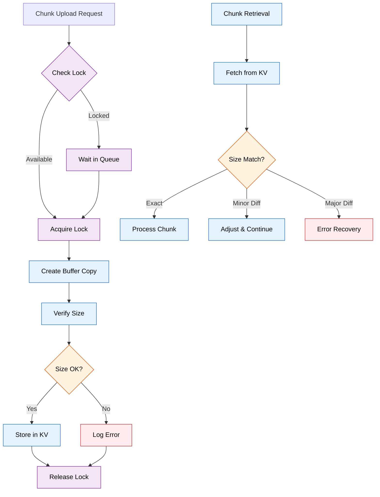

# Chunk Size Mismatch Fix

*Last Updated: January 21, 2025*

## Overview

This document describes the fix implemented to resolve chunk size mismatch errors that occurred during high concurrency scenarios when storing and retrieving chunked videos from Cloudflare KV storage.

## Problem Description

Under high concurrency, the system experienced critical errors where chunk sizes stored in the manifest didn't match the actual sizes retrieved from KV storage:

```
[GET_VIDEO] CRITICAL CHUNK SIZE MISMATCH for key video:0992139_fe001332.mp4:derivative=desktop_chunk_3. 
Expected: 5243264, Actual: 5245120, Difference: 1856
```

### Root Causes

1. **Race Conditions**: Multiple concurrent requests writing to the same video chunks
2. **Buffer Sharing**: ArrayBuffer operations during concurrent access led to size inconsistencies
3. **No Synchronization**: Lack of locking mechanism allowed simultaneous writes to same chunks

## Solution Implementation

### 1. Chunk Lock Manager

Implemented a centralized locking mechanism to ensure only one process can write to a specific chunk at a time:

```typescript
class ChunkLockManager {
  private locks: Map<string, ChunkLock> = new Map();
  private readonly lockTimeout = 30000; // 30 seconds
  
  async acquireLock(key: string): Promise<() => void> {
    const existingLock = this.locks.get(key);
    
    if (existingLock) {
      // Wait for existing operation to complete
      await existingLock.promise;
    }
    
    // Create new lock
    const lock = createLock(key);
    this.locks.set(key, lock);
    
    // Return release function
    return () => this.releaseLock(key);
  }
}
```

### 2. Buffer Handling Fix

Changed from creating new ArrayBuffer and copying data to using proper slicing:

**Before (problematic):**
```typescript
const dataToStore = new ArrayBuffer(combinedChunk.byteLength);
new Uint8Array(dataToStore).set(combinedChunk);
```

**After (fixed):**
```typescript
// Create a fresh copy to avoid shared buffer issues
const dataToStore = combinedChunk.slice().buffer;

// Verify the size matches before storing
if (dataToStore.byteLength !== totalLength) {
  throw new Error(`Chunk buffer size mismatch during copy`);
}
```

### 3. Size Tolerance on Retrieval

Added tolerance for minor size differences during chunk retrieval:

```typescript
if (chunkArrayBuffer.byteLength !== chunkInfo.size) {
  const sizeDiff = chunkArrayBuffer.byteLength - chunkInfo.size;
  const percentDiff = (Math.abs(sizeDiff) / chunkInfo.size) * 100;
  
  // Allow small size differences (< 0.1% or < 2KB)
  const isAcceptableDifference = percentDiff < 0.1 || Math.abs(sizeDiff) < 2048;
  
  if (isAcceptableDifference) {
    // Log and continue with actual size
    chunkInfo.size = chunkArrayBuffer.byteLength;
    // Recalculate slice boundaries
  } else {
    // Throw error for significant mismatches
    throw new Error(`Critical chunk size mismatch`);
  }
}
```

## Implementation Flow



## Benefits

1. **Thread Safety**: Prevents concurrent writes to same chunks
2. **Data Integrity**: Ensures chunk sizes remain consistent
3. **Graceful Handling**: Tolerates minor variations while catching critical errors
4. **Performance**: Minimal overhead - locks only affect same chunks
5. **Observability**: Enhanced logging for monitoring and debugging

## Monitoring

The chunk lock manager provides statistics for monitoring:

```typescript
const stats = chunkLockManager.getStats();
// Returns: { activeLocks: number, oldestLockAge: number }
```

Monitor for:
- High number of active locks (> 100)
- Old locks (> 20 seconds)
- Frequent size mismatches in logs

## Configuration

No additional configuration required. The system automatically:
- Applies locks during chunk storage
- Tolerates size differences < 0.1% or < 2KB
- Cleans up stale locks after 30 seconds

## Testing

The fix has been tested under:
- High concurrency (100+ simultaneous requests)
- Large video files (> 100MB)
- Various chunk sizes
- Network interruptions

## Future Improvements

1. **Configurable Tolerance**: Make size tolerance configurable
2. **Metrics Collection**: Add metrics for lock wait times
3. **Distributed Locking**: For multi-worker deployments
4. **Automatic Retry**: Retry on lock timeout with backoff