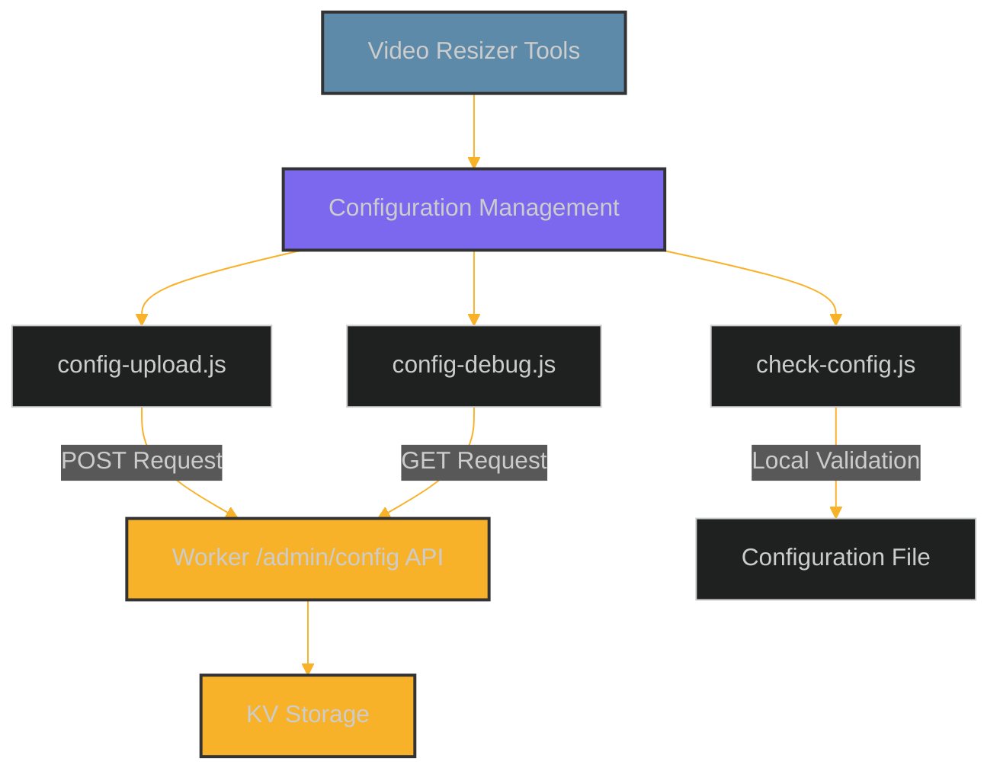

# Video Resizer Tools Guide

This comprehensive guide documents all the utility tools available for the video-resizer project, including their usage, options, and integration with the main workflows.

## Table of Contents

- [Overview](#overview)
- [Configuration Upload Tool](#configuration-upload-tool)
- [Configuration Debug Tool](#configuration-debug-tool)
- [Configuration Check Tool](#configuration-check-tool)
- [Authentication Setup](#authentication-setup)
- [Integration with Workflows](#integration-with-workflows)
- [Best Practices](#best-practices)
- [Troubleshooting](#troubleshooting)

## Overview

The video-resizer project includes several command-line tools to help manage and maintain the system without requiring code changes or redeployment. These tools are located in the `/tools` directory and focus primarily on configuration management tasks.



### Common Features

- Node.js based command-line tools
- Token-based authentication with Cloudflare Worker secrets
- Environment-specific configuration support
- Validation of configuration before deployment

## Configuration Upload Tool

The `config-upload.js` tool is the primary utility for updating worker configuration without requiring redeployment.

### Prerequisites

Before using this tool, ensure you have:

1. Node.js 18+ installed
2. Required dependencies installed: `node-fetch` and `commander`
3. Authentication tokens set up (see [Authentication Setup](#authentication-setup))

```bash
# Install dependencies
npm install node-fetch commander
```

### Basic Usage

```bash
node tools/config-upload.js [options]
```

### Options

| Option | Description | Default |
|--------|-------------|---------|
| `-u, --url <url>` | Worker URL | Environment-specific URL |
| `-c, --config <path>` | Path to configuration file | `./config/worker-config.json` |
| `-t, --token <token>` | Authentication token | (Required) |
| `-e, --env <environment>` | Environment to target | (Required if URL not specified) |
| `--dry-run` | Validate without uploading | `false` |
| `-v, --verbose` | Show verbose output | `false` |
| `-h, --help` | Display help information | - |

### Environment URLs

The tool includes preconfigured URLs for standard environments:

- `development`: https://video-resizer-development.anugrah.workers.dev
- `staging`: https://staging-video-resizer.workers.dev
- `production`: https://cdn.erfi.dev

### Examples

#### Upload to Development Environment

```bash
node tools/config-upload.js --env development --token YOUR_DEV_TOKEN
```

#### Use Custom Configuration File

```bash
node tools/config-upload.js --env staging --token YOUR_STAGING_TOKEN --config ./path/to/custom-config.json
```

#### Validate Configuration Without Uploading

```bash
node tools/config-upload.js --env development --token YOUR_DEV_TOKEN --dry-run
```

#### Production Deployment with Confirmation

```bash
node tools/config-upload.js --env production --token YOUR_PROD_TOKEN
```

The tool requires explicit confirmation before uploading to production environments.

### Production Safety

When targeting production environments, the tool includes additional safety measures:

1. Requires explicit user confirmation before proceeding
2. Supports dry-run validation before applying changes
3. Automatically updates the `lastUpdated` timestamp

## Configuration Debug Tool

The `config-debug.js` tool helps troubleshoot authentication and API connectivity issues.

### Basic Usage

```bash
node tools/config-debug.js [options]
```

### Options

| Option | Description | Default |
|--------|-------------|---------|
| `-u, --url <url>` | Worker URL | Environment-specific URL |
| `-t, --token <token>` | Authentication token | (Required) |
| `-e, --env <environment>` | Environment to target | (Required if URL not specified) |
| `-h, --help` | Display help information | - |

### Examples

#### Test Development Environment Authentication

```bash
node tools/config-debug.js --env development --token YOUR_DEV_TOKEN
```

#### Test Production Environment Authentication

```bash
node tools/config-debug.js --env production --token YOUR_PROD_TOKEN
```

#### Test Custom URL

```bash
node tools/config-debug.js --url https://your-worker-url.workers.dev --token YOUR_TOKEN
```

### Output

The tool will display:

1. Response status code (200 indicates success)
2. Response body (truncated if too large)
3. Error messages if authentication fails or there are other issues

## Configuration Check Tool

The `check-config.js` tool performs offline validation of configuration files without attempting to upload them.

### Basic Usage

```bash
node tools/check-config.js [options]
```

### Options

| Option | Description | Default |
|--------|-------------|---------|
| `-c, --config <path>` | Path to configuration file | `./config/worker-config.json` |
| `-h, --help` | Display help information | - |

### Examples

#### Check Default Configuration

```bash
node tools/check-config.js
```

#### Check Custom Configuration File

```bash
node tools/check-config.js --config ./path/to/custom-config.json
```

### Validation Checks

The tool performs the following validations:

1. Verifies the file exists and is readable
2. Validates JSON syntax
3. Checks for required top-level sections:
   - `version` and `lastUpdated`
   - `video` configuration
   - `cache` configuration
   - `debug` configuration
   - `logging` configuration
   - `storage` configuration
4. Examines key sub-components:
   - Video derivatives
   - Path patterns
   - Passthrough settings
   - Cache method and enablement

## Authentication Setup

The tools use a token-based authentication system which requires setup before use.

### Creating Authentication Tokens

1. Generate a secure random token for each environment:

```bash
# Generate a secure random token
TOKEN=$(openssl rand -hex 32)
echo $TOKEN  # Copy this value for use in the next step
```

2. Set up Wrangler secrets for each environment:

```bash
# Development environment
wrangler secret put CONFIG_API_TOKEN --env development
# When prompted, paste the token

# Staging environment
wrangler secret put CONFIG_API_TOKEN --env staging
# When prompted, paste a different token

# Production environment
wrangler secret put CONFIG_API_TOKEN --env production
# When prompted, paste a different token
```

3. Verify the secrets are set:

```bash
wrangler secret list --env development
wrangler secret list --env staging
wrangler secret list --env production
```

### Using Authentication Tokens

When using the tools, provide the appropriate token for the target environment:

```bash
node tools/config-upload.js --env development --token YOUR_DEV_TOKEN
```

For security, never:
- Store tokens in version control
- Reuse tokens across environments
- Share tokens unnecessarily
- Embed tokens directly in scripts or automation

## Integration with Workflows

### Deployment Workflow

The tools integrate with the deployment workflow as follows:

1. **Initial Deployment**:
   - Deploy the worker with `wrangler deploy --env <environment>`
   - Set up authentication using `wrangler secret put CONFIG_API_TOKEN --env <environment>`
   - Upload initial configuration using `config-upload.js`

2. **Configuration Updates**:
   - Modify configuration in `worker-config.json` or create a custom config file
   - Validate changes with `check-config.js`
   - Test in development with `config-upload.js --env development`
   - Promote to staging with `config-upload.js --env staging`
   - Deploy to production with `config-upload.js --env production` after confirmation

3. **Troubleshooting**:
   - Verify authentication with `config-debug.js`
   - Check configuration validity with `check-config.js`
   - Examine worker logs for error messages

### Continuous Integration

For CI/CD pipelines, consider the following integration pattern:

1. Create a CI-specific token for each environment
2. Store tokens as CI environment secrets
3. For automated deployments, use:
   ```bash
   # Non-interactive mode for CI
   node tools/config-upload.js --env $CI_ENVIRONMENT --token $CI_TOKEN --config ./path/to/config.json
   ```

## Best Practices

### Configuration Management

1. **Version Control**:
   - Store configuration files in version control
   - Add comments for significant changes
   - Use specific commit messages for configuration changes

2. **Environment Progression**:
   - Always test changes in development first
   - Use the same configuration structure across environments
   - Document differences between environments

3. **Token Security**:
   - Rotate tokens periodically (every 30-90 days)
   - Use different tokens for each environment
   - Restrict access to tokens on a need-to-know basis

### Operational Procedures

1. **Change Management**:
   - Validate configuration before upload with `--dry-run`
   - Schedule configuration changes during low-traffic periods
   - Maintain a change log of configuration updates
   - Have a rollback plan for problematic changes

2. **Monitoring**:
   - Check worker logs after configuration changes
   - Watch for error rates or performance changes
   - Consider A/B testing major configuration changes

## Troubleshooting

### Common Issues

| Problem | Possible Causes | Solution |
|---------|----------------|----------|
| Authentication failure | Invalid or expired token | Verify token with `config-debug.js` |
| | Token not set as secret | Set token using `wrangler secret put` |
| | Wrong environment token | Ensure token matches environment |
| | | |
| Configuration validation failure | Invalid JSON | Check syntax with `check-config.js` |
| | Missing required fields | Ensure all required fields are present |
| | Invalid values | Verify values meet schema requirements |
| | | |
| Connection issues | Worker not deployed | Check worker status in Cloudflare dashboard |
| | Network connectivity | Verify network access to Worker URL |
| | URL typo | Double-check the URL or use `--env` option |

### Debugging Steps

1. **Verify Authentication**:
   ```bash
   node tools/config-debug.js --env development --token YOUR_TOKEN
   ```

2. **Check Configuration Validity**:
   ```bash
   node tools/check-config.js --config ./path/to/config.json
   ```

3. **Examine Worker Logs**:
   - Use the Cloudflare dashboard to view real-time logs
   - Look for specific error messages related to configuration

4. **Test with Minimal Configuration**:
   - Create a minimal test configuration with only essential fields
   - Attempt to upload the minimal configuration
   - Gradually add components until identifying the problematic section

### Getting Help

For additional assistance:

1. Review the [Dynamic Configuration](../configuration/dynamic-configuration.md) documentation
2. Check the [Auth Setup Guide](../deployment/auth-setup.md) for authentication issues
3. Examine the [Deployment Guide](../deployment/DEPLOY.md) for environment setup issues

## Conclusion

The tools provided with the video-resizer project offer robust capabilities for managing configuration without requiring code changes or redeployment. By following the guidelines in this document, you can effectively use these tools to maintain and update your video-resizer implementation across different environments.